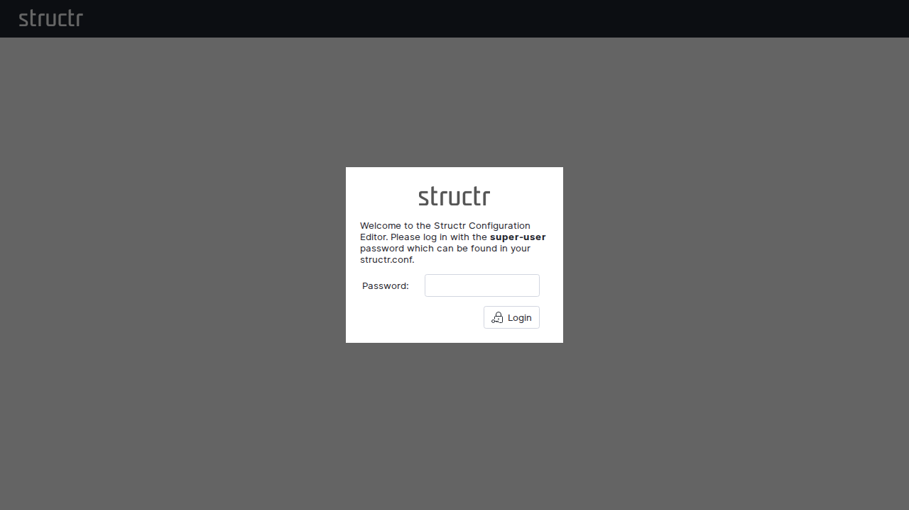
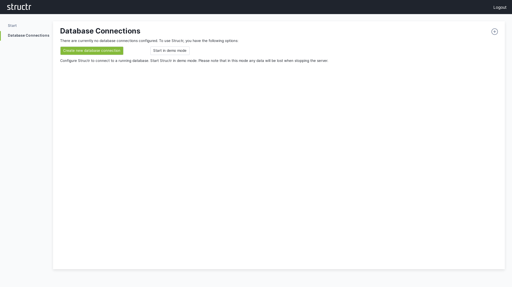
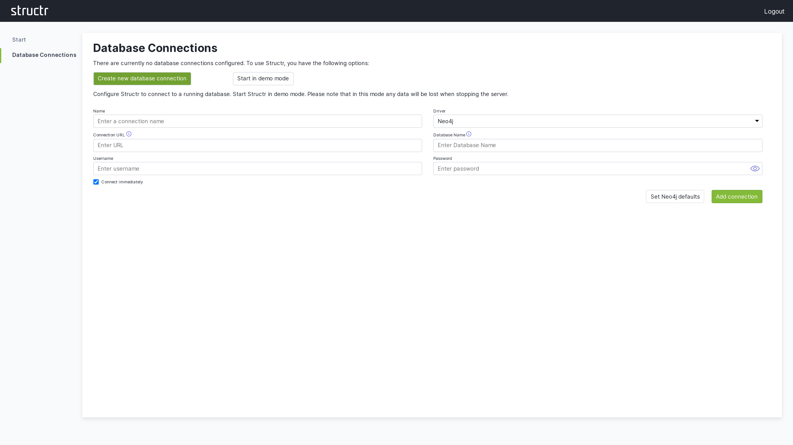
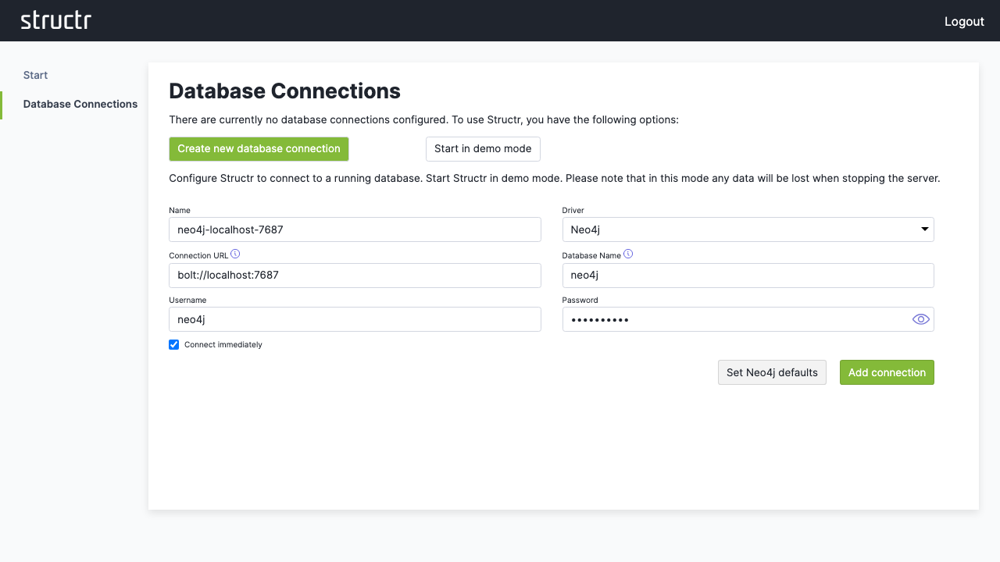
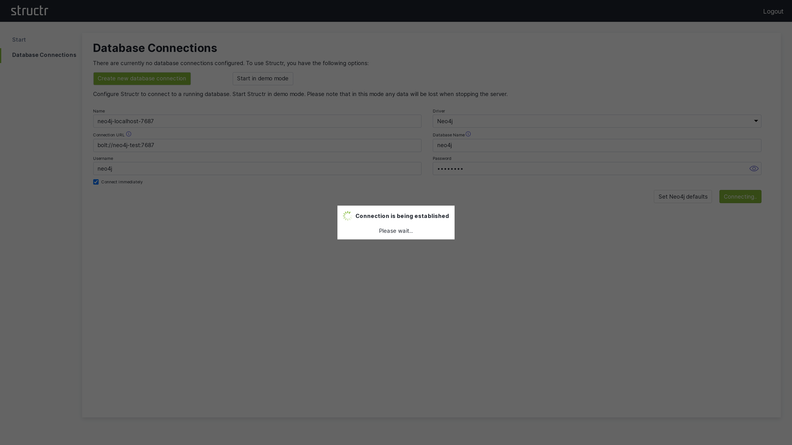
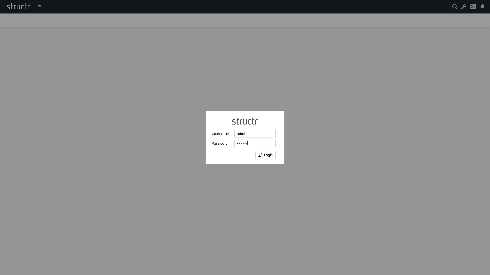
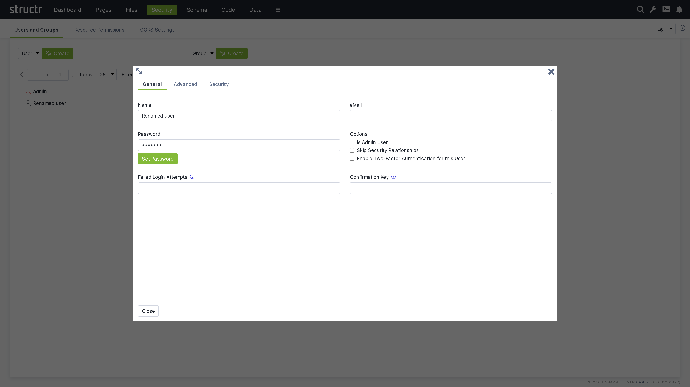

# Getting Started with Structr

Welcome to Structr! This guide will help you get up and running with Structr, a powerful low-code development platform that combines a graph database with a web application framework. Whether you're building a simple website or a complex business application, Structr provides the tools you need to create data-driven applications quickly and efficiently.

## What is Structr?

Structr is an open-source low-code platform that allows you to:
- Build web applications without extensive coding
- Create and manage complex data models using a visual schema editor
- Design responsive web pages with drag-and-drop functionality
- Implement business logic using server-side JavaScript (or other languages)
- Create REST APIs automatically based on your data model
- Manage users, groups, roles, permissions, and access rights out of the box
- Store and manage files in a virtual folder tree with your own metadata

## Prerequisites

Before you begin, you should have:
- Basic understanding of web technologies (HTML, CSS, JavaScript)
- A modern web browser (Chrome, Firefox, Safari, or Edge)
- For local installation: Java 25 or higher and a Neo4j database (optional, as Structr can manage this for you)

## Choose Your Installation Method

There are three ways to get started with Structr:

### Option 1: Structr Sandbox (Recommended for Testing/Exploring)

The easiest way to start is with a free Structr Sandbox - a cloud-hosted server instance managed by the Structr team.

**Advantages:**
- No installation required
- Ready to use in minutes
- Full functionality for testing
- No costs, no obligations, no aggressive marketing
- Free for 14 days

**How to get started:**
1. Visit [https://structr.com/try-structr/](https://structr.com/try-structr/)
2. Sign up for a free sandbox
3. Access your personal Structr instance via the provided URL
4. Sign in with the credentials sent to your email

> **Note:** Sandboxes have limited CPU, memory, and disk space but are perfect for learning and prototyping. After the 14-day trial, you can upgrade to a paid plan to keep your sandbox running.

### Option 2: Docker Installation (Recommended for Development)

For local development or self-hosted production environments, Docker provides the most straightforward setup.

**Advantages:**
- Consistent environment across different systems
- Easy to update and maintain
- Includes all necessary dependencies

**Quick start:**
```bash
# Clone the Docker setup repository
git clone https://github.com/structr/docker-setup.git
cd docker-setup

# Start Structr with Docker Compose
docker-compose up -d

# Access Structr at http://localhost:8082/structr
```

For detailed Docker setup instructions, visit: [https://github.com/structr/docker-setup](https://github.com/structr/docker-setup)

### Option 3: Manual Installation (Advanced Users)

For experienced administrators who need custom configurations, manual installation is available. In this installation guide, we assume a recent Debian Linux system and you working as the root user.

**Update the system and install dependencies**

    $ apt update
    $ apt -y upgrade

#### Install GraalVM

GraalVM is a high-performance runtime that can execute applications written in Java, JavaScript, Python, Ruby, R, and LLVM-based languages like C and C++. It provides advanced optimizations including ahead-of-time compilation to native executables, resulting in faster startup times and lower memory usage compared to traditional JVMs. 

> **Note:** Depending on your server architecture, you need to adapt the following commands to the download URLs and version strings. Use `uname -a` to determine the architecture of your server (`aarch64` or `x86_64`).
 
Download the GraalVM binaries from [https://www.graalvm.org/downloads/](https://www.graalvm.org/downloads/). 

**Example for x64_64 (X86-64/AMD64) architecture**

    $ wget https://download.oracle.com/graalvm/25/latest/graalvm-jdk-25_linux-x64_bin.tar.gz && tar xvzf graalvm-jdk-25_linux-x64_bin.tar.gz && mkdir -p /usr/lib/jvm && mv graalvm-jdk-25+37.1 /usr/lib/jvm && update-alternatives --install /usr/bin/java java /usr/lib/jvm/graalvm-jdk-25+37.1/bin/java 25 && update-alternatives --auto java

**Example for aarch64 (ARM) architecture**

    $ wget https://download.oracle.com/graalvm/25/latest/graalvm-jdk-25_linux-aarch64_bin.tar.gz && tar xvf graalvm-jdk-25_linux-aarch64_bin.tar.gz && mkdir -p /usr/lib/jvm && mv graalvm-jdk-25+37.1 /usr/lib/jvm && update-alternatives --install /usr/bin/java java /usr/lib/jvm/graalvm-jdk-25+37.1/bin/java 25 && update-alternatives --auto java

If the installation was successful, running `java -version` should result in the following output:

    java version "25" 2025-09-16 LTS
    Java(TM) SE Runtime Environment Oracle GraalVM 25+37.1 (build 25+37-LTS-jvmci-b01)
    Java HotSpot(TM) 64-Bit Server VM Oracle GraalVM 25+37.1 (build 25+37-LTS-jvmci-b01, mixed mode, sharing)

#### Install Neo4j Debian Package (version 5.26 LTS)

    $ wget -O - https://debian.neo4j.com/neotechnology.gpg.key | sudo apt-key add -
    $ echo 'deb https://debian.neo4j.com stable 5' | sudo tee -a /etc/apt/sources.list.d/neo4j.list
    $ apt update
    $ apt -y install neo4j

You can alternatively install the latest Neo4j version 2025.09.0:

    $ wget -O - https://debian.neo4j.com/neotechnology.gpg.key | sudo gpg --dearmor -o /etc/apt/keyrings/neotechnology.gpg
    $ echo 'deb [signed-by=/etc/apt/keyrings/neotechnology.gpg] https://debian.neo4j.com stable latest' | sudo tee -a /etc/apt/sources.list.d/neo4j.list
    $ sudo apt-get update
    $ apt -y install neo4j=1:2025.09.0

#### Configure and Start Neo4j

Edit `/etc/neo4j/neo4j.conf` and adjust memory settings to fit your server configuration. For a server with 8 GB RAM, we recommend the following initial settings:

    server.memory.heap.initial_size=1g
    server.memory.heap.max_size=1g
    server.memory.pagecache.size=2g

Start Neo4j with the following command:

    $ systemctl start neo4j

You can check the status of the Neo4j process with the following command:

    $ systemctl status neo4j

#### Install and Start Structr (version 6.0.0)

    $ wget https://download.structr.com/repositories/releases/org/structr/structr/6.0.0/structr-6.0.0.deb
    $ dpkg -i structr-6.0.0.deb
    $ systemctl start structr

#### Troubleshooting: Conflicting Java Versions

>**Note:** If Structr can't be started with `systemctl start structr`, it's probably because you installed the GraalVM JDK for the wrong architecture, or there's en existing Java version configured.

Check which Java version is currently active with `java -version`.

If you get something like `cannot execute binary file: Exec format error` as result, you have installed the wrong JDK for your CPU architecture. Use `uname -a` to see which architecture your server has (`aarch64` or `x86_64`), download and install the right JDK.

If the result doesn't show JDK version 25 you installed earlier, run `update-alternatives --config java` and choose the correct version from the list by entering the number displayed in the `Selection` column, `1` in the following example.

      Selection    Path                                         Priority   Status
    ------------------------------------------------------------
    * 0            /usr/lib/jvm/java-17-openjdk-arm64/bin/java   1711      auto mode
      1            /usr/lib/jvm/graalvm-jdk-25+37.1/bin/java     25        manual mode
      2            /usr/lib/jvm/java-17-openjdk-arm64/bin/java   1711      manual mode

In this example, you have to press `1` to select and configure the correct version. 

Don't forget to re-run `systemctl start structr' to start the Structr process.

If Structr has been started successfully, the last lines of its system log file should look similar to the following:
 
    2025-09-24 12:33:20.695 [main] INFO  o.structr.rest.service.HttpService - Starting Structr (host=0.0.0.0:8082, maxIdleTime=1800, requestHeaderSize=8192)
    2025-09-24 12:33:20.696 [main] INFO  o.structr.rest.service.HttpService - Base path ./
    2025-09-24 12:33:20.697 [main] INFO  o.structr.rest.service.HttpService - Structr started at http://0.0.0.0:8082
    2025-09-24 12:33:20.701 [main] INFO  org.eclipse.jetty.server.Server - jetty-12.0.23; built: 2025-07-02T14:02:02.445Z; git: 01a4119797e9cee53c974ae126cc316d0c8a533a; jvm 25+37-LTS-jvmci-b01
    2025-09-24 12:33:20.770 [main] INFO  o.e.j.s.DefaultSessionIdManager - Session workerName=93118b0075dc8a19a6d487948fe5ddf7
    2025-09-24 12:33:20.777 [main] INFO  o.e.j.server.handler.ContextHandler - Started oeje10s.ServletContextHandler@4c0d7878{ROOT,/,b=null,a=AVAILABLE,h=GzipHandler@5a349644{STARTED,min=256,inflate=32768}}
    2025-09-24 12:33:20.788 [main] INFO  o.e.j.e.s.ServletContextHandler - Started oeje10s.ServletContextHandler@4c0d7878{ROOT,/,b=null,a=AVAILABLE,h=GzipHandler@5a349644{STARTED,min=256,inflate=32768}}
    2025-09-24 12:33:20.789 [main] INFO  o.e.j.server.handler.ContextHandler - Started oejsh.ContextHandler@18dda2e1{/structr,/structr,b=null,a=AVAILABLE,h=osrs.HttpService$@3c0b9643{STARTED}}
    2025-09-24 12:33:20.802 [main] INFO  o.e.jetty.server.AbstractConnector - Started ServerConnector@4bd29a01{HTTP/1.1, (http/1.1, h2c)}{0.0.0.0:8082}
    2025-09-24 12:33:20.809 [main] INFO  org.eclipse.jetty.server.Server - Started oejs.Server@6e1d939e{STARTING}[12.0.23,sto=1000] @6888ms
    2025-09-24 12:33:20.811 [main] INFO  org.structr.core.Services - 5 service(s) processed
    2025-09-24 12:33:20.812 [main] INFO  org.structr.core.Services - Registering shutdown hook.
    2025-09-24 12:33:20.826 [main] INFO  org.structr.core.Services - Started Structr 6.0.0 abcde 202510121210
    2025-09-24 12:33:20.827 [main] INFO  org.structr.core.Services - ---------------- Initialization complete ---------------- 

## Initial Configuration

After installation (for Docker or manual setup), you'll need to go through the initial configuration procedure as follows.

>**Note:** In the following chapter, we assume that you installed Structr on your local computer (localhost). If you installed it on a server instead, you need to adapt the URLs accordingly.

### 1. Set a Superuser Password

Navigate to [http://localhost:8082/structr](http://localhost:8082/structr) which will redirect you to the configuration wizard at [http://localhost:8082/structr/config](http://localhost:8082/structr/config).



> **Note:** Choose a strong password - this is your system administrator account with full access to all Structr features. After the first call, the configuration tool is secured with this password. If you have forgotten the password, you can only obtain it as a system administrator at the operating system level from structr.conf.

### 2. Configure a Database Connection

Click "Configure a database connection" and then "Create new database connection".



For a standard Neo4j setup:
1. Click "Set Neo4j defaults" to auto-fill typical values
2. Adjust the connection parameters if needed
3. Click "Save" to establish the connection



If your database connection does not use these default settings, change them according to your database configuration.




### 3. Access the Admin Interface

Once connected, click "Open Structr UI" to enter the main application.



## First Steps 

When you see the sign-in screen, you're ready to start working with your Structr instance.

### Sign In



There's default admin user which is created automatically if the database was found empty. The default password is `admin`.

>**Note:** You should change the admin password immediately after signing in. Go to `Security` → `Users and Groups`, right-click on `admin` → `General` and set a password that can't be easily guessed. You can also set password rules in the configuration.

### Change Admin Password



Now you're set and done and ready for the [first steps](2-First Steps.md) with Structr.