# First Steps with Structr

This guide walks you through typical steps of building an application using Structr's visual development tools.

The use case is a simple system for managing projects, milestones and tasks. We'll start with the schema, add some sample data and create a web page to display the data.

As an optional addition, we add a user and a group, define API access permissions and a CORS rules.

## Chapter 1: Defining the Data Schema

Start by creating the data structure for your project management system. The schema defines three main entities:

- Projects
- Milestones
- Tasks

### Creating the Project Type

Navigate to the "Schema" view and click "Create Data Type" to add your first entity type.

1. Enter "Project" as the type name
2. Click "Create" to add the type

Add a custom property to uniquely identify projects:

1. Expand "Direct properties"
2. Click "Add direct property"
3. Set JSON name to "projectId"
4. Check "unique" to ensure each project has a unique identifier
5. Select "String" as the property type
6. Click "Save All"

### Creating the Milestone Type

Add a Milestone type following the same pattern:

Add multiple properties to track milestone details:

- `milestoneId`: String property marked as unique
- `dueDate`: Date property for deadline tracking
- `projectId`: Function property that automatically links to the parent project

The Function property allows setting a Read and a Write function which are called when a value is read from or written to the property.

In our example, the Read function just returns the value of the `projectId` property of the connected project.

The Write function establishes a relationship between the Milestone object and the Project object referenced by the given value.

- **Read**: `this.project.projectId`
- **Write**: `set(this, 'project', first(find('Project', 'projectId', value)))`

### Defining Relationships

Connect your types by dragging from one connection point to another:

Create these relationships and set the type to:

- **PROJECT\_HAS\_MILESTONE**: One project can have many milestones
- **TASK\_BELONGS\_TO**: Many tasks belong to one project

### Creating the Task Type

Create a Task type with similar structure:

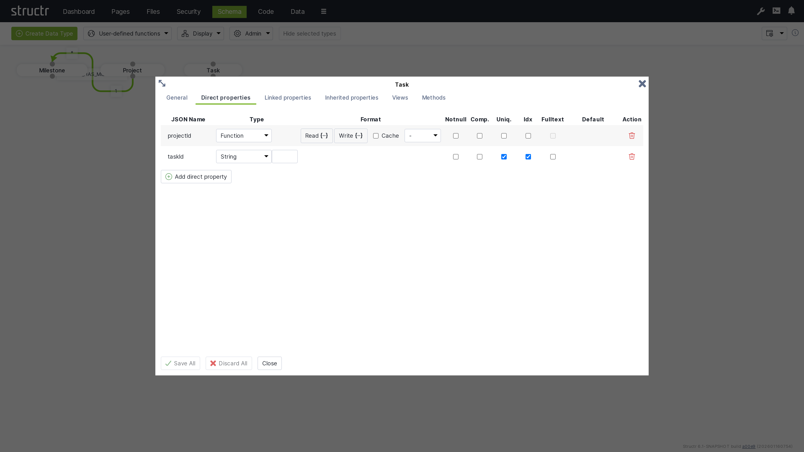

- `taskId`: String property marked as unique
- `projectId`: Function property linking to projects

## Chapter 2: Adding Sample Data

Switch to the Data tab to create test records for your project management system.

### Creating Projects

1. Searchg for "Project" and click on the "Project" type in the sidebar
2. Use "Create Project" to add three sample projects
3. Set names by clicking on the name cells:
   - Project A
   - Project B
   - Project C

### Creating Milestones

1. Click on the "Milestone" type
2. Create a couple of milestone records
3. Name them according to their projects, e.g.:
   - Milestone A1, A2, A3 (for Project A)
   - Milestone B1, B2, B3 (for Project B)
   - Milestone C1, C2, C3 (for Project C)

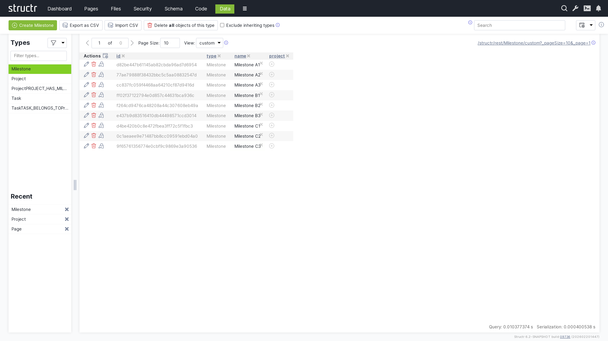

### Linking Data

Connect milestones to their respective projects:

1. Select the "Project" type
2. Click the relationship icon in the "milestones" column for each project
3. Select the appropriate milestones for each project

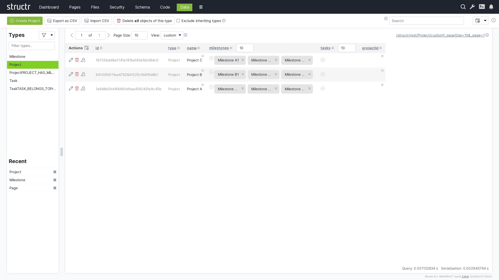

## Chapter 3: Building the Web Interface

Create a web page to display your project data using Structr's page builder.

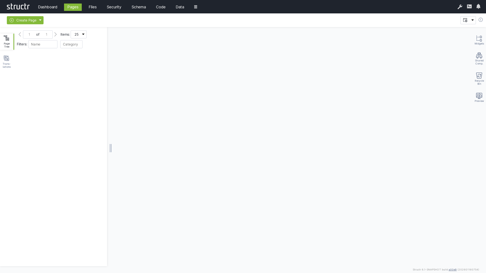

### Creating a New Page

1. Click the dropdown menu and select "Create Page"
2. Choose the "Sidebar Layout" template

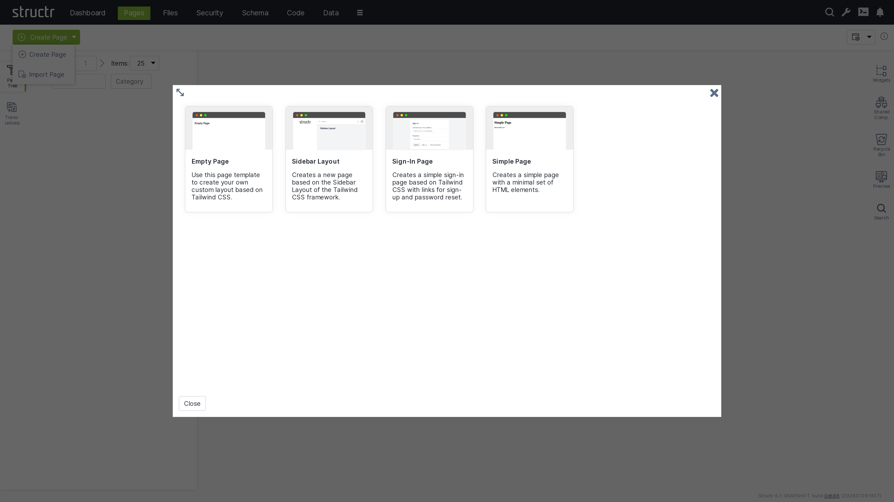

3. Name the page "projects" in the General tab

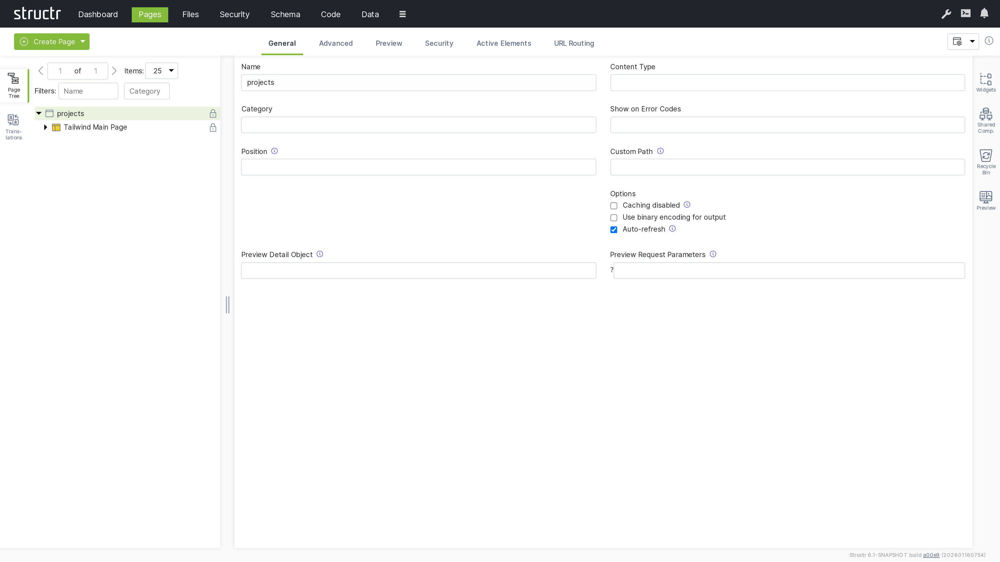

4. Right-click the page and expand the tree structure to see all elements

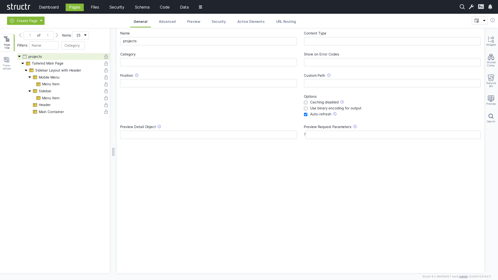

### Adding a Table

1. Switch to the Preview tab to see your page
2. Open the tab on the right-hand side labeled "Widgets"
3. Drag the "Simple Table" widget from the Widgets tab onto the Main Container

The widget is attached to the page tree as a branch of individual DOM elements that can be navigated and modified.

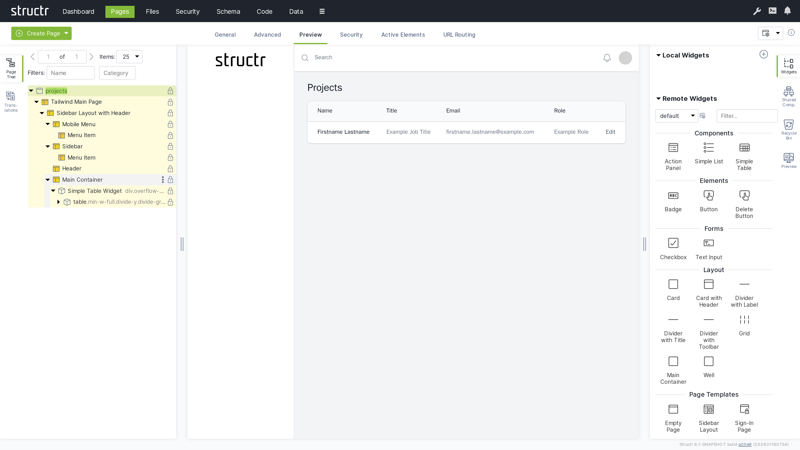

### Customizing the Table

>**Note:** In this section, we're using template expressions which are enclosed in `${...}`. See [Keywords](5-API Reference/1-Keywords.md) and [Functions](5-API Reference/2-Functions.md).

Modify the table to display project information:

1. Change the table header from "Title" to a localized header:
   `${localize("milestones", "table-header")}`

2. Replace placeholder content with dynamic project data:
   - Name column: `${project.name}`
   - Description column: `${join(extract(project.milestones, "name"), ", ")}`

3. Remove unnecessary columns by right-clicking and selecting "Remove Node"

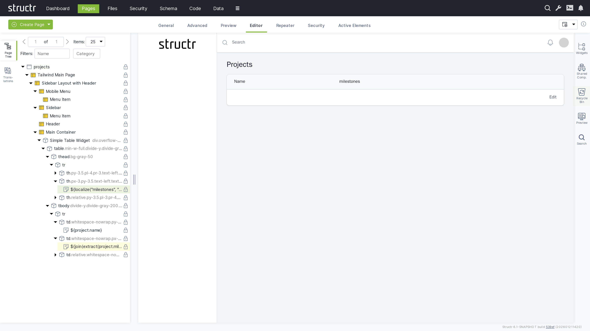

### Adding Dynamic Data

Configure the table to display all projects:

1. Select the table row (`tr`) element
2. Switch to the "Repeater" tab
3. Set up a Function Query: `find('Project')`
4. Set the data key to "project"

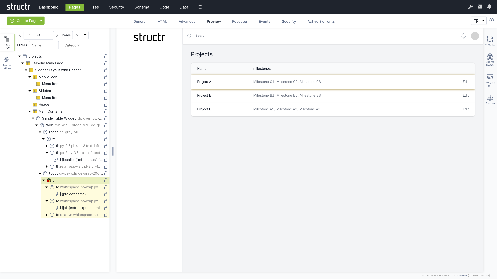

Your page now dynamically displays all projects with their associated milestones.

## Chapter 4: Configuring Security

Set up user access controls to secure your project management system.

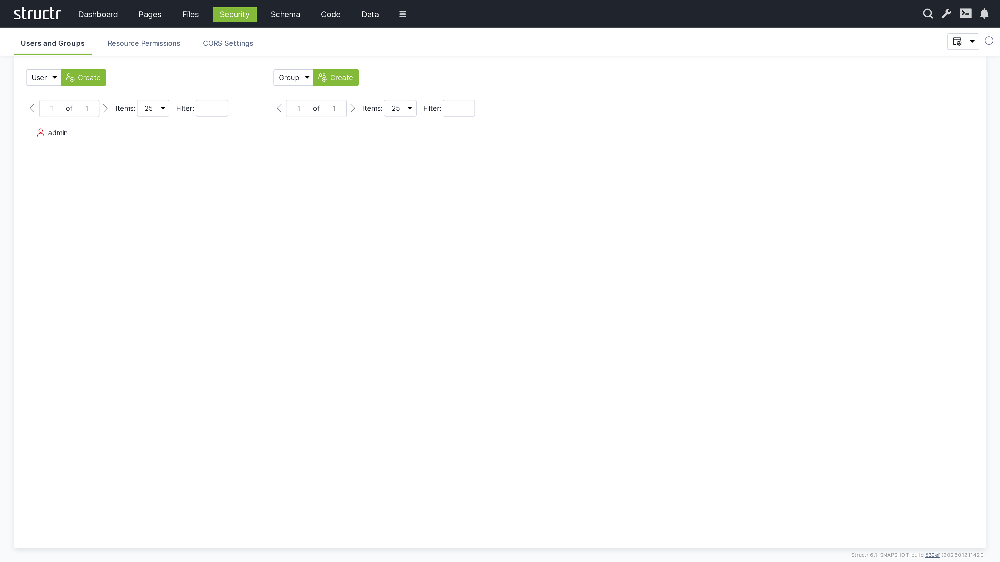

### Creating Users

To create users, navigate to `Security` via the main menu.

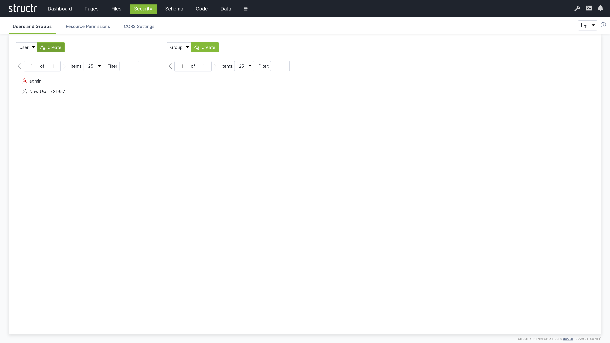
 
1. Make sure "User" is selected and click "Create" to create a new user account
2. Rename the user from "New User" to a new user name of your choice
3. Right-click the user and select "General" to change the password to a new value that is difficult to guess.

>**Note:** We recommend using a password manager to create a good password and to store it securely. Structr is compatible with most password managers.

### Creating Groups

1. Make sure "Group" is selected and click "Create" to create a user group
2. Rename from "New Group" to a new group name of your choice

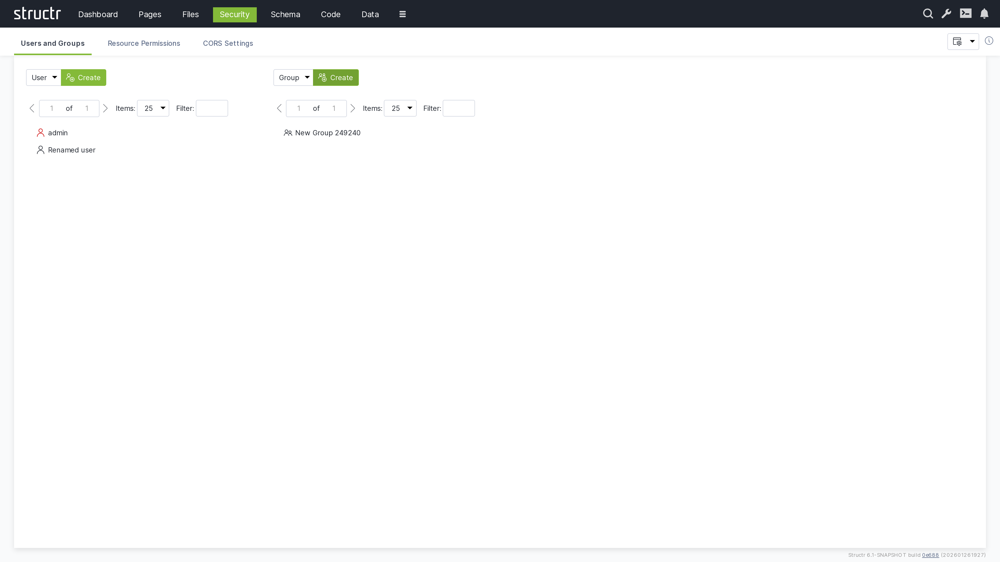

3. Drag the user onto the group to add them as a member

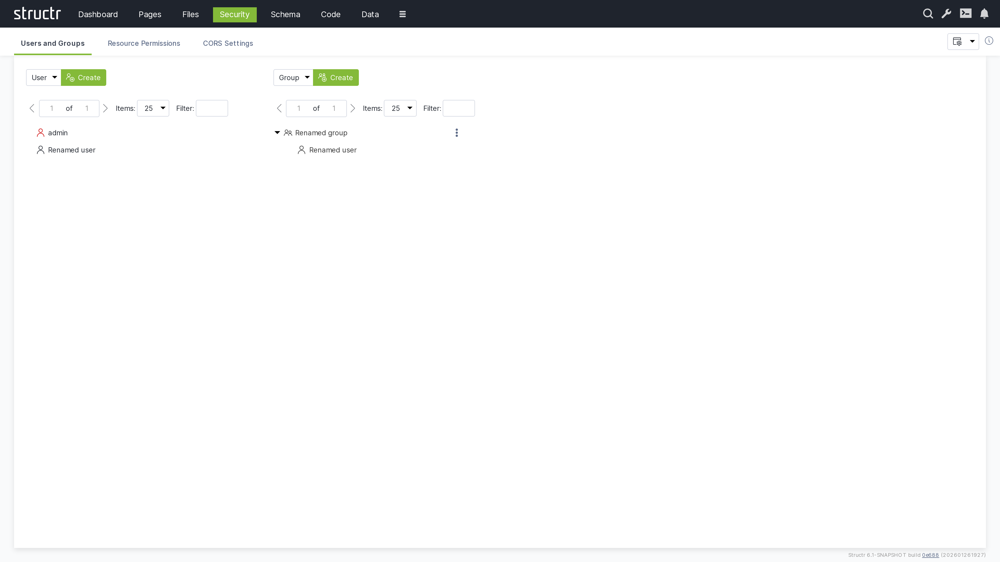

### Setting Resource Permissions

Grant API access permissions for authenticated users:

1. Switch to the "Resource Access" tab
2. Create a permission for "Project" resources
3. Enable "GET" for authenticated users to allow them read access to project data

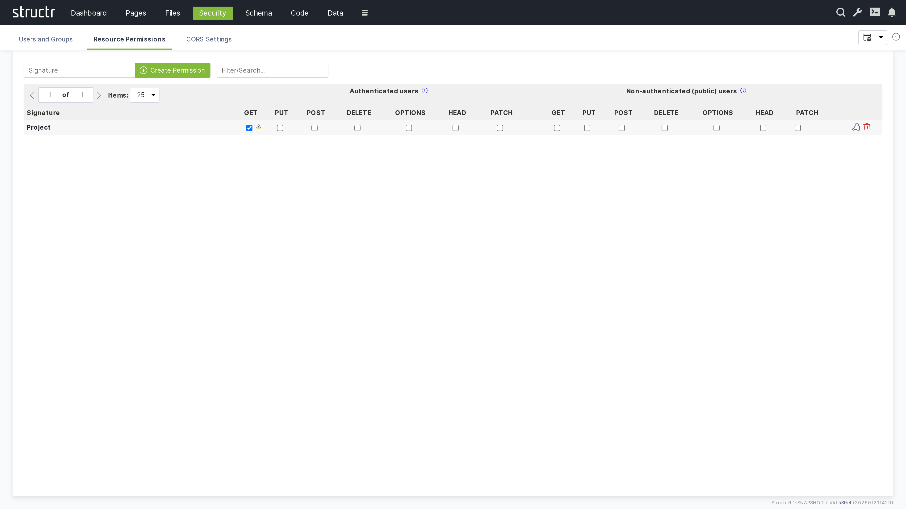

4. Create an additional permission for "Project/_id" resources
5. Enable "POST" to allow authenticated users to create new projects

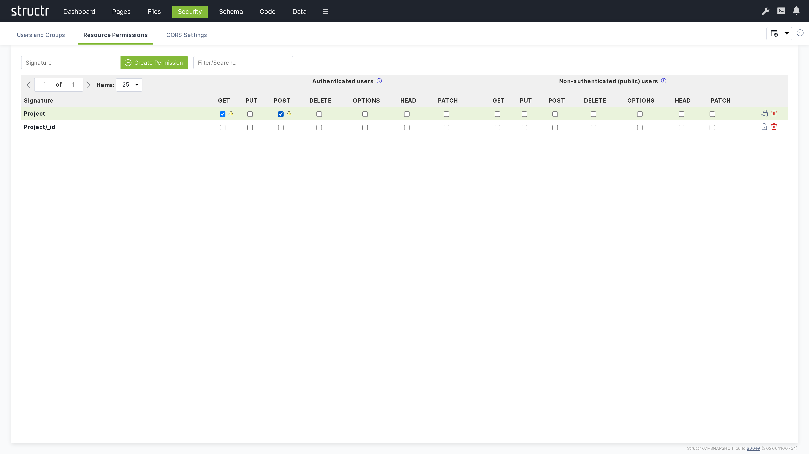

### CORS Configuration

Enable cross-origin requests for web applications:

1. Switch to "CORS Settings"
2. Set request URI to `/structr/html/projects`
3. Configure CORS headers:
   - Accepted Origins: `*`
   - Max Age: `3600`
   - Allow Methods: `HEAD, GET, PUT, POST, OPTIONS`
   - Allow Headers: `Content-Type, Accept`
   - Allow Credentials: `true`
   - Expose Headers: `Allow`

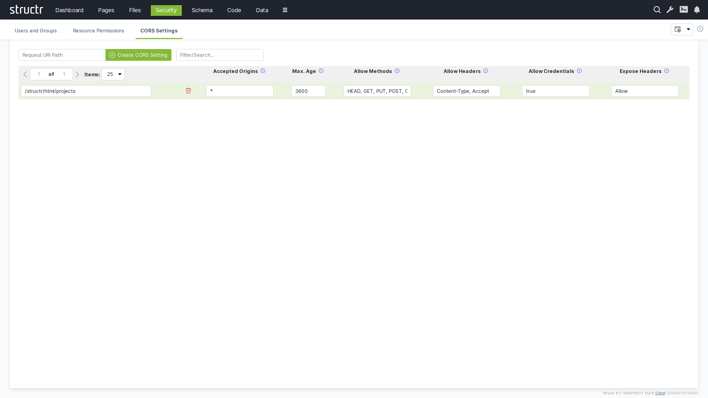

## Conclusion

You now have a simple project management application with:

- **Schema**: Defined data types for Projects, Milestones, and Tasks with proper relationships
- **Data**: Sample data demonstrating the structure and relationships
- **Pages**: A web interface displaying projects and their milestones
- **Security**: User authentication, authorization, and API access controls

The application provides a foundation that can be extended with additional features like task management, user assignment, progress tracking, and reporting capabilities.
