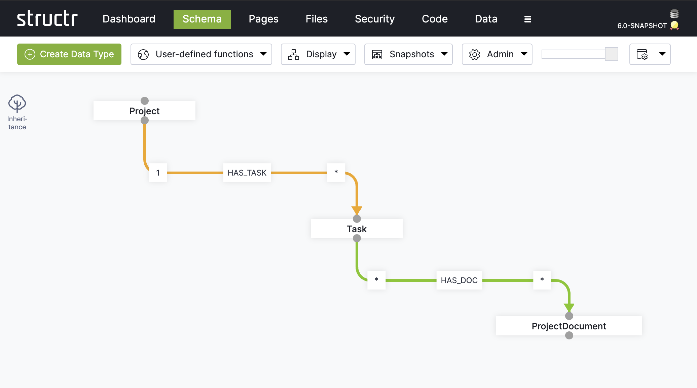

# Type System

The type system of the Structr platform is the result of almost 15 years of constant development and evolution towards the best object-to-graph mapping system in its class.

## Java Beans (early versions)

In the early versions of Structr, the system or built-in types were defined by classic Java beans. Any change or extension had to be done in Java and added to the main product code base.

The cycle times for schema changes were typical of Java development, ranging from hours to days. The demand for faster development and deployment cycles led to the introduction of dynamic types.

## Dynamic Custom Types (until version 6.0)

A fully dynamic schema based was introduced in version 3.0-rc1 on May 26, 2021. This dynamic schema allowed for the creation and modification of an application's data models at runtime without restarting the application.

The implementation was based on system type classes implemented as Java interfaces with abstract base classes that could be overridden by dynamic classes whose sources were generated by a Java code generator based on a schema graph.

Making changes to the schema in the graphical user interface of the schema editor resulted in changes to the graph structure, the so-called schema graph, which was stored in the integrated graph database. With each change, the modified parts of the class model were recreated as Java code, which was then compiled and inserted into the running JVM process.

The cycle times for schema changes were brought down from hours/days to seconds/minutes which was a major step in the evolution of Structr towards a true low-code platform. Also, the validation of the JVM compiler against the base interfaces and classes lead to a high quality and reliability of the applications built with Structr.

Although the cycle times were much shorter than in the previous implementation, they still depended on the complexity of the schema and usually ranged from 5 to 30 seconds, which was still perceived as too slow for truly rapid development.

The next step in the development was therefore only logical: the introduction of the property-based type classes in 2025. 

## Traits-based Type Classes

With Structr 6, released in 2025, an entirely new type system based on [traits](https://en.wikipedia.org/wiki/Trait_(computer_programming)) has been introduced. It's a new way to solve type inheritance, cuts down schema compilation time to only an instant and even allows for [multiple inheritance](https://en.wikipedia.org/wiki/Multiple_inheritance). 

>**Note:** Structr provides a set of base classes like `AbstractNode` and `AbstractRelationship` to define a couple of system attributes like `id`, `name`, `createdDate` etc. which are necessary for the Structr application stack to function.

### Methods

There are three different types of methods in the new implementation:

- **Framework methods**: Overridable methods that implement the basic functionality of Structr, something like in `AccessControllable`, see for example `core/traits/operations` in the `structr-base` module.
- **Lifecycle methods**: Non-overridable methods that also implement basic functionality, such as `isValid`, `onCreate` etc.
- **Dynamic methods**: Additional methods that must be exported (something like `File.doCSVImport`), see for example  `core/traits/definitions/GroupTraitDefinition.java` in `structr-base`.

#### Framework Methods

In Framework methods, there is a `super` implementation that you can call up as in normal overwritten methods.

#### Lifecycle Methods

Lifecycle methods are executed in the order in which they were defined, one after the other, without having to know each other.

#### Dynamic Methods
Dynamic methods are made available as Java methods, for example, for external access.