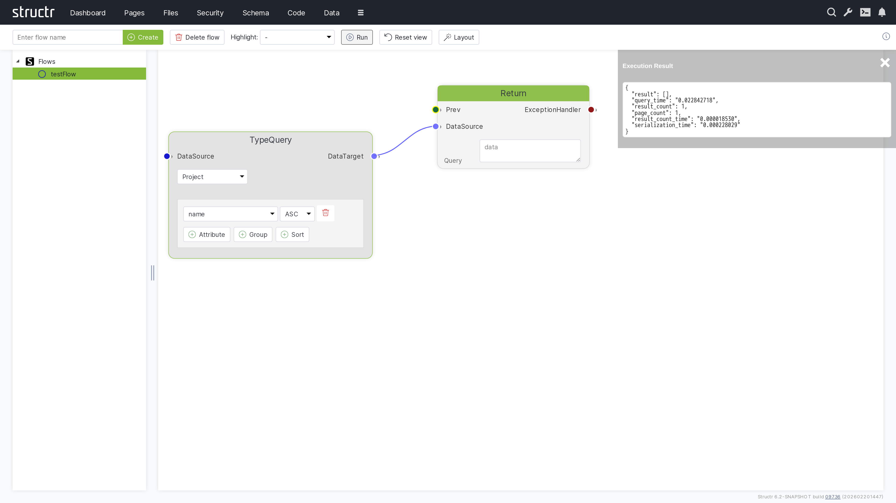

# Admin User Interface Overview

The Structr Admin User Interface is a comprehensive web-based administration console that provides full control over your Structr application. It offers intuitive access to all tools for application development, from schema design to frontend development and system administration.

## Interface Layout

The Admin UI features a clean, modern design with a navigation bar at the top that provides access to all major functional areas. The main content area displays the selected functionality with context-appropriate tools and options.

## Main Navigation Areas

The Admin UI is organized into the following main sections:

### Dashboard
System overview, monitoring, and administrative functions including server status, logs, deployment tools, and configuration options.

### Pages
Visual page editor and development environment for creating web applications, managing templates, and building user interfaces.

[Pages](5-Pages.md)

### Files
Virtual file system management for uploading, organizing, and managing static assets, documents, and media files.

### Security
User management, authentication, authorization, and access control configuration.

### Schema
Visual schema editor for designing data models, creating custom types, defining relationships, and managing database structure.

### Code
Code editor and development tools for creating custom methods, scripts, and advanced functionality.

### Data
Database management interface for viewing, creating, editing, and managing data objects and their relationships.

### Flows
Visual workflow designer for creating automated business processes and data transformation pipelines.

### Importer
Data import tools and utilities for migrating content from external sources and file formats.

### Localization
Multi-language support configuration for creating internationalized applications.

### Graph
Visual graph database explorer for visualizing data relationships and performing graph-based analysis.

### Virtual Types
Advanced type system configuration for creating dynamic and computed data types.

### Mail Templates
Email template management for automated communications and notifications.

## Key Features

### Real-Time Updates
The Admin UI provides real-time updates and notifications, ensuring you always have current information about your application state.

### Responsive Design
The interface is fully responsive and most functions work seamlessly across desktop and mobile devices.

### Context-Sensitive Help
Built-in help and documentation are available throughout the interface to guide users through complex operations.

### Collaborative Features
Multiple administrators can work simultaneously with conflict resolution and change tracking.

### Customizable Interface
The UI can be customized to meet specific requirements e.g. by setting set a custom label in the header to mark a production or stating environment.
Also, there are a couple of settings in the Dashboard section to configure the UI behaviour.

## Getting Started

1. **Login**: Access the Admin UI through your Structr server URL (typically `http://localhost:8082/structr/`)
2. **Dashboard**: Start with the Dashboard to get an overview of your system status
3. **Schema**: Begin building your application by designing the data schema
4. **Pages**: Create your first pages and user interfaces
5. **Data**: Add and manage your application data

## Best Practices

### Navigation

- Use the left sidebar for primary navigation between functional areas
- Utilize breadcrumbs and back buttons for efficient navigation within sections
- Take advantage of keyboard shortcuts for faster operation

### Performance

- Close unused tabs and panels to optimize browser performance
- Use filters and search functionality to work with large datasets efficiently
- Regular browser cache clearing may be needed for optimal performance

### Security

- Always log out when finished working
- Use appropriate user permissions and roles
- Regularly review and update access controls

## Browser Compatibility

The Admin UI is optimized for modern web browsers:

- **Chrome** (recommended): Full feature support
- **Firefox**: Full feature support
- **Safari**: Full feature support
- **Edge**: Full feature support

For the best experience, ensure your browser is updated to the latest version and has JavaScript enabled.

## Next Steps

Explore each section of this Admin UI guide to learn about the specific functionality and capabilities available in each area. Start with the [Dashboard](2-Dashboard.md) for system monitoring and configuration, then move on to [Schema](3-Schema.md) design and [Pages](5-Pages.md) development for building your application.
