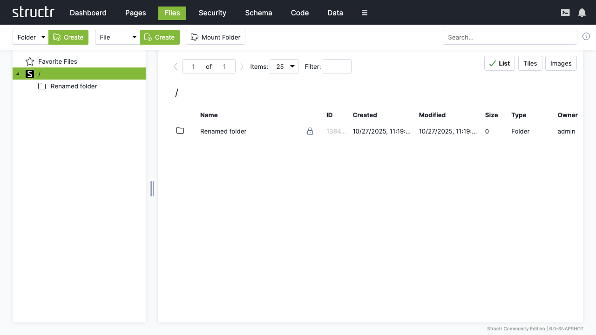
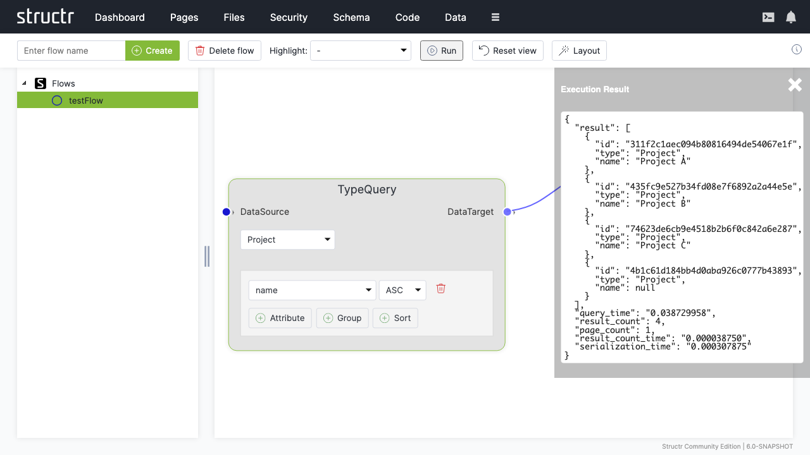
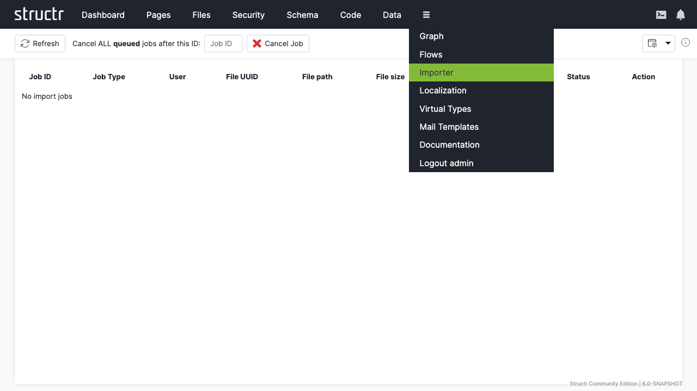
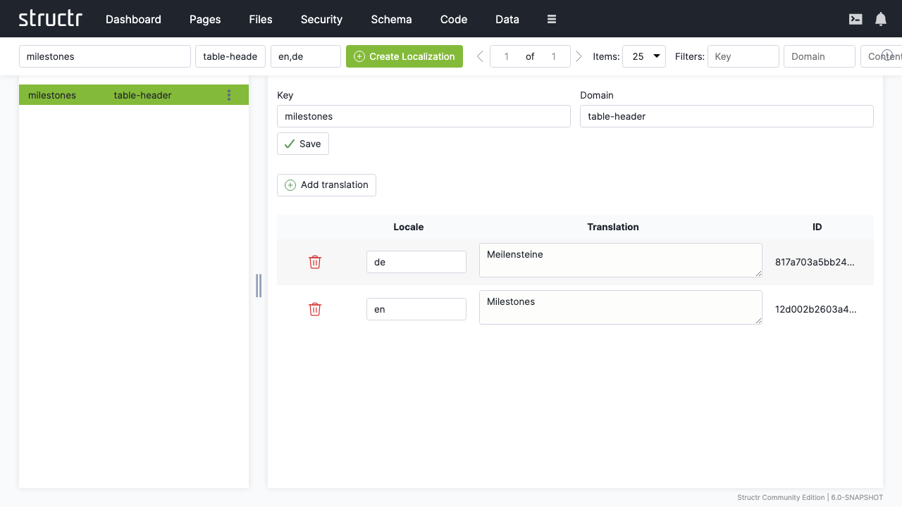

# Admin User Interface

The Structr Admin User Interface is a web-based console for building and managing Structr applications. From here, you design your data model, build pages, manage users, and monitor your running application – all without leaving the browser.

## Finding Your Way Around

The interface is organized around a header bar that stays visible across all areas. The main navigation on the left side of the header takes you to the different functional areas: Dashboard, Pages, Files, Security, Schema, Code, Data, and more. Less frequently used items are tucked into the burger menu, which also contains the logout link. You can customize which items appear in the main navigation and which go into the burger menu through the UI Settings on the Dashboard.

On the right side of the header, you'll find tools that are useful regardless of where you are in the application:

### Search

The magnifying glass icon opens a global search across all your data.

### Configuration

The wrench icon takes you to the configuration interface.

### Admin Console

The terminal icon opens the Structr Admin Console for direct command execution.

### Notifications

The bell icon shows notifications and system alerts.

## The Main Areas

### Dashboard

Your starting point. It shows system information, server logs, and deployment tools. This is where you go to check if everything is running smoothly, export your application, or adjust UI settings.

### Pages

Where you build your user interface. It's a visual editor for creating web pages, with a tree view of your page structure, drag-and-drop widgets, and live preview.

### Files

Manages your static assets – CSS, JavaScript, images, documents. It works like a virtual file system where you can upload, organize, and reference files in your pages.

### Security

Handles users, groups, and permissions. You create accounts here, organize users into groups, and configure which API endpoints are accessible to whom.

### Schema

The visual data modeler. Types appear as boxes, relationships as connecting lines. Drag to arrange, click to edit. This is where you define what your application knows about.

### Code

Focuses on business logic. It shows the same types as the Schema area, but organized for writing and editing methods rather than visualizing relationships.

### Data

Lets you browse and edit the actual data in your application. Select a type, see all instances in a table, edit values directly.

### Flows

A visual workflow designer for creating automated processes and data transformations.

### Importer

Despite its name, shows scheduled jobs and background tasks. Jobs created with `$.schedule()` appear here and can be monitored or cancelled.

### Localization

Manages translations for multi-language applications.

### Graph

Visualizes your data as an interactive graph, showing objects and their relationships.

### Virtual Types

Configures dynamic types that transform or aggregate data from other sources.

### Mail Templates

An editor for email templates used in automated notifications.

## Browser Compatibility

The Admin UI works in all modern browsers – Chrome, Firefox, Safari, and Edge are fully supported. For the best experience, keep your browser updated to the latest version.
