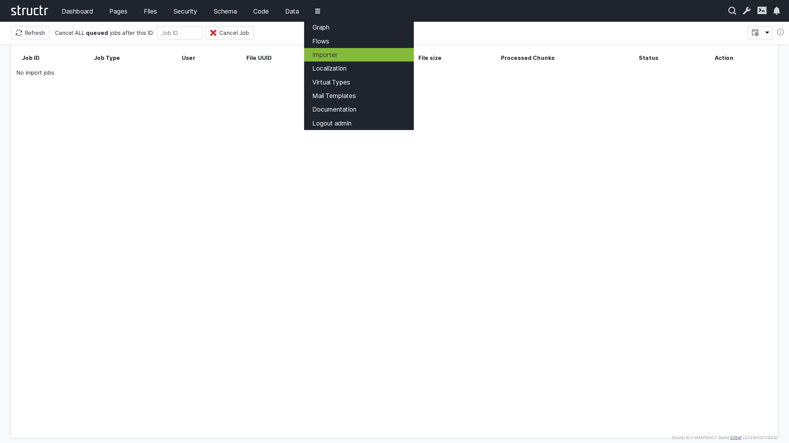

# Importer

The Importer section provides comprehensive tools for importing data from various external sources into your Structr application. It supports multiple file formats, offers flexible data mapping capabilities, and includes validation and transformation features to ensure data quality.

## Overview

The Importer enables seamless data migration from external systems, spreadsheets, databases, and files into your Structr schema. It provides a user-friendly interface for mapping external data to your schema types while maintaining data integrity and relationships.

## Key Features

### Multi-Format Support

- CSV, XML file imports
- API-based data imports
- Custom format adapters

### Data Mapping

- Visual field mapping interface
- Automatic field detection and suggestion
- Data transformation during import
- Relationship mapping and creation

### Validation and Quality

- Pre-import data validation
- Schema constraint verification
- Duplicate detection and handling
- Error reporting and correction
