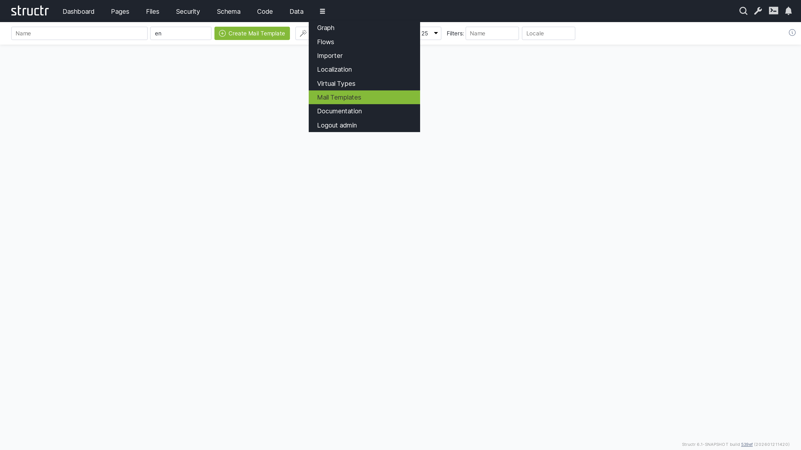

# Mail Templates

Mail Templates provide a centralized system for creating, managing, and organizing email templates used throughout your Structr application. Whether for transactional emails, notifications, or marketing communications, Mail Templates combine HTML-based design with dynamic content capabilities to produce personalized, professional emails.

## Overview

The Mail Templates section enables you to design email content using HTML with full support for StructrScript template expressions. These expressions dynamically populate emails with data from your application, such as user details, order information, or any other entity properties, ensuring each email is personalized to its recipient and context.

## Key Features

Mail Templates support dynamic content through template expressions embedded directly in your HTML. Using the familiar `${...}` syntax, you can insert property values, perform calculations, apply conditional logic, and format data—all resolved at send time based on the entity passed to the template.

For international applications, templates can be assigned a language or locale code, allowing you to maintain multiple versions of the same email for different audiences. Structr automatically selects the appropriate template based on the recipient's locale settings.

## Template Wizard

The template wizard simplifies the creation process by generating complete template bundles for common authentication workflows. These bundles include not only the email content but also all necessary configuration parameters for links, redirects, and URL handling.

### Registration Confirmation Templates

The wizard can generate a complete set of templates for user registration confirmation emails:

| Template Name | Default Value | Description |
|---------------|---------------|-------------|
| `CONFIRM_REGISTRATION_SENDER_ADDRESS` | structr-mail-daemon@localhost | Sender address of the registration mail |
| `CONFIRM_REGISTRATION_SENDER_NAME` | Structr Mail Daemon | Sender name of the registration mail |
| `CONFIRM_REGISTRATION_SUBJECT` | Welcome to Structr, please finalize registration | Subject of the registration mail |
| `CONFIRM_REGISTRATION_TEXT_BODY` | Go to ${link} to finalize registration. | Plain text body of the registration mail |
| `CONFIRM_REGISTRATION_HTML_BODY` | `
Click <a href='${link}'>here</a> to finalize registration.
` | HTML body of the registration mail |
| `CONFIRM_REGISTRATION_BASE_URL` | *(server base URL)* | Server base URL to prefix all links |
| `CONFIRM_REGISTRATION_PAGE` | /confirm_registration | Path of the validation page linked in the email |
| `CONFIRM_REGISTRATION_TARGET_PAGE` | /register_thanks | Path of the page to redirect to on successful validation |
| `CONFIRM_REGISTRATION_ERROR_PAGE` | /register_error | Path of the page to redirect to in case of errors |
| `CONFIRM_REGISTRATION_CONFIRMATION_KEY_KEY` | key | Name of the URL parameter for the confirmation key |
| `CONFIRM_REGISTRATION_TARGET_PAGE_KEY` | target | Name of the URL parameter for the success redirect page |
| `CONFIRM_REGISTRATION_ERROR_PAGE_KEY` | onerror | Name of the URL parameter for the error redirect page |

### Password Reset Templates

The wizard can also generate templates for the password reset workflow:

| Template Name | Default Value | Description |
|---------------|---------------|-------------|
| `RESET_PASSWORD_SENDER_NAME` | Structr Mail Daemon | Sender name of the reset password mail |
| `RESET_PASSWORD_SENDER_ADDRESS` | structr-mail-daemon@localhost | Sender address of the reset password mail |
| `RESET_PASSWORD_SUBJECT` | Request to reset your Structr password | Subject of the reset password mail |
| `RESET_PASSWORD_TEXT_BODY` | Go to ${link} to reset your password. | Plain text body of the reset password mail |
| `RESET_PASSWORD_HTML_BODY` | `
Click <a href='${link}'>here</a> to reset your password.
` | HTML body of the reset password mail |
| `RESET_PASSWORD_BASE_URL` | *(server base URL)* | Server base URL used to build the link variable |
| `RESET_PASSWORD_PAGE` | /reset-password | Path of the page linked in the email |
| `RESET_PASSWORD_TARGET_PAGE` | /reset-password | Path of the page to redirect to on successful password reset |
| `RESET_PASSWORD_ERROR_PAGE` | /reset-password | Path of the page to redirect to in case of errors |
| `RESET_PASSWORD_CONFIRMATION_KEY_KEY` | key | Name of the URL parameter for the confirmation key |
| `RESET_PASSWORD_TARGET_PAGE_KEY` | target | Name of the URL parameter for the success redirect page |
| `RESET_PASSWORD_ERROR_PAGE_KEY` | onerror | Name of the URL parameter for the error redirect page |

These template bundles provide a complete, ready-to-use foundation for user authentication workflows. After generation, you can customize any template to match your application's branding and requirements.