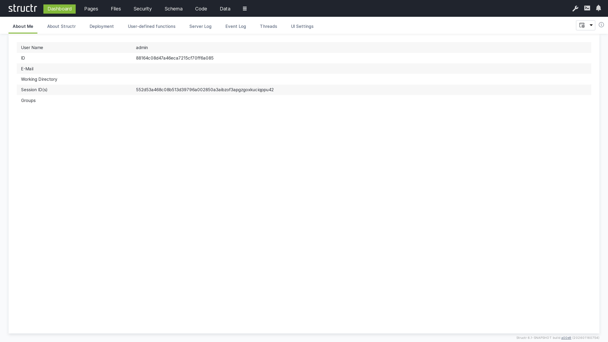
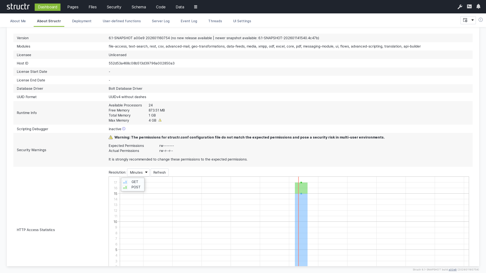
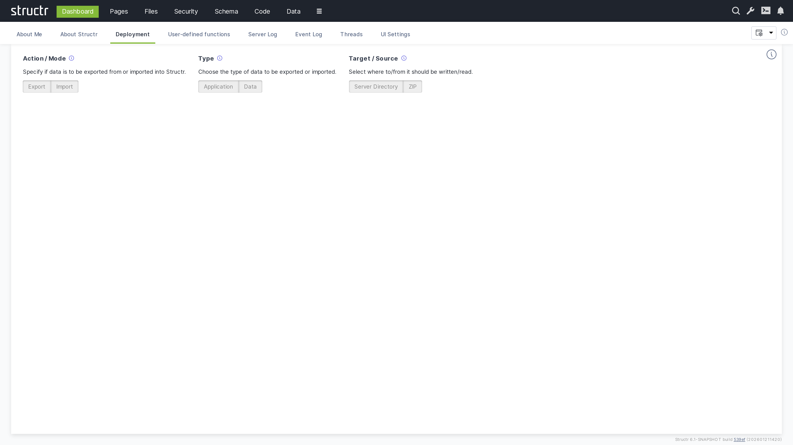
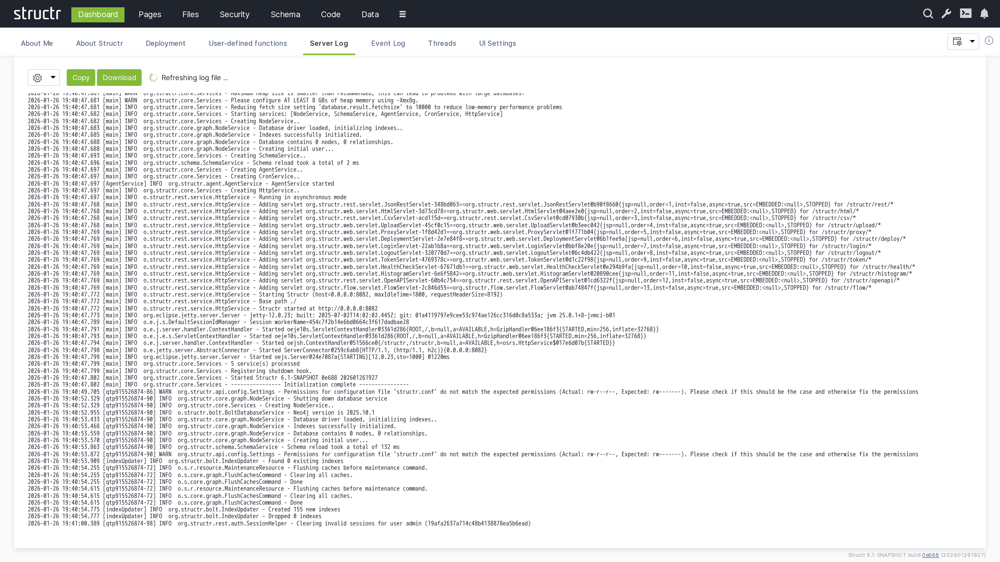
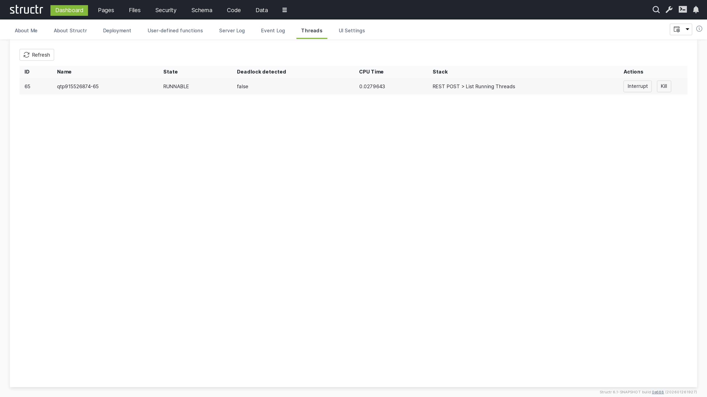
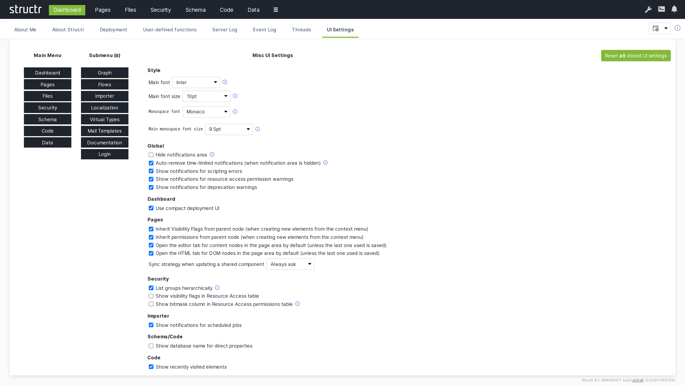

# Dashboard

The Dashboard is the central command center of the Structr Admin UI, providing a comprehensive overview of your system's status, performance metrics, and administrative tools. It serves as the starting point for monitoring and managing your Structr application.

## Overview

The Dashboard provides real-time insights into your Structr instance, including system information, user activity, server performance, and administrative controls. It's designed to give administrators quick access to critical information and commonly used system management functions.

## Dashboard Sections

### About Me

The "About Me" section displays information about the currently logged-in user, including user details, session information, and personal settings.

### About Structr

This section provides detailed information about the Structr server instance, including version information, system configuration, and licensing details. It also shows some information about hardware configuration and access statistics.

### Deployment

The Deployment section offers comprehensive tools for managing application deployment, including export/import functionality and environment synchronization.

**Deployment features:**
- **Export functionality**: Export a Structr application with schema, pages, files, or custom data, to a server directory or ZIP file
- **Import functionality**: Import a Structr application from a ZIP file or server directory
- **Selective deployment**: Choose specific components to export/import
- **Environment sync**: Synchronize configurations between development, staging, and production

### Server Log

The Server Log provides real-time access to server log messages, allowing administrators to monitor system events, debug issues, and track application behavior.

You can temporarily stop the auto-refresh by focusing the log area by clicking on it. To restart automatic updates, click somewhere outside the log area.

**Features:**
- Real-time log streaming
- Refresh interval from 1s to 10s and manual (no automatic refresh)
- Select log file to view in case of log rotation
- Number of lines to show and position to truncate at

### Event Log

The Event Log tracks important system events, user actions, and security-related activities within the Structr application. It can be filtered by different event types, and the number of events to show can be configured (default: 100).

**Filterable event types:**
- All events
- Authentication events
- Cron events
- HTTP requests
- Maintenance
- Scripting events
- REST requests
- ResourceAccess events
- Transactions
- System info

### Threads

The Threads monitor lists active threads and processes running within the Structr server to track system performance and identify potential bottlenecks.

You can interrupt or kill a thread by clicking on the corresponding button.

### UI Configuration

Customize the Admin UI appearance and behavior to match your preferences and organizational requirements.

**Configuration options:**
- **Theme settings**: Choose between light and dark themes
- **Language preferences**: Select interface language
- **Layout options**: Customize sidebar and panel arrangements
- **Notification settings**: Configure alert preferences
- **Performance settings**: Adjust refresh rates and update intervals
- **Accessibility options**: Enable accessibility features

## Best Practices

### Monitoring
- Regularly check the Server Log for errors or warnings
- Monitor Running Threads for performance issues
- Review Event Log for security-related activities
- Keep track of system uptime and performance metrics

### Deployment
- Always test deployments in a staging environment first
- Create backups before major deployments
- Use selective deployment for incremental updates
- Document deployment procedures and rollback plans

### System Maintenance
- Regularly review and archive old log files
- Monitor memory usage and thread performance
- Keep system configuration up to date
- Schedule regular maintenance windows for updates

### Security
- Monitor the Event Log for suspicious activities
- Regular review of user sessions and access patterns
- Keep track of administrative actions
- Ensure proper audit trails are maintained

## Troubleshooting

### Common Issues

**High Memory Usage**
- Check Running Threads for memory-intensive processes
- Review Server Log for memory-related warnings
- Consider adjusting JVM heap settings

**Performance Problems**
- Monitor active thread counts
- Check for long-running processes
- Review system resource utilization
- Analyze log patterns for bottlenecks

**Deployment Failures**
- Check Server Log for deployment error details
- Verify target environment compatibility
- Ensure sufficient disk space and permissions
- Validate export package integrity

### Diagnostic Tools

The Dashboard provides several diagnostic capabilities:
- Real-time system metrics
- Historical performance data
- Error tracking and analysis
- Resource utilization monitoring

## Integration with External Tools

The Dashboard can integrate with external monitoring and management tools:
- **Log aggregation**: Forward logs to external systems (ELK stack, Splunk)
- **Monitoring**: Export metrics to monitoring platforms (Prometheus, Grafana)
- **Alerting**: Configure notifications for critical events
- **Backup systems**: Integrate with enterprise backup solutions

## Next Steps

After familiarizing yourself with the Dashboard:
1. Explore the [Pages](5-Pages.md) section for application development
2. Review [Schema](3-Schema.md) design capabilities
3. Learn about [Security](6-Security.md) management
4. Understand [Data](4-Data.md) management features

The Dashboard serves as your primary tool for system oversight and administration, providing the foundation for effective Structr application management.
