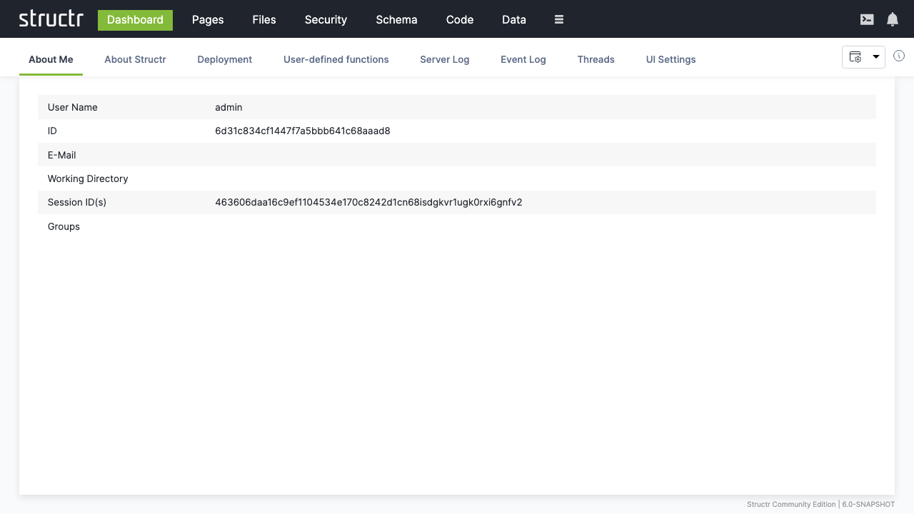
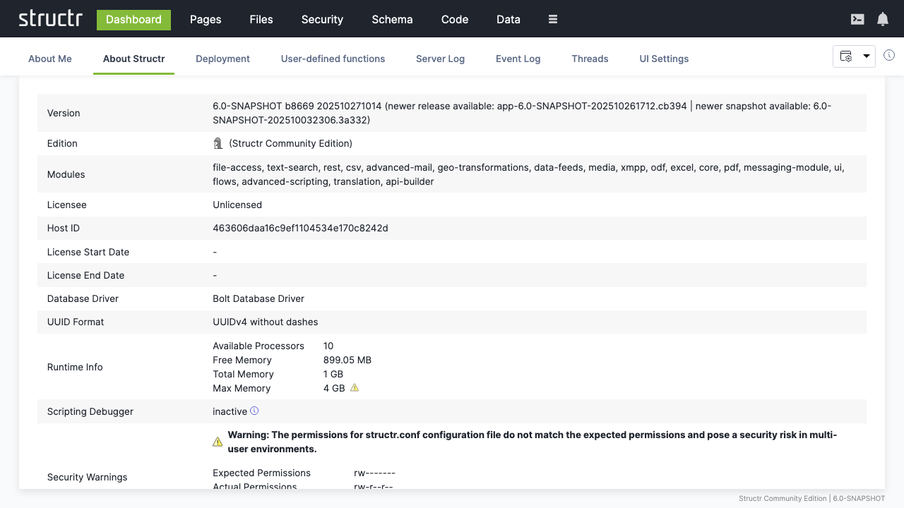
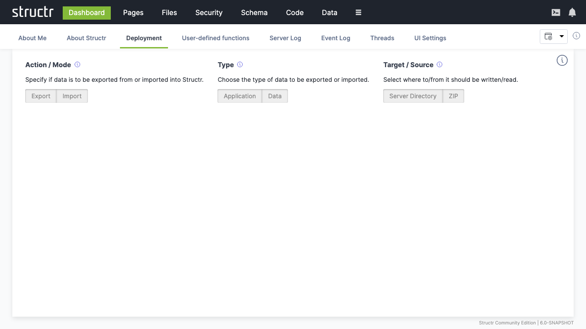
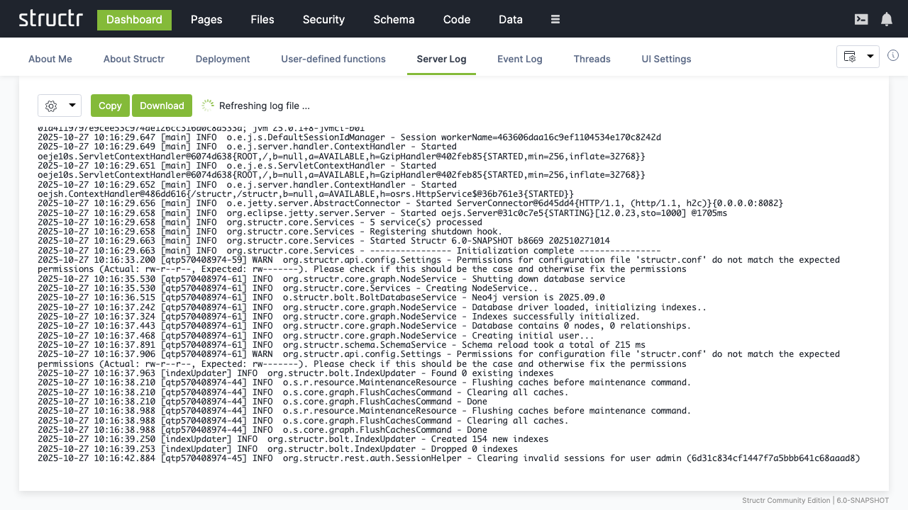
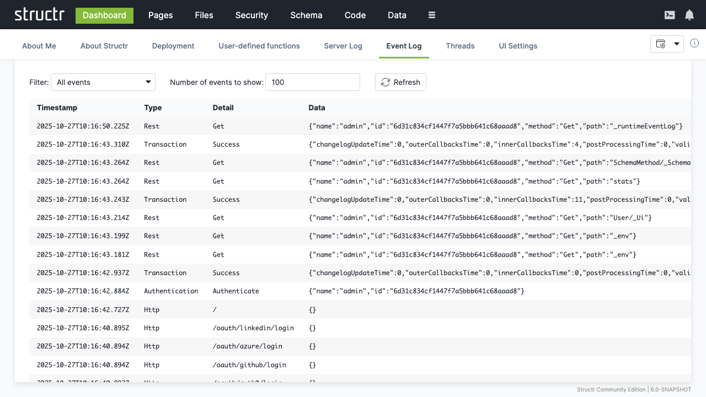
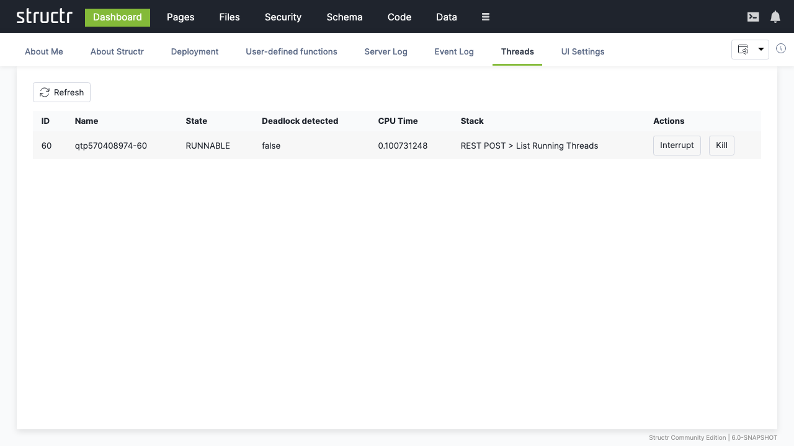
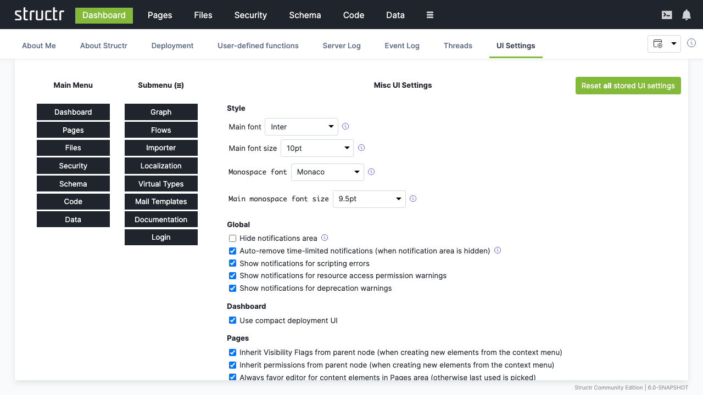

# Dashboard

The Dashboard is your control center. When you log in, this is where you land – and it's where you return when you need to check on your system, export your application, or dig into logs to figure out why something isn't working.

## What You'll Find Here

The Dashboard is organized into tabs, each focused on a different aspect of system management.

### About Me

This tab shows who you're logged in as. You'll see your username, UUID, email address, working directory, session IDs, and group memberships. It's useful when you're troubleshooting permission issues or when you're working with multiple accounts and need to verify which one you're using.

### About Structr

Everything about your Structr installation lives here.

#### Version and Modules

The version number tells you exactly which build you're running, with indicators showing whether newer releases or snapshots are available. Below that, you'll see which modules are active – these extend Structr's capabilities with features like PDF generation, Excel import/export, or advanced scripting.

#### License and Database

The license section shows your licensee name, host ID (which you'll need when requesting a license), and the validity period. Database information tells you which driver you're using – Structr supports both embedded and external Neo4j databases. You'll also see the UUID format in use; Structr supports both dashed and non-dashed formats, configured at installation time.

#### Runtime Information

Runtime information gives you a quick health check: number of processors, free memory, total memory, and maximum memory. Keep an eye on these if your application feels sluggish.

#### Scripting Debugger

The scripting debugger status shows whether the GraalVM debugger is active. If you need to step through JavaScript code with Chrome DevTools, enable it by setting `application.scripting.debugger = true` in `structr.conf`. See [Debugging JavaScript Code](#placeholder-debugging) for details.

#### Access Statistics

At the bottom, access statistics show request patterns over time – when requests came in, how many, and which HTTP methods were used. This helps you understand how your application is being used and can reveal unusual access patterns.

### Deployment

This is where you back up your work and move it between environments. Deployment in Structr means exporting your application – schema, pages, files, configuration – to a portable format that can be imported into another Structr instance. This enables version control, backup, and migration between development, staging, and production.

#### Export and Import Options

Six options combine export/import, application/data, and server directory/ZIP file:

- Export Application to Server Directory
- Export Application to ZIP File
- Import Application from Server Directory
- Import Application from ZIP File
- Export Data to Server Directory
- Import Data from Server Directory

#### What Gets Exported

Application exports include everything needed to recreate your application structure. Data exports include the actual objects in your database. For a complete backup, you need both.

#### Selective Deployment

When exporting, you can select which components to include – schema, files, pages, or specific data types. This allows selective deployment when you only want to update certain parts. Store your exports in version control to maintain a history of your application state.

### User-Defined Functions

This tab lists functions you've marked as maintenance tools. Instead of writing a script or calling the API, you can execute these functions directly from the Dashboard with a single click.

To make a function appear here, set the `includeInFrontendMenu` flag on the function in the Schema or Code area. Common uses include data cleanup, report generation, cache invalidation, or any administrative task you run regularly.

### Server Log

The server log is your primary debugging tool. It shows what Structr is doing in real-time: startup messages, errors, warnings, request processing, and transaction details. When something breaks, this is usually the first place to look.

#### Controls

The log refreshes every second by default. Click inside the log area to pause auto-refresh when you need to read a specific message. You can copy the content to your clipboard, download the file, adjust the refresh interval, change how many lines are displayed, or switch between log files if you have rotation enabled.

### Event Log

While the server log shows technical details in free-form text, the event log provides a structured view of what's happening: API requests, authentication events, transactions, and more. Each event appears as a row with consistent columns, making it easy to filter and analyze.

#### Using the Event Log

The event log doesn't auto-refresh – click the refresh button to update it. Use it to trace user activity, debug permission issues, or analyze performance. Transaction events include timing breakdowns that can help identify bottlenecks.

### Threads

This tab shows all threads running in the Java Virtual Machine. Most of the time you won't need it, but when a request hangs or your application becomes unresponsive, this is where you look.

#### Thread Management

You can interrupt a thread (asking it to stop gracefully) or kill it (forcing immediate termination – use with caution). Long-running threads might indicate infinite loops or deadlocks in your code.

### UI Settings

Customize how the Admin UI looks and behaves. Changes take effect immediately and are stored per user.

#### Menu Configuration

Menu configuration lets you choose which items appear in the main navigation bar and which are hidden in the burger menu.

#### Font Settings

Font settings control the main font, font size, and monospace font used in code editors and log displays.

#### Behavior Settings

The settings section contains checkboxes grouped by area – Global, Dashboard, Pages, Security, Importer, Schema/Code, Code, and Data. These control details like notification display, inheritance behavior when creating elements, and how certain data types are shown.
