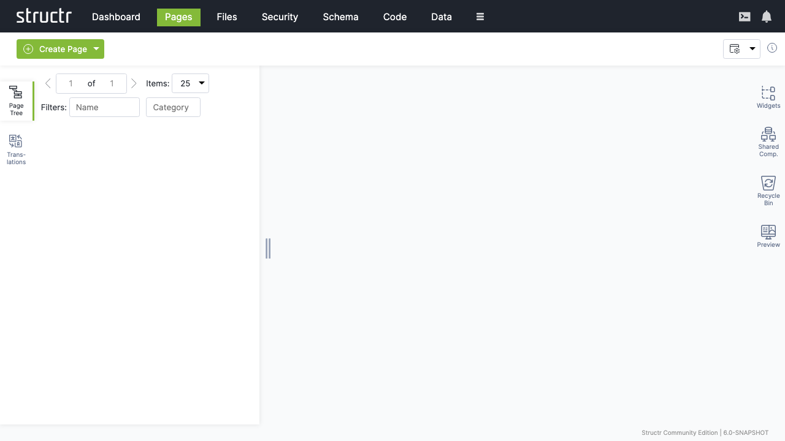
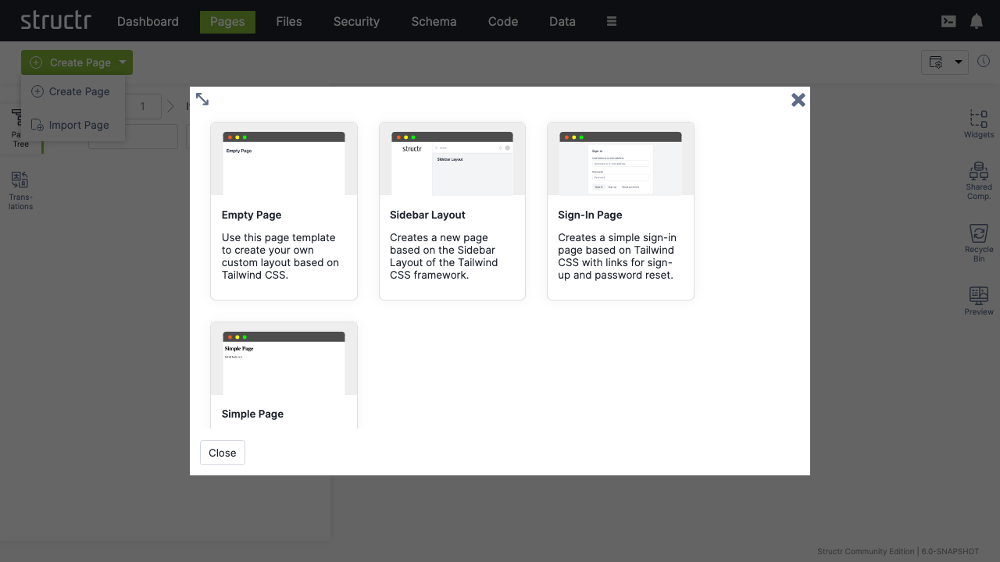
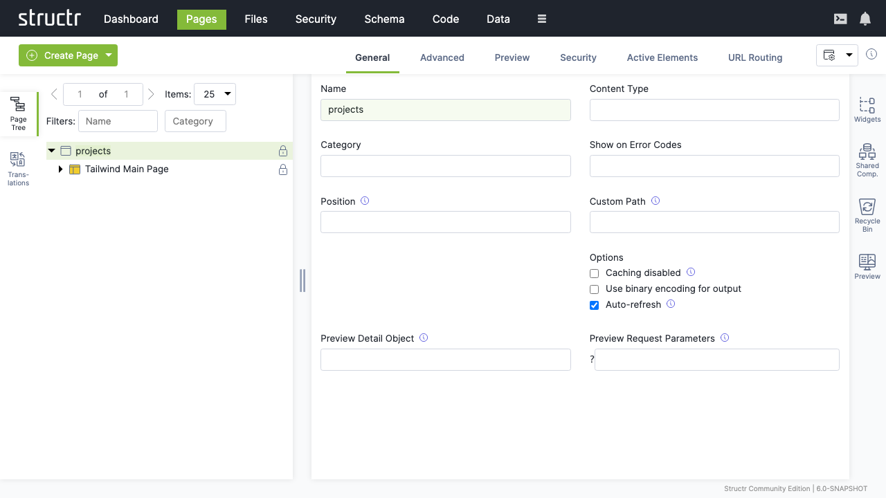
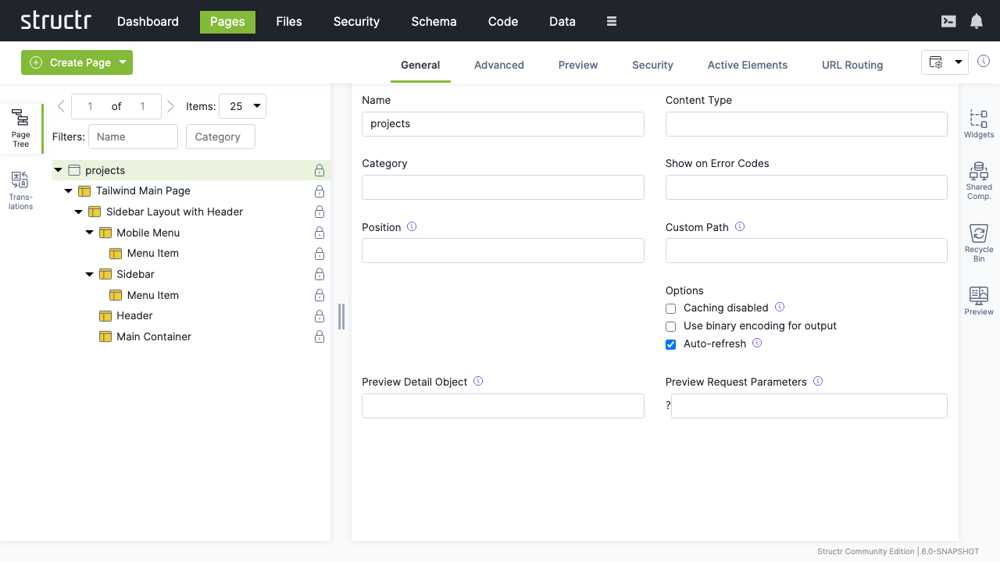
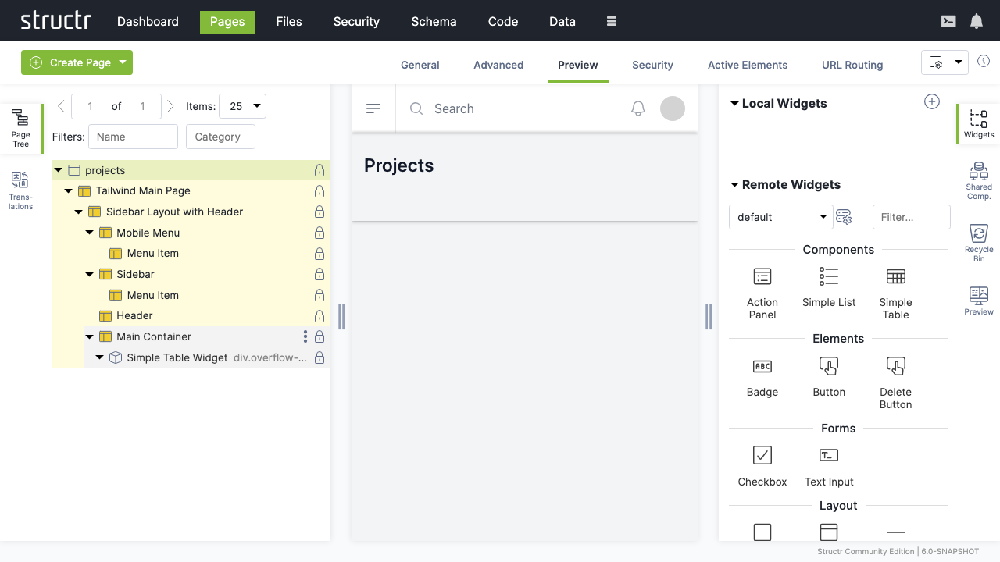
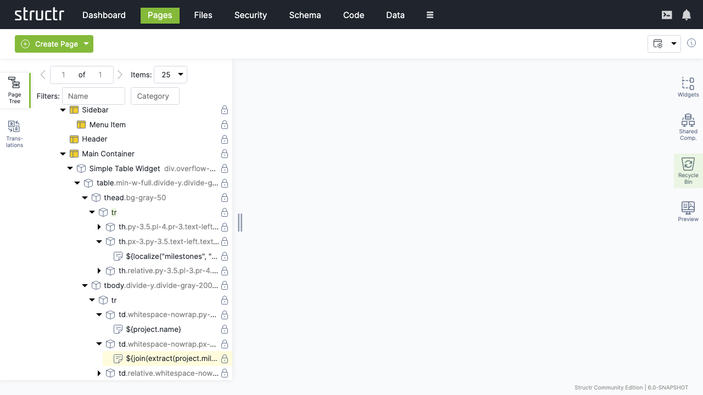
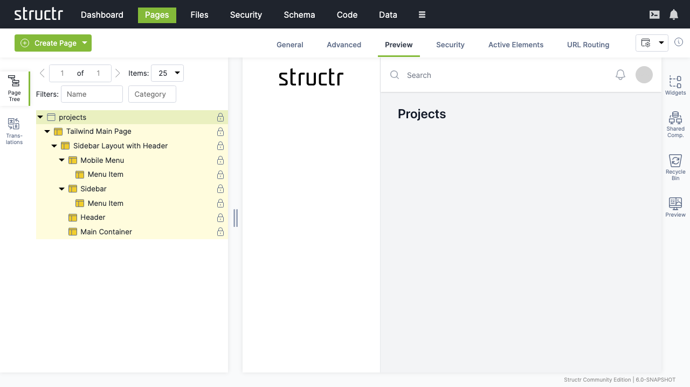

# Pages

The Pages section is Structr's integrated development environment (IDE) for creating web-based applications. It provides a visual, drag-and-drop interface for building responsive web pages, managing content, and creating dynamic user interfaces.

## Overview

The Pages area combines the power of a traditional web IDE with the simplicity of visual page builders. It allows developers and content creators to build everything from simple static pages to complex, data-driven web applications without extensive coding knowledge.



## Key Features

### Visual Page Builder
- Drag-and-drop interface for adding HTML elements
- Real-time preview and editing
- Responsive design tools
- Component-based development

### Template System
- Reusable page templates
- Dynamic content integration
- StructrScript templating language
- JavaScript integration

### Content Management
- In-line content editing
- Media asset management (see [Files](4-Files.md))
- Multi-language support (see [Localization](12-Localization.md))

## Page Creation Workflow

### 1. Creating a New Page

Start by creating a new page using the page creation dialog.



**Page creation options:**
- **Page name**: Unique identifier for the page
- **URL path**: (Optional) URL for the page, default URL path is the name of the page
- **Template**: Choose from existing templates or start blank
- **Visibility**: Set public/private access permissions

### 2. Page Structure

Once created, you can see the page structure in the tree view and begin building your content.



**Page components:**
- **HTML structure**: Standard HTML5 document structure
- **Head section**: Meta tags, CSS, and JavaScript includes
- **Body content**: Visual content and layout elements
- **Navigation**: Menu and link structures

### 3. Adding Content Elements

Use the visual editor to add and configure content elements. You can add element using the right-click menu.



**Available elements:**
- **HTML element**: Any HTML5 element
- **Text content**: Content, template or comment nodes

### 4. Content Tables and Data Display

Create dynamic tables and data displays that connect to your schema.



**Table features:**
- **Data binding**: Define repeaters to connect to schema types and queries
- **Formatting**: Custom cell formatting and styling by using template expressions like `${...}`

### 5. Dynamic Content with Expressions

Use StructrScript or JavaScript expressions to create dynamic, data-driven content.



**Expression capabilities:**
- **Data access**: Retrieve and display database content
- **Calculations**: Perform mathematical operations
- **Conditional logic**: Show/hide content based on conditions
- **User context**: Access current user and session information
- **Date/time**: Format and manipulate dates and times

### 6. Live Preview

Test your pages with the built-in preview functionality.



**Preview features:**
- **Real-time rendering**: See changes immediately
- **Responsive testing**: Test different screen sizes
- **Interactive testing**: Test forms and user interactions
- **Debug mode**: Identify and resolve issues

## Advanced Features

### StructrScript Integration
Embed dynamic functionality using StructrScript:

```javascript
// Display current user name
${me.name}

// Conditional content
${if(me.isAdmin, 'Admin Panel', 'User Dashboard')}
```

### Shared Components

Create reusable components for common functionality, e.g.:

- Navigation menus
- Contact forms
- Image galleries
- Social media widgets

You can create Shared Components by dragging existing elements from the page tree to the top of the shared components area on the right-hand side. 

## Page Security and Permissions

### Access Control
- Public/private page settings
- User-based access restrictions
- Group/role-based permissions

### Content Security
- CORS settings (see [Security](5-Security.md))
- CSRF prevention
- Input validation using lifecycle methods

## Best Practices

### Page Organization
- Use meaningful page names and URLs
- Organize pages in logical hierarchies
- Implement consistent navigation
- Maintain clear page structures

### Content Strategy
- Plan content structure before building
- Use templates for consistent layouts
- Optimize images for web delivery
- Write SEO-friendly content

### Performance
- Minimize HTTP requests
- Optimize database queries
- Use appropriate caching strategies
- Test on various devices and connections

### Security
- Validate all user inputs
- Implement proper access controls
- Use HTTPS for sensitive content
- Regular security audits

## Troubleshooting

### Common Issues

**Page Not Loading**
- Check page permissions and visibility settings
- Verify URL configuration
- Review server logs for errors
- Test with different user accounts

**Dynamic Content Not Displaying**
- Verify database connections
- Check StructrScript syntax
- Review data permissions
- Test queries in the Data section

**Performance Issues**
- Optimize database queries
- Enable appropriate caching
- Compress large images
- Minimize HTTP requests

## Next Steps

After mastering the Pages section:
1. Learn advanced [Schema](6-Schema.md) design for better data integration
2. Explore [Files](4-Files.md) management for media assets
3. Understand [Security](5-Security.md) for user access control
4. Review [Data](8-Data.md) management for content creation

The Pages section is where your Structr applications come to life, providing the tools to create engaging, dynamic web experiences that seamlessly integrate with your data model and business logic.
