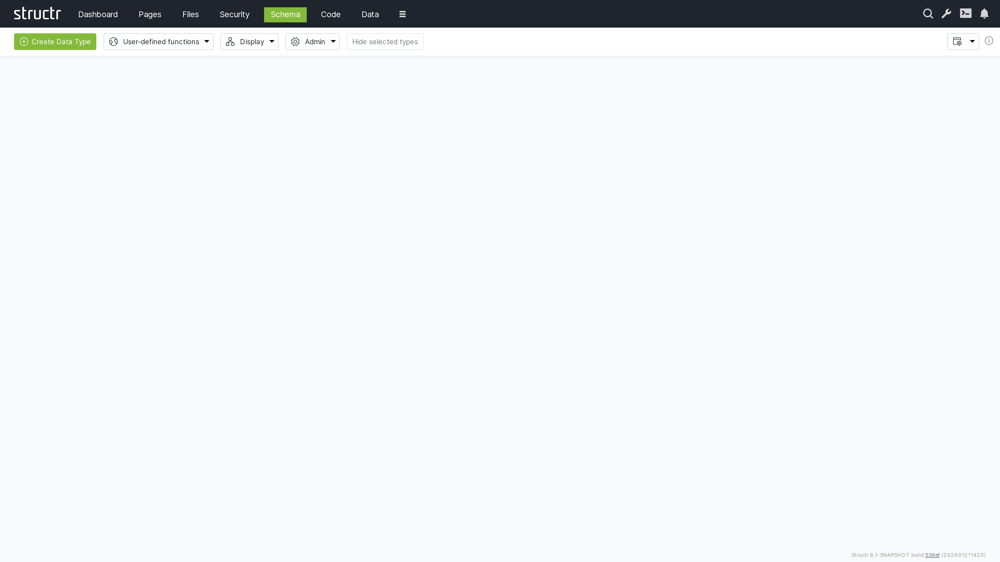
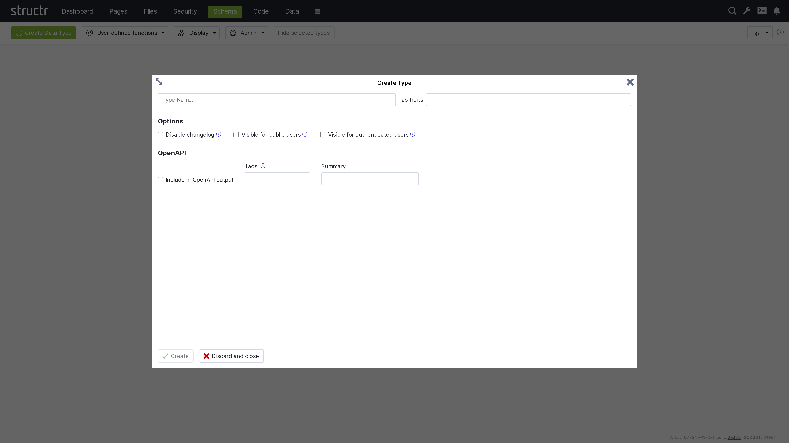
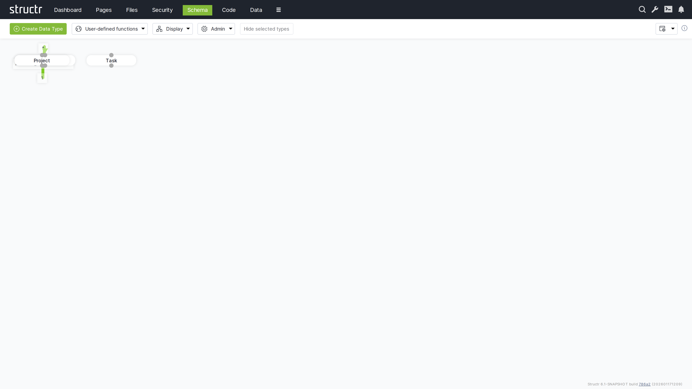
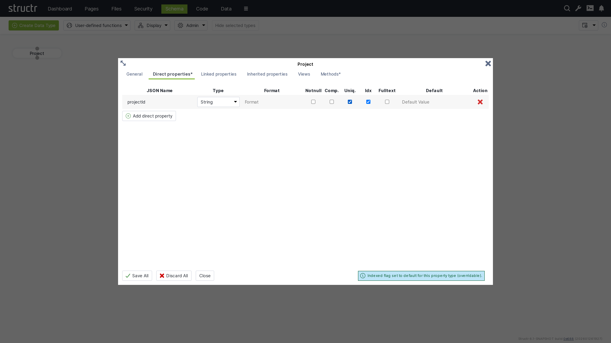
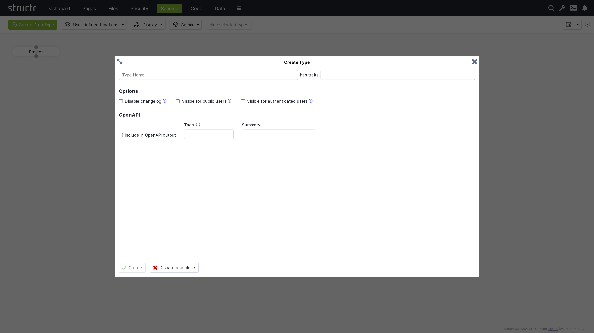
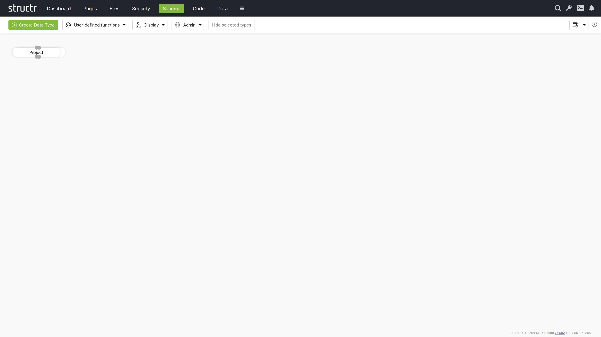
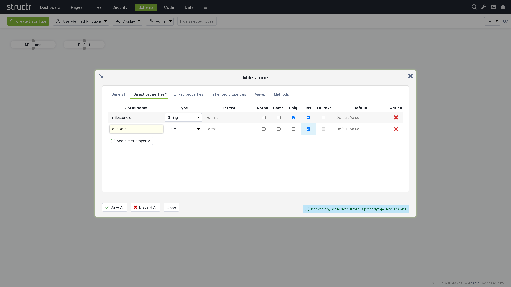
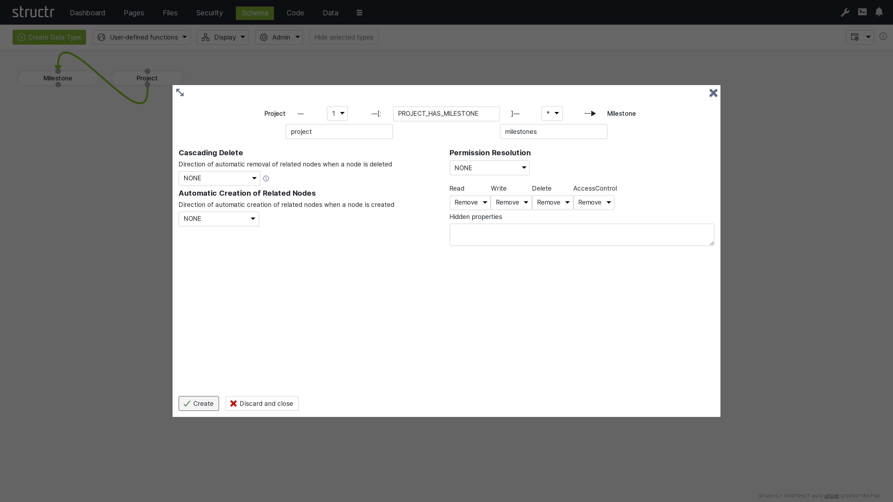

# Schema

The Schema section is the heart of Structr's data modeling capabilities, providing a visual, UML-like interface for designing custom data types, defining relationships, and managing your application's data structure. It combines the power of graph database modeling with an intuitive graphical interface.

## Overview

The Schema editor allows you to create sophisticated data models using a drag-and-drop interface. It automatically generates the underlying database schema, REST API endpoints, and provides the foundation for all data operations in your Structr application.



## Key Features

### Visual Schema Design

- UML-like graphical interface
- Drag-and-drop type creation
- Visual relationship modeling
- Real-time schema validation

### Automatic Code Generation

- Database schema generation
- REST API endpoint creation
- JavaScript object models
- Validation rule implementation

### Advanced Type System

- Multiple type inheritance and polymorphism
- Custom property types
- Function properties
- Schema methods and business logic

## Creating Schema Types

### Basic Type Creation

Start by creating a new schema type to represent your data entities.



### Type Properties

Once a type is created, you can see it in the schema designer and begin adding properties.



**Core type configuration:**

- **Name**: Unique identifier for the type
- **Traits**: Inherit properties and method from existing types
- **OpenAPI**: Documentation and purpose

### Adding Properties

Add properties to define the data structure of your types.



**Property configuration:**

- **Property name**: Unique identifier within the type
- **Data type**: String, Integer, Date, Boolean, etc.
- **Constraints**: Required, unique, format validation
- **Default values**: Initial property values
- **Indexing**: Database index configuration

### Complex Type Example

Create more sophisticated types like the Milestone type with date properties.



**Advanced property types:**

- **Date/Time**: Timestamps and scheduling
- **Relationships**: Connections to other types
- **Collections**: Arrays and lists
- **Computed**: Calculated properties
- **Binary**: File and media attachments



### Date Properties

Add time-based properties for scheduling and tracking.



**Date property features:**

- **Date formats**: Various date and time formats
- **Timezone handling**: Automatic timezone conversion
- **Validation**: Date range and format validation
- **Indexing**: Optimized date-based queries

## Relationships

### Creating Relationships

Define connections between your schema types to model complex data structures.

Just drag a connection from the bottom dot to the top dot of another schema node.



**Relationship configuration:**

- **Source type**: The originating entity
- **Target type**: The destination entity
- **Relationship type**: Descriptive identifier
- **Source and target property name**: How connected nodes of the other type are addressed
- **Cardinality**: One-to-one, one-to-many, many-to-one, many-to-many
- **Cascade behavior**: Deletion and permission propagation

**Relationship types:**

- **One-to-One**: Single connection between entities
- **One-to-Many**: Single source connected to multiple targets
- **Many-to-Many**: Multiple connections in both directions
- **Self-referencing**: Relationships within the same type, e.g. use parent/child relationships to define a tree structure 

### Relationship Properties

Relationships can have custom properties to store connection-specific data, e.g.:

**Relationship properties:**

- **Timestamps**: When the relationship was created/modified
- **Weights**: Numerical relationship strength
- **Status**: Relationship state information
- **Metadata**: Additional relationship context

### Navigation Properties

Relationships automatically create navigation properties:

**Automatic properties:**

- **Outgoing relationships**: Properties pointing to related objects
- **Incoming relationships**: Back-references from related objects
- **Collection properties**: Lists of related objects
- **Count properties**: Number of related objects

## Data Types

### Built-in Types

Structr provides comprehensive built-in data types:

**Primitive types:**

- **String**: Text data with length constraints
- **Integer**: Whole numbers with range validation
- **Long**: Large integer values
- **Double**: Floating-point numbers
- **Boolean**: True/false values
- **Date**: Date and time values

**Advanced types:**

- **Enum**: Predefined value lists
- **Function**: Computed properties with custom logic
- **Cypher**: Dynamic graph database queries
- **String[]**: Arrays of text values
- **Integer[]**: Arrays of numbers
- **Date[]**: Arrays of dates

### Custom Property Types

Create specialized property types for specific use cases:

**Custom implementations:**

- **Validation logic**: Custom data validation rules
- **Transformation**: Data format conversion
- **Indexing**: Specialized search capabilities
- **Security**: Property-level access control

### Property Constraints

Define validation and business rules using regular expressions, e.g.:

**Constraint types:**

- **Required**: Mandatory property values
- **Unique**: Prevent duplicate values
- **Range**: Minimum and maximum values
- **Format**: Regular expression validation
- **Length**: String length restrictions

## Schema Methods

### Business Logic Implementation

Add custom methods to schema types for business logic:

**Method types:**

- **Instance methods**: Operate on individual objects
- **Static methods**: Class-level operations
- **Validation methods**: Custom validation logic
- **Transformation methods**: Data processing
- **Lifecycle methods**: Object creation/update/deletion hooks


### Function Properties

Create properties that calculate values dynamically, e.g.:

**Function property examples:**

- **Full names**: Concatenate first and last names
- **Age calculations**: Calculate age from birth date
- **Status derivations**: Derive status from other properties
- **Aggregations**: Sum, count, or average related objects

## Advanced Schema Features

### Inheritance

Implement type inheritance for code reuse and polymorphism:

**Inheritance benefits:**

- **Property inheritance**: Child types inherit parent properties
- **Method inheritance**: Shared behavior across type hierarchies
- **Polymorphic queries**: Query parent types to get all children
- **Interface implementation**: Define contracts for type behavior

**Inheritance example:**
```
Person (abstract)
├── Employee
│   ├── Manager
│   └── Developer
└── Customer
    ├── PremiumCustomer
    └── RegularCustomer
```

### Mixins and Traits

Implement reusable property sets, e.g.:

**Common mixins:**

- **Timestamped**: Created/modified timestamps
- **Versioned**: Version tracking and history
- **Tagged**: Tag-based categorization
- **Audited**: Change tracking and logging
- **Localized**: Multi-language support

### Schema Validation
 
Schema integrity and consistency is automatically ensured by Structr.

**Validation checks:**

- **Circular dependencies**: Infinite relationship loops are prevented
- **Naming conflicts**: Unique type and property names are ensured
- **Type compatibility**: Relationship endpoints are always compatibel
- **Constraint conflicts**: Contradictory rules are prevented

## Schema Security

### Schema-based Access Control

Define access control based on the schema

**Security features:**

- **Group-based type permissions**: Control access based on the combination of type and groups
- **Relationship-propagating permissions**: Access control via relationship definitions


## Best Practices

### Schema Design

- **Start simple**: Begin with core entities and basic relationships
- **Iterative refinement**: Evolve schema based on requirements
- **Consistent naming**: Use clear, descriptive names
- **Documentation**: Document types, properties, and relationships

### Performance

- **Strategic indexing**: Index queried properties
- **Relationship optimization**: Design efficient traversal paths
- **Property selection**: Include only necessary properties
- **Batch operations**: Optimize bulk data operations

### Security

- **Least privilege**: Grant minimal necessary access
- **Property-level control**: Secure sensitive fields by using views and endpoint permissions
- **Regular reviews**: Periodic security assessments

### Maintenance

- **Version control**: Track schema changes via exported Schema JSON
- **Testing**: Validate schema changes thoroughly
- **Documentation**: Keep schema documentation current

## Integration with Other Sections

### Pages Integration

- **Dynamic content**: Display schema-based data
- **Data binding**: Connect pages to schema types via repeater queries
- **Forms**: Generate forms from schema definitions by using schema info
- **Validation**: Use schema constraints in forms

### Data Management

- **Object creation**: Create instances of schema types
- **Relationship management**: Manage object connections
- **Queries**: Search and filter schema-based data
- **Import/export**: Bulk data operations

### API Generation

For each schema type, Structr automatically creates an API endpoint.

- **REST endpoints**: Automatic API generation
- **Validation**: API requests are validated based on schema rules
- **Documentation**: Auto-generated API docs in OpenAPI 3.0 format

## Troubleshooting

### Common Issues

**Schema Validation Errors**

- Check for wrong relationship directions
- Verify unique naming across types and properties
- Validate relationship endpoint names
- Review constraint definitions

**Performance Problems**

- Analyze query patterns and add appropriate indexes
- Review relationship cardinalities and traversal patterns
- Optimize property selection in queries

**Import/Export Issues**

- Verify schema compatibility between environments
- Check for naming conflicts with existing types
- Test import process in staging environment

## Next Steps

After mastering the Schema section:

1. Create data objects in the [Data](4-Data.md) management section
2. Build pages that display your schema data in [Pages](5-Pages.md)
3. Configure appropriate [Security](6-Security.md) permissions
4. Monitor schema performance through the [Dashboard](2-Dashboard.md)

The Schema section provides the foundation for all data operations in Structr. A well-designed schema enables efficient data management, powerful APIs, and flexible application development.
