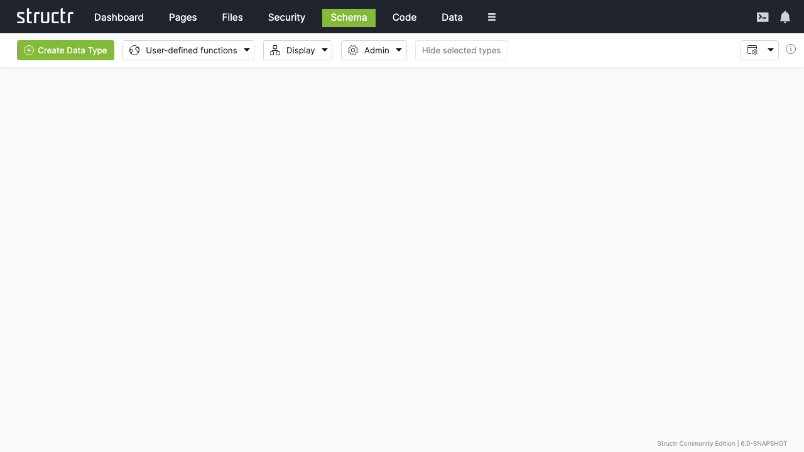

# Schema

The Schema area is where you design your data model. Types appear as boxes on a canvas, relationships as lines connecting them. You can drag types around to arrange them, click to edit, and draw connections between types to create relationships. It's a visual approach to data modeling that makes it easy to see your application's structure at a glance.

## The Canvas

The main area displays your data model as a graph. Each type appears as a box showing the type name, with a pencil icon to edit and a delete icon to remove it. Connection points at the top and bottom of each box let you create relationships by dragging from one type to another.

### Relationship Colors

Relationship lines are color-coded: green for normal relationships, orange for relationships that propagate permissions. This visual distinction helps you understand your security model at a glance.

### Schema and Data Are Loosely Coupled

One important thing to understand: the schema and your data are loosely coupled. If you delete a type, the data objects of that type remain in the database. You can recreate the type later and the data will still be there. This flexibility is powerful but means you need to manage data cleanup separately from schema changes.

### Editing Types and Relationships

To edit a type, click the pencil icon. To edit a relationship, click on the connecting line. Both open editor dialogs described in the Data Model chapter.

## Working with the Schema

The secondary menu above the canvas provides tools for managing your schema.

### Create Type

The green Create Type button on the left opens the Create Type dialog. See the Data Model chapter for details on type configuration.

### User Defined Functions

Opens a list of global functions. This is a legacy location – the same functions are more conveniently accessible in the Code area.

### Display Menu

The Display menu controls how the schema looks.

#### Type Visibility

Opens a dialog where you choose which types appear on the canvas. Types are grouped into categories – Custom Types, User/Group Types, File Types, HTML Types, Flow Types, Schema Types, and Other Types. This is essential for focusing on the part of the schema you're working with, especially in larger applications.

#### Display Options

Toggles relationship labels and trait inheritance arrows on and off.

#### Edge Style

Changes how relationship lines are drawn – flowchart, bezier, state machine, or straight. Choose whatever makes your schema most readable.

#### Saved Layouts

Lets you export, share, and import arrangements of types on the canvas. If you've spent time organizing a complex schema visually, you can save that layout and restore it later or share it with teammates.

#### Reset Layout and Reset Zoom

Restore default positioning.

#### Apply Automatic Layout

An experimental feature that arranges types automatically.

## Administration Tools

The Admin menu provides database maintenance functions.

### Indexing – Nodes

Tools for managing database indexes. Rebuild Index recreates indexes for all or selected node types – necessary after adding indexed properties to existing data. Add UUIDs and Create Labels help when importing data from an external Neo4j database.

### Indexing – Relationships

Provides the same tools for relationship indexes.

### Rebuild All Indexes

Triggers a complete rebuild of every index, useful when you suspect index corruption or after major data changes.

### Maintenance

Flush Caches clears internal caches (rarely needed nowadays). Clear Schema removes all custom types and relationships – use with extreme caution, as it erases your entire data model.

## Settings

On the right side of the menu bar, you'll find configuration options specific to the Schema area. These are the same settings available on the Dashboard, filtered to show only what's relevant here.
