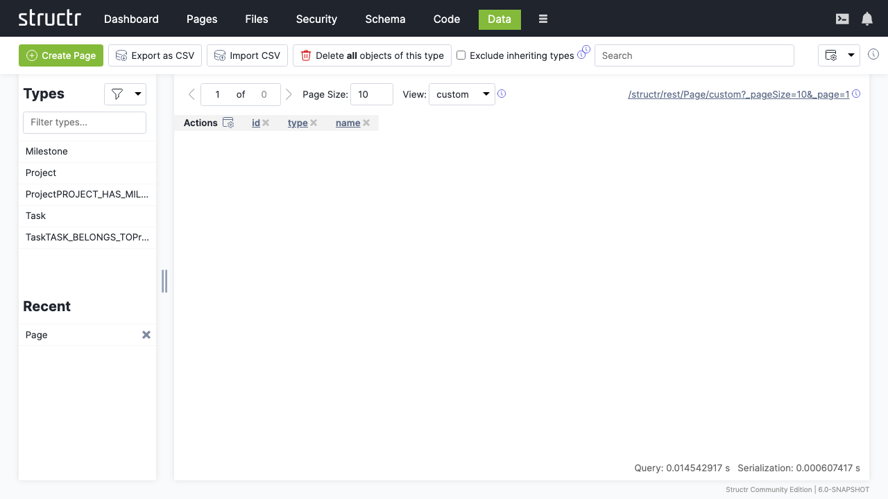

# Data

The Data area is where you work with the actual objects in your database. It's a generic interface that works with any type – select a type from the list, see all its instances in a table, and edit values directly. For quick data fixes, bulk reviews, or just exploring what's in your database, this is the place.

## Browsing Your Data

The left sidebar shows a list of all your custom types. Click one to see its instances in a paginated table on the right.

### Type Filter

A filter button above the list lets you expand what's shown – you can include Custom Relationship Types, Built-In Relationship Types, HTML Types, Flow Types, and Other Types. Most of the time you'll just work with custom types, but the other categories are there when you need them.

### Recently Used Types

Below the type list, Recently Used Types provides quick access to types you've worked with recently.

## The Data Table

When you select a type, the main area shows all objects of that type in a table. Each row is an object, each column is a property. System properties like `id` and `type` are read-only, but you can edit other properties directly in the table cells.

### Pagination and Views

Above the table, pager controls let you navigate through large datasets. You can set the page size and choose which view to display – views control which properties appear as columns.

### Navigating Related Objects

Properties that reference other objects are clickable. Click one to open a dialog showing the related object, where you can view and edit it. From that dialog, you can navigate further to other related objects, traversing your entire data graph without leaving the Data area.

### Creating Relationships

For relationship properties (properties representing one side of a relationship), you'll see a plus button in the table cell. Click it to open a search dialog limited to the target type. Select an object to create the relationship. The dialog respects cardinality – for one-to-one or many-to-one relationships, selecting a new object replaces any existing one.

## Creating and Deleting Objects

### Create Button

The Create button in the header creates a new object of the currently selected type. The button label changes to reflect which type you're working with.

### Delete All

Delete All Objects of This Type does what it says – use with caution. A checkbox lets you restrict deletion to exactly this type; otherwise, objects of derived types are also deleted.

## Import and Export

### Export as CSV

Downloads the current table view as a CSV file – useful for quick data extraction or sharing with tools that understand spreadsheets.

### Import CSV

Opens the Simple CSV Import dialog for bringing data into Structr. See the Importing Data chapter for details on the import process.

## Search

The search box in the header searches across your entire database, not just the currently selected type. Results are grouped by type, making it easy to find objects when you're not sure where they are. Click the small "x" at the end of the search field to clear the search and return to the normal type-based view.

## The REST Endpoint Link

In the top right corner of the content area, you'll find a link to the REST endpoint for the current type. This opens the HTML REST View – a special feature of Structr.

### HTML REST View

When you access a REST URL with a browser, Structr detects the `text/html` content type and returns a formatted HTML page instead of raw JSON. Objects appear with collapsible JSON structures you can expand and navigate. A status bar at the top lets you switch between views.

This makes it easy to explore your data and debug API responses directly in the browser, without needing external tools like Postman or curl.
