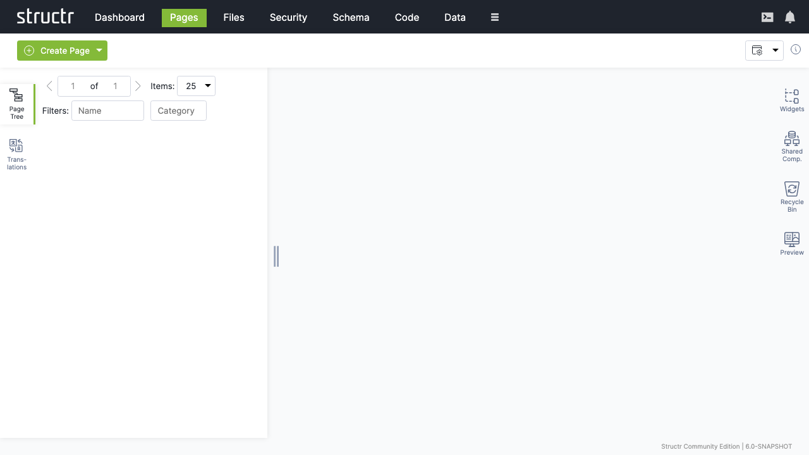

# Pages

The Pages area is where you build your application's user interface. It's a visual editor that combines a page tree, property panels, and live preview in one workspace. You'll spend a lot of time here – designing layouts, wiring up data bindings, configuring interactions, and previewing the results.

## The Workspace

The screen is divided into three parts: a left sidebar with the page tree and localization tools, a main area showing properties and preview, and a right sidebar with widgets, shared components, the recycle bin, and preview panel. All sidebars are collapsible, so you can expand your workspace when you need more room.

## Left Sidebar

### The Page Tree

The left sidebar's Pages panel shows all your pages as expandable trees. Each page reveals its structure when expanded: HTML elements, templates, content nodes, and their nesting relationships.

#### Element Icons

Different element types have different icons. Page elements show a window icon. HTML elements show a box – or a colored box (red, green, yellow) when configured as repeaters. Template elements show an application icon. Content elements show a document icon and can't be expanded because they can't have children.

#### Visibility Indicators

A lock icon on the right of each element indicates visibility settings. No icon means the element is visible to both public and authenticated users. A lock with a key means only one visibility flag is enabled.

#### Interaction

Click any element to select it and see its properties in the main area. Right-click (or hover and click the menu icon) to open the context menu. Drag elements to reorder them or move them between parents.

### Localization

The Localization panel in the left sidebar manages translations for the current page. Select a page, enter a language code, and click refresh to see all `localize()` calls used in that page. You can create, edit, and delete translations directly here.

## Right Sidebar

### Widgets

The Widgets panel contains reusable page fragments – from simple HTML snippets to complete configurable components. Drag a widget onto your page tree to insert it. If the widget has configuration options, a dialog appears where you fill in values before insertion.

#### Suggested Widgets

Widgets can also appear as suggestions in the context menu when their selector matches the element you've right-clicked. This speeds up common patterns – right-click a table and see table-related widgets offered automatically.

#### Local and Remote Widgets

The panel shows both local widgets (stored in your database) and remote widgets (fetched from configured servers). Click the plus button to create new local widgets.

### Shared Components

Shared components are different from widgets. When you insert a widget, Structr copies its content into your page. When you insert a shared component, Structr creates a reference to the original. Edit the shared component, and every page using it updates automatically.

Create a shared component by dragging an element from the page tree into the Shared Components panel. Headers, footers, and navigation menus are ideal candidates – anything that should look and behave the same across multiple pages.

### Recycle Bin

When you delete an element from a page, it goes to the recycle bin rather than disappearing forever. Drag elements back into the page tree to restore them. This safety net is especially valuable when restructuring complex pages.

Note that pages themselves aren't soft-deleted – when you delete a page, only its child elements go to the recycle bin.

### Preview

The Preview panel shows your page as users will see it. You can keep the preview visible while working with other tabs in the main area, watching your changes take effect in real time.

## Editing Elements

When you select an element in the page tree, the main area shows its properties organized in tabs. The available tabs depend on the element type.

### General Tab

Contains basic settings: name, CSS classes, HTML ID, inline styles. For repeaters, you'll find the Function Query and Data Key fields here. Show and Hide Conditions control whether the element appears in the output.

### HTML Tab

Available for HTML elements. Manages HTML-specific attributes – both global attributes and tag-specific ones. Click "Show all attributes" to reveal event handlers like `onclick`. Add custom attributes with the plus button.

### Editor Tab

Available for templates and content elements. Provides a Monaco-based code editor with syntax highlighting and autocompletion. The content type selector at the bottom controls processing – Markdown and AsciiDoc convert to HTML, while plaintext, XML, and JSON output directly.

### Repeater Tab

Configures data-driven rendering. Select a source (Flow, Cypher Query, or Function Query), define the data key, and the element renders once for each object in the result.

### Events Tab

Sets up Event Action Mappings – what happens when users interact with the element. Select a DOM event, choose an action, configure parameters, and define follow-up behaviors.

### Security Tab

Shows access control settings: owner, visibility flags, and individual permissions.

### Advanced Tab

Provides a raw view of all attributes in an editable table – useful for properties not exposed elsewhere.

### Preview Tab

Shows the rendered page. Hover over elements to highlight them in both the preview and tree. Click to select for editing.

### Active Elements Tab

Gives you an overview of key components: templates, repeaters, and elements with event action mappings. Click any item to jump to its location in the tree.

### URL Routing Tab

Available for pages. Configures additional URL paths with typed parameters. See the Navigation & Routing chapter for details.

## The Context Menu

Right-click any element to open the context menu. What you see depends on the element type, but common options include:

### Insert Options

Let you add new elements as children or siblings. Suggested Widgets appear when widgets match the current element's selector. Suggested Elements offer common children for the current tag – `<tr>` for tables, `<li>` for lists.

### Edit Options

Include Clone (copy and insert after), Wrap Element In (wrap with a new parent), Replace Element With (swap while keeping children), and Convert to Shared Component.

### Select/Deselect

Marks elements for move or clone operations. Once selected, you can right-click elsewhere and choose "Clone Selected Element Here" or "Move Selected Element Here."

### Remove Node

Sends the element to the recycle bin.

## Creating Pages

The Create Page button in the secondary menu offers two options:

### Create

Opens a dialog with templates based on Tailwind CSS – from empty pages to complex layouts with sidebars and navigation. Templates are actually widgets with the "Is Page Template" flag enabled.

### Import

Lets you create pages from HTML source code or by fetching from an external URL. This is how you bring existing designs into Structr and make them dynamic.

## Learning More

The Pages area is deeply connected to other parts of the documentation:

- Pages & Templates – explains how to build page structures, work with templates, and create widgets and shared components
- Dynamic Content – covers data binding, template expressions, and repeaters
- Event Action Mapping – details how to handle user interactions
- Navigation & Routing – describes URL configuration and the `current` keyword
- Security – explains visibility flags and access control
