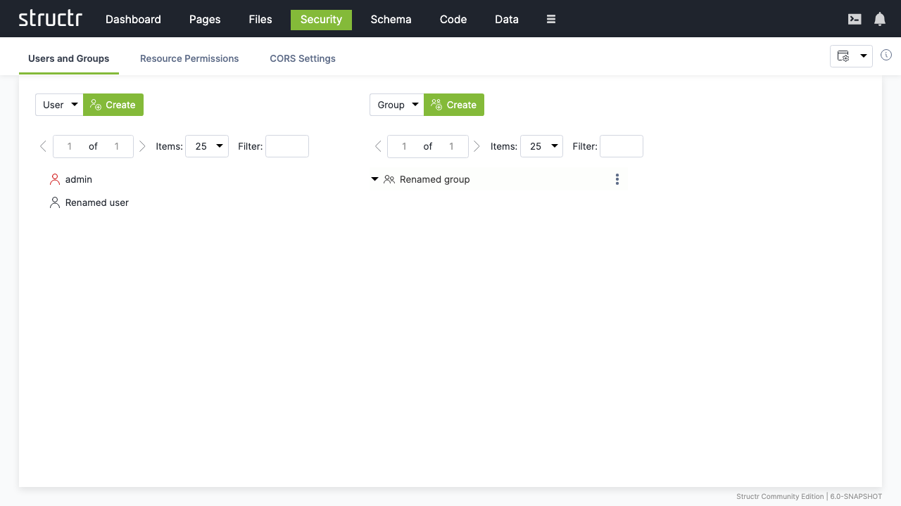

# Security

The Security section provides comprehensive user management, authentication, authorization, and access control capabilities for your Structr application. It enables administrators to create secure, multi-user environments with granular permission controls.

## Overview

Security in Structr is built on a flexible, role-based access control system that allows you to create sophisticated permission structures while maintaining ease of use. The Security section provides tools for managing users, groups, roles, and permissions across all aspects of your application.
