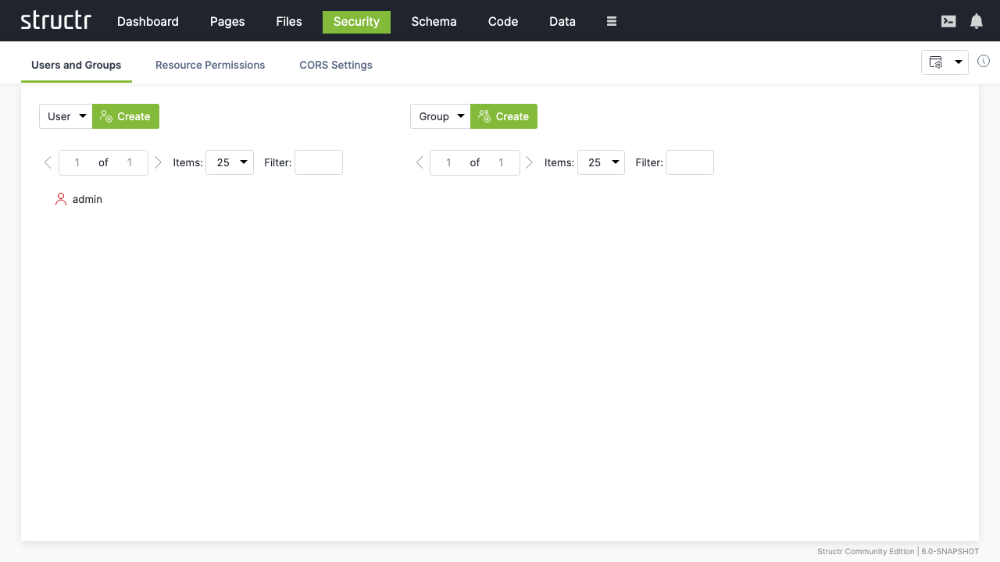

# Security

The Security area handles three related but distinct concerns: managing who can use your application (users and groups), controlling what they can access via the API (resource access), and configuring cross-origin requests (CORS). Each has its own tab.

## Users and Groups

The first tab shows two lists side by side: users on the left, groups on the right. Both are paginated and filterable, which matters when you have hundreds of users.

### Creating Users and Groups

Click the Create button above either list to add a new user or group. If you've extended the User or Group types – by creating subclasses or adding the User trait to another type – a dropdown appears next to the button letting you choose which type to create.

### Organizing Your Security Model

Drag users onto groups to make them members. Drag groups onto other groups to create hierarchies. This flexibility lets you model complex organizational structures: departments containing teams, teams containing members, with permissions flowing down through the hierarchy.

### Editing Users

Click a user to edit the name inline. For more options, hover over the user and click the menu icon to open the context menu.

#### General Dialog

Lets you edit essential user properties: name, password, email address. Three flags control special behaviors:

- Is Admin User – grants full access, bypassing all permission checks
- Skip Security Relationships – optimizes performance for users who don't need fine-grained permissions
- Enable Two-Factor Authentication – adds an extra security layer for this user

You'll also find the Failed Login Attempts counter (useful for diagnosing lockouts) and the Confirmation Key (used during self-registration).

#### Advanced Dialog

Shows all user attributes in a raw table format.

#### Security Dialog

Opens the access control dialog for the user object itself.

#### Delete User

Removes the account.

See the User Management chapter for detailed explanations of these settings.

### Editing Groups

Groups are simpler – they have names and members, but fewer special properties. Click to edit the name inline, or use the context menu to access the Advanced dialog (all attributes), Security dialog (access control for the group object), or Delete Group.

## Resource Access

The second tab controls which REST endpoints are accessible and to whom. This is where you open up your API to the world – or lock it down.

### How Resource Access Works

Each row in the table represents a grant: a signature (URL pattern) combined with permissions for authenticated and non-authenticated users. The signature identifies which endpoints the grant applies to. Permissions are checkboxes for each HTTP method: GET, POST, PUT, DELETE, OPTIONS, HEAD, and PATCH.

For example, a grant with signature `Project` and GET enabled for non-authenticated users means anyone can read projects via the REST API. Add POST for authenticated users, and logged-in users can create projects too.

### Creating Grants

Enter a signature in the input field next to the Create button and click Create. The signature syntax is documented in the Security chapter of Building Applications – it's powerful but takes some learning.

### Per-User and Per-Group Grants

Here's a subtle but powerful feature: Resource Access grants are themselves objects with access control. Click the lock icon at the end of any row to open the access control dialog for that grant.

This means you can create multiple grants for the same signature, each visible to different users or groups. One grant might allow read-only access for regular users, while another allows full access for administrators. Each user sees only the grants that apply to them.

### Visibility Options

The Settings menu on the right side of the tab bar includes options for showing visibility flags and bitmask columns in the table. The bitmask is a numeric representation of the permission flags – useful for debugging but usually hidden.

## CORS

The third tab configures Cross-Origin Resource Sharing – the mechanism browsers use to decide whether JavaScript from one domain can make requests to another.

### Why CORS Matters

When your frontend runs on a different domain than your Structr backend (common during development, or with single-page applications), browsers block requests by default. CORS headers tell browsers which cross-origin requests to allow.

### Configuring CORS

Each row configures CORS for one URL path. Enter a path in the input field, click Create, then fill in the columns:

#### Accepted Origins

Specifies which domains can make requests. Use `*` to allow any origin, or list specific domains like `https://example.com`. This becomes the `Access-Control-Allow-Origin` header.

#### Max Age

Tells browsers how long to cache the CORS preflight response, in seconds. Higher values reduce preflight requests but delay the effect of configuration changes.

#### Allow Methods

Lists which HTTP methods are permitted: `GET, POST, PUT, DELETE`, etc.

#### Allow Headers

Specifies which request headers clients can send: `Content-Type, Authorization`, etc.

#### Allow Credentials

Controls whether browsers include cookies and HTTP authentication with cross-origin requests.

#### Expose Headers

Determines which response headers JavaScript can access. By default, only a few headers are exposed; list additional ones here.

The delete button is in the second column – easy to miss but important when cleaning up test configurations.

See the Security chapter in Building Applications for more details on CORS configuration patterns.
