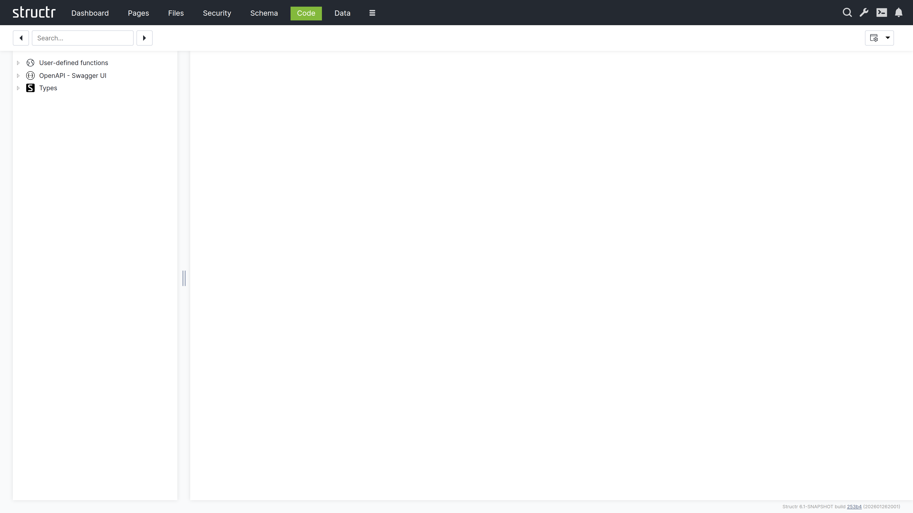

# Code

The Code section provides a comprehensive development environment for creating custom methods, scripts, and advanced functionality within Structr. It serves as an integrated development environment (IDE) for implementing business logic, data processing, and custom behaviors.

## Overview

The Code section enables developers to extend Structr's capabilities through custom Java-like methods, StructrScript functions, and JavaScript implementations. It provides syntax highlighting, code completion, debugging tools, and integrated testing capabilities.



## Key Features

### Integrated Development Environment

- Syntax highlighting for multiple languages
- Auto-completion
- Integrated debugging tools

### Multiple Language Support

- Javascript
- StructrScript expressions

## Method Types

### Schema Methods

Implement custom behavior for schema types:

**Instance Methods**

Methods that operate on individual object instances.

**Static Methods**

Class-level operations that don't require an instance.

### User-defined Methods

System-wide utility functions available throughout the application:

**Utility Functions**

Common operations and calculations.

**Integration Methods**

Connect with external systems and APIs.

### Lifecycle Methods

Methods that execute automatically during object lifecycle events, e.g. onCreate, afterSave, afterDelete.

## StructrScript Integration

### Expression Syntax

Use StructrScript for dynamic content and logic:

**Data Access**

```javascript
// Access current object properties
${this.name}
${this.project.title}
${size(this.milestones)}

// User context
${me.name}
${me.groups}

// Date formatting
${date(this.dueDate, 'yyyy-MM-dd')}
```

**Conditional Logic**

```javascript
// Simple conditions
${if(this.isOverdue, 'OVERDUE', 'ON_TRACK')}

// Complex conditions
${if(and(this.status == 'ACTIVE', lt(this.dueDate, now())), 
    'Project is overdue!', 
    'Project is on track')}
```

### Built-in Functions

Leverage Structr's extensive function library:

**Data Manipulation**

```javascript
// Finding and filtering
find('Project', 'status', 'ACTIVE')
filter(find('Task'), equal(data.assignee, me))
sort(this.projects, 'dueDate')

// Aggregation
add(this.expenses, 2.5)
mult(this.ratings, data.score)
count(filter(this.tasks, eq(data.status, 'COMPLETED')))
```

**String Operations**

```javascript
// Text processing
concat(this.firstName, ' ', this.lastName)
upper(this.status)
replace(this.description, 'old', 'new')
substring(this.title, 0, 50)
```

**Date Operations**

```javascript
// Date calculations
date_format(now(), 'yyyy-MM-dd HH:mm:ss')
```

## Best Practices

### Code Organization

- **Modular design**: Break complex logic into smaller methods
- **Clear naming**: Use descriptive method and variable names
- **Documentation**: Comment complex logic and business rules
- **Consistent style**: Follow coding conventions

### Performance

- **Efficient queries**: Minimize database operations
- **Caching**: Cache expensive calculations
- **Batch operations**: Group multiple operations when possible
- **Resource management**: Properly handle connections and resources

### Security

- **Input validation**: Validate all input parameters
- **Access control**: Check permissions before operations
- **Error handling**: Don't expose sensitive information in errors
- **Logging**: Log security-relevant events

### Maintainability

- **Version control**: Track code changes
- **Testing**: Write comprehensive tests
- **Documentation**: Maintain current documentation
- **Refactoring**: Regularly improve code quality

## Troubleshooting

### Common Issues

**Compilation Errors**

- Check syntax and method signatures
- Verify import statements and dependencies
- Validate parameter types and return values
- Review scope and visibility modifiers

**Runtime Errors**

- Add proper error handling and logging
- Validate input parameters and data
- Check for null pointer exceptions
- Verify database connectivity and permissions

**Performance Issues**

- Profile slow methods and queries
- Optimize database operations
- Implement appropriate caching
- Review algorithm complexity

### Debugging Techniques

**Logging Strategy**

- Use appropriate log levels
- Include relevant context information
- Avoid logging sensitive data
- Monitor log output for patterns

**Testing Approach**

- Write unit tests for individual methods
- Test edge cases and error conditions
- Use integration tests for complex workflows
- Automate testing where possible

## Next Steps

After mastering the Code section:

1. Implement custom logic for your [Schema](3-Schema.md) types
2. Create dynamic behavior for [Pages](5-Pages.md)
3. Integrate with [Data](4-Data.md) management operations
4. Monitor code performance through the [Dashboard](2-Dashboard.md)

The Code section empowers you to extend Structr's capabilities and implement sophisticated business logic tailored to your specific requirements. Well-written custom code enhances application functionality while maintaining performance and security standards.
