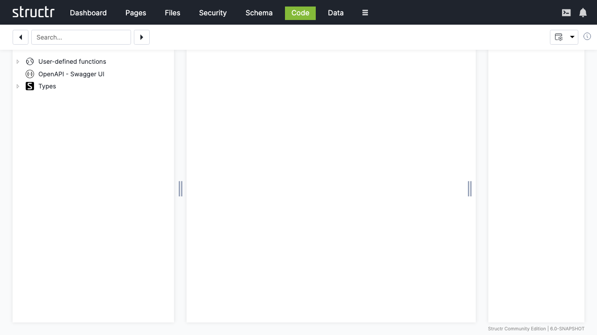

# Code

The Code area is where you write and organize your application's business logic. While the Schema area gives you a visual overview of types and relationships, the Code area focuses on what those types *do* – their methods, computed properties, and API configuration.

## Working with the Code Area

The screen is divided into a navigation tree on the left and a context-sensitive editor on the right. The tree organizes your code by type: expand a type to see its properties, views, and methods. Click any item to edit it.

Most of your time here will be spent in the method editor. When you click on a method, the editor expands to fill the screen, giving you a full-featured coding environment with syntax highlighting, autocompletion, and integrated documentation.

The Code area also provides access to user-defined functions (global utilities available throughout your application) and service classes (containers for business logic that doesn't belong to a specific type). You'll find the OpenAPI output here too, which is useful for verifying how your methods appear to API consumers.

## The Navigation Tree

The tree contains three main sections:

### User Defined Functions

Shows global functions in a table format – the same view available in the Schema area. These functions are callable from anywhere in your application.

### OpenAPI

Displays your application's API specification. Use this to verify endpoints, check parameter definitions, and copy documentation for external consumers.

### Types

Lists all your custom types and service classes. Expand a type to see its contents:

- Direct Properties – properties defined on this type
- Linked Properties – properties from relationships
- Views – property sets for different contexts (API responses, UI display)
- Methods – the business logic attached to this type
- Inherited Properties – properties from parent types or traits

This structure mirrors what you see in the Schema type editor, but organized for code navigation rather than visual modeling.

### Services

A special category under Types. Service classes can only contain methods, not properties. They're useful for grouping related business logic that doesn't belong to a specific data type – report generators, external integrations, utility functions.

## The Method Editor

Click any method to open a full-screen editor. This is where the real work happens.

### Writing Code

The editor is based on Monaco (the same engine as VS Code), with syntax highlighting for JavaScript and StructrScript, autocompletion, and all the features you'd expect from a modern code editor.

At the bottom of the screen, a settings dropdown lets you configure the editor to your preferences: word wrap, indentation style, tab size, code folding, and more.

### Method Configuration

Above the editor, several options control how the method behaves:

#### Method is static

Means the method can be called without an object instance – it's a class-level function rather than an instance method.

#### Not callable via HTTP

Hides the method from the REST API. Use this for internal utilities that shouldn't be exposed.

#### Wrap JavaScript in main

Wraps your code in a main function, which affects scoping and is sometimes needed for compatibility.

#### Return result object only

Strips metadata from the response, returning just the result.

#### HTTP verb dropdown

Specifies which HTTP method triggers this function when called via REST API – GET for read operations, POST for creating things, PUT for updates, DELETE for removals.

### Testing Your Code

For static methods, a Run Dialog button appears in the action bar (alongside Save, Revert, and Delete). Click it to open a testing interface where you can enter parameters and execute the method immediately. The return value displays in the dialog, making it easy to test and debug without leaving the editor.

### API Tab

Lets you define typed parameters for your method. Structr validates incoming requests against these definitions before your code runs – catching type mismatches and missing required parameters automatically. This also generates accurate OpenAPI documentation.

### Usage Tab

Shows how to call this method from different contexts: JavaScript, StructrScript, and REST API. These examples use your actual method name and parameters, so you can copy them directly into your code.

## Searching Your Code

The search field in the secondary menu searches across all code in your application – schema methods, user-defined functions, and service classes. This is invaluable when you need to find where something is defined or used.

Note that the search doesn't include page content. For that, use the Pages area.

## Two Views, One Model

The Code area and Schema area are two perspectives on the same underlying data. Changes you make in one immediately appear in the other.

Use the Schema area when you're thinking about structure – what types exist, how they relate to each other, what properties they have. Use the Code area when you're thinking about behavior – what methods do, how they're implemented, how they're called.

Many developers keep both open in different tabs, switching based on the task at hand.
