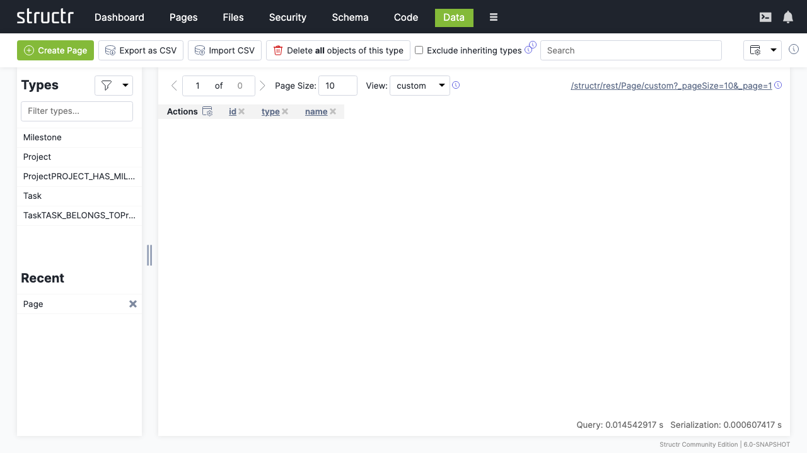
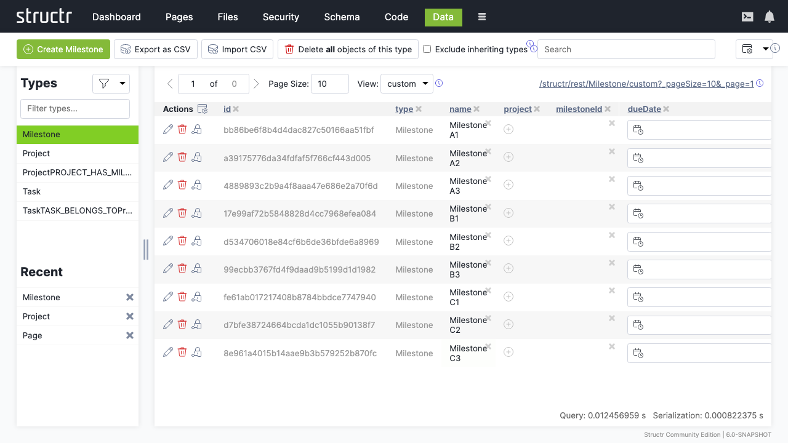

# Data

The Data section provides comprehensive management of database objects and their relationships, offering powerful tools for creating, viewing, editing, and organizing your application's data. It serves as the primary interface for working with instances of your schema types.

## Overview

The Data section combines the power of a graph database with an intuitive interface for data management. It allows you to work with individual objects, manage relationships, perform bulk operations, and maintain data integrity across your entire application.

## Key Features

### Object Management
- Create, read, update, and delete operations (CRUD)
- Bulk data operations and transformations
- Real-time data validation and integrity checks
- Advanced search and filtering capabilities

## Object Creation and Management

### Creating Objects

Create new instances of your schema types with proper validation.

**Object creation process:**
1. **Type selection**: Choose the schema type to instantiate
2. **Property values**: Set initial property values
3. **Validation**: Automatic validation against schema constraints
4. **Relationships**: Establish connections to related objects

**Creation methods:**
- **Manual creation**: Individual object creation through the UI
- **Bulk creation**: Create multiple objects simultaneously
- **Import creation**: Create objects from external data sources
- **API creation**: Programmatic object creation via REST API

### Object Properties

**Property management:**
- **Direct editing**: In-line property value editing
- **Type validation**: Automatic validation based on property type
- **Constraint checking**: Enforcement of schema constraints
- **Default values**: Automatic application of default values

## Data Browsing and Navigation

### Object Browser

Navigate through your data using the hierarchical object browser:

**Navigation features:**
- **Type-based browsing**: View objects organized by type
- **Relationship traversal**: Follow connections between objects
- **Search integration**: Find objects quickly by property values
- **Filtering**: Display only objects meeting specific criteria

**View options:**
- **List view**: Tabular display with sortable columns
- **Graph view**: Visual relationship network (see [Graph](9-Graph.md))
- **Detail view**: Comprehensive object information

### Search and Filtering

**Advanced search capabilities:**
- **Property-based search**: Find objects by specific property values
- **Full-text search**: Search across all text properties

### Sorting and Pagination

**Sorting options:**
- **Property-based sorting**: Sort by any object property

**Pagination features:**
- **Configurable page sizes**: Adjust objects per page
- **Quick navigation**: Jump to specific pages
- **Performance optimization**: Efficient loading of large datasets
- **Lazy loading**: Load data as needed

### Referential Integrity

The referential integrity is ensured by Structr.

**Relationship integrity:**
- **Orphan prevention**: Prevent creation of invalid references
- **Cascade operations**: Automatic cleanup of related data can be defined in the schema
- **Constraint enforcement**: Cardinality restrictions are always respeceted
- **Circular reference detection**: Prevent infinite loops

**Data consistency:**
- **Transaction support**: Atomic operations for data consistency
- **Rollback capability**: Inconsistent operations are rolled back automatically
- **Conflict resolution**: Concurrent data modifications are handled automatically
- **Audit trails**: Audit log to track all data changes for accountability available

## Security and Access Control

### Data Security

**Access control:**
- **Object-level permissions**: Control access to individual objects
- **Property-level security**: Restrict access to specific properties by defining schema views
- **Relationship security**: Control relationship traversal by defining schema-based permissions (see [Security](5-Security.md))
- **Dynamic permissions**: Context-based access control based on custom code (see [Code](7-Code.md))

**Data protection:**
- **Encryption**: Protect sensitive data at rest and in transit, e.g. by using Encrypted String as data type in the schema
- **Anonymization**: Remove or mask personal information, e.g. by using Funciton Properties
- **Audit logging**: Track all data access and modifications
- **Backup security**: Secure data backup and recovery by using the data deployment feature (see [Dashboard](2-Dashboard.md))

## Integration with Other Sections

### Pages Integration
- **Data binding**: Display data objects in web pages
- **Form integration**: Create and edit objects through web forms
- **Dynamic content**: Generate content from data objects
- **User interaction**: Enable user data manipulation through pages

### API Integration
- **REST endpoints**: Access data through automatically generated APIs
- **CRUD operations**: Perform data operations via API calls
- **Query API**: Execute complex queries through API endpoints
- **Bulk operations**: Perform mass operations via API

## Troubleshooting

### Common Issues

**Data Validation Errors**
- Review schema constraints and validation rules
- Check property types and format requirements
- Verify required field completion
- Validate relationship constraints

**Performance Problems**
- Analyze query patterns and add appropriate indexes
- Review large dataset handling and pagination
- Optimize relationship traversals
- Monitor resource usage and caching effectiveness

**Import/Export Issues**
- Verify file formats and data structure compatibility
- Check field mapping and data transformation rules
- Validate data quality before import
- Review error logs for specific failure details

## Next Steps

After mastering the Data section:
1. Design effective [Schema](6-Schema.md) structures for your data
2. Create [Pages](2-Pages.md) that display and interact with your data
3. Implement [Security](5-Security.md) controls for data protection
4. Monitor data operations through the [Dashboard](1-Dashboard.md)

The Data section is where your application's information comes to life, providing the tools to create, manage, and maintain the data that powers your Structr application. Effective data management ensures application performance, data integrity, and user satisfaction.
