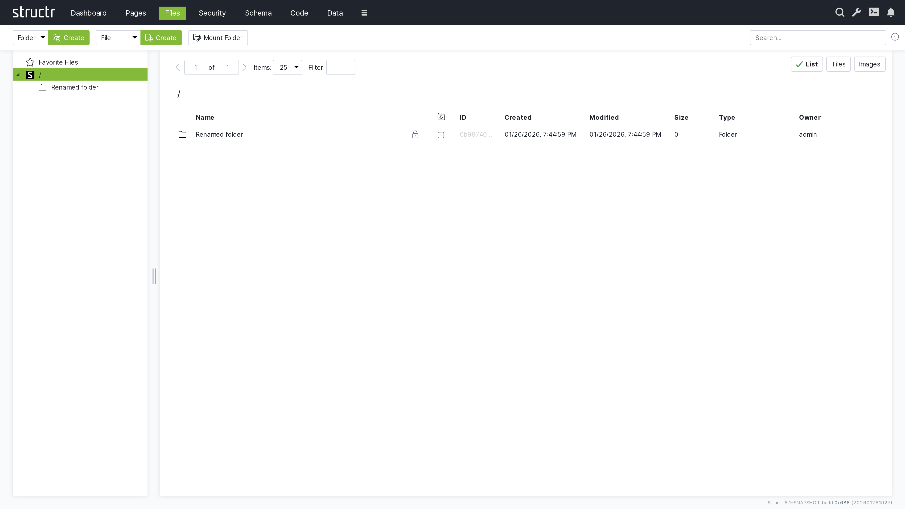

# Files



The Files section provides comprehensive management of Structr's virtual file system, offering powerful tools for organizing, uploading, editing, and transforming various types of digital assets. It serves as the central hub for all file-related operations in your Structr application.

## Overview

The Files area combines traditional file management capabilities with advanced features like image transformation, video transcoding, and content search. It provides a familiar file explorer interface while offering web-based editing and processing capabilities.

## Key Features

### Virtual File System
- Hierarchical directory structure
- Web-based file explorer interface
- Drag-and-drop file operations
- Bulk file management tools

### File Upload and Management
- Single and multiple file uploads
- Progress tracking for large uploads
- File versioning and history
- Metadata management

### Advanced Processing
- Image transformation and resizing
- Video transcoding and optimization
- Document conversion
- Content indexing and search

## File System Structure

### Directory Management

Create and organize directories to structure your file system:

**Directory operations:**
- **Create folders**: Organize files in logical hierarchies
- **Rename directories**: Update folder names and structure
- **Move directories**: Reorganize file system layout
- **Delete directories**: Remove unused folders (with safety checks)

**Best practices for directory structure:**
```
/assets/
  /images/
    /products/
    /banners/
    /icons/
  /videos/
  /documents/
    /legal/
    /manuals/
  /scripts/
  /styles/
```

### File Operations

Standard file management operations with web-based convenience:

**Basic operations:**
- **Upload**: Single files or batch uploads with progress tracking by drag'n drop
- **Download**: Individual files or compressed archives
- **Copy**: Duplicate files within the system
- **Move**: Relocate files between directories by drag'n drop
- **Rename**: Update file names and extensions
- **Delete**: Remove files with confirmation dialogs

**Advanced operations:**
- **File properties**: View and edit metadata
- **Permission management**: Control access and visibility
- **Version control**: Track file changes and revisions
- **Link management**: Create and manage file references

## File Types and Support

### Text Files
- **Formats**: All text formats are supported, e.g. TXT, MD, HTML, CSS, JS, JSON, XML, CSV
- **Features**: Syntax highlighting, auto-completion, line numbering
- **Editing**: Real-time collaborative editing
- **Validation**: Format validation and error checking

### Images
- **Formats**: All image types are supported, e.g. JPEG, PNG, GIF, SVG, WebP, TIFF, BMP
- **Transformations**: Resize, crop, rotate, flip
- **Optimization**: Compression and format conversion
- **Metadata**: EXIF data viewing and editing

### Videos
- **Formats**: All video formats are supported, e.g. MP4, AVI, MOV, WMV, FLV, WebM
- **Transcoding**: Format conversion and optimization
- **Thumbnails**: Automatic preview generation
- **Streaming**: Optimized delivery options

### Documents
- **Formats**: E.g. PDF, DOC/DOCX, XLS/XLSX, PPT/PPTX
- **Preview**: Built-in document viewers
- **Conversion**: Format transformation capabilities
- **Text extraction**: Content indexing for search

### Code Files
- **Languages**: E.g. JavaScript, CSS, HTML, JSON, XML, SQL
- **Syntax highlighting**: Language-specific formatting
- **Code completion**: Intelligent suggestions
- **Error detection**: Real-time syntax validation

## Image Transformation

### Automatic Transformations
Configure automatic image processing for uploaded images:

**Resize operations:**
- **Thumbnail generation**: Automatic creation of preview images
- **Multiple sizes**: Generate various dimensions for responsive design
- **Aspect ratio preservation**: Maintain image proportions
- **Quality optimization**: Balance file size and image quality

**Format conversion:**
- **WebP conversion**: Modern format for better compression
- **Progressive JPEG**: Improved loading experience
- **PNG optimization**: Lossless compression
- **Format selection**: Choose optimal format based on content

### Manual Transformations
Perform on-demand image editing:

**Basic editing:**
- **Crop**: Select specific image areas
- **Resize**: Adjust dimensions with various algorithms
- **Rotate**: 90-degree rotations and custom angles
- **Flip**: Horizontal and vertical mirroring

## Video Transcoding

### Automatic Processing
Configure video processing pipelines:

**Format optimization:**
- **Web-optimized formats**: MP4, WebM for browser compatibility
- **Resolution scaling**: Generate multiple quality versions
- **Compression**: Balance quality and file size
- **Progressive loading**: Enable streaming capabilities

**Thumbnail generation:**
- **Multiple thumbnails**: Various time points in the video
- **Custom timing**: Specify exact frames for thumbnails
- **Animated previews**: GIF generation from video clips
- **Poster frames**: High-quality still images

### Manual Processing
On-demand video operations:

**Conversion options:**
- **Format selection**: Choose target video formats
- **Quality settings**: Adjust bitrate and resolution
- **Audio processing**: Extract or modify audio tracks
- **Trimming**: Cut video segments

## Content Search

### Full-Text Search
Search within file contents across all supported formats:

**Search capabilities:**
- **Document content**: Search within PDF, Word, and text files
- **Metadata search**: Find files by properties and tags

**Search results:**
- **Relevance ranking**: Score-based result ordering
- **Content preview**: Highlighted search terms in context

### Indexing
Automatic content indexing for fast searching:

**Indexed content:**
- **Text files**: Full content indexing
- **Documents**: Extracted text from PDFs and Office files
- **Images**: EXIF data and embedded text
- **Metadata**: File properties and custom tags

## File Permissions and Security

### Access Control
Manage file access with granular permissions:

**Permission levels:**
- **Read**: View and download files
- **Write**: Edit and update file content
- **Delete**: Remove files and directories
- **Admin**: Full control including permission management

**Permission inheritance:**
- **Directory permissions**: Apply to contained files
- **Role-based access**: Assign permissions to user groups
- **User-specific access**: Individual user permissions
- **Public access**: Anonymous user access control

## Integration with Pages

### File Linking
Connect files to your web pages:

**Direct linking:**
- **Static assets**: CSS, JavaScript, and image files
- **Download links**: Documents and media files
- **Embedded content**: Videos and interactive media
- **Dynamic galleries**: Automated image collections

**Content management:**
- **Media libraries**: Organized asset collections
- **File browsers**: User-friendly file selection
- **Upload widgets**: In-page file upload functionality
- **Preview components**: File preview and thumbnails

## Best Practices

### File Organization
- **Logical structure**: Create intuitive directory hierarchies
- **Naming conventions**: Use consistent, descriptive file names
- **File categorization**: Group related files together
- **Regular cleanup**: Remove obsolete and unused files

### Performance
- **Image optimization**: Compress images for web delivery
- **Format selection**: Choose appropriate file formats
- **Bulk operations**: Use batch processing for efficiency
- **Monitor storage**: Track disk usage and growth

### Security
- **Access reviews**: Regularly audit file permissions
- **Upload restrictions**: Limit file types and sizes
- **Backup strategy**: Implement regular file backups
- **Security updates**: Keep file processing libraries updated

## Troubleshooting

### Common Issues

**Upload Failures**
- Check file size limits and server configuration
- Verify file type restrictions
- Ensure sufficient disk space
- Review upload permissions

**Processing Errors**
- Verify file format compatibility
- Check server resources (memory, CPU)
- Review error logs for specific issues
- Test with smaller files

**Access Problems**
- Review file and directory permissions
- Check user roles and group memberships
- Verify authentication status
- Test with administrative accounts

## Next Steps

After mastering the Files section:
1. Learn how to integrate files with [Pages](5-Pages.md)
2. Understand [Security](6-Security.md) for proper access control
3. Explore [Schema](3-Schema.md) for file metadata management
4. Review [Dashboard](2-Dashboard.md) for system monitoring

The Files section provides the foundation for managing all digital assets in your Structr application, enabling rich media experiences and efficient content workflows.
