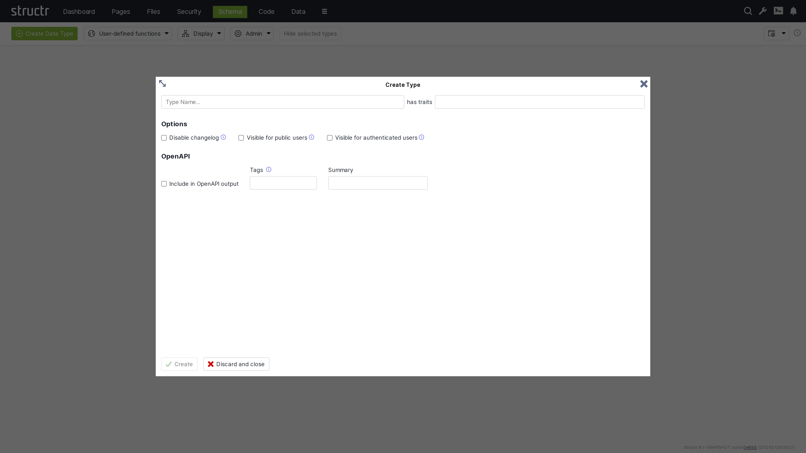
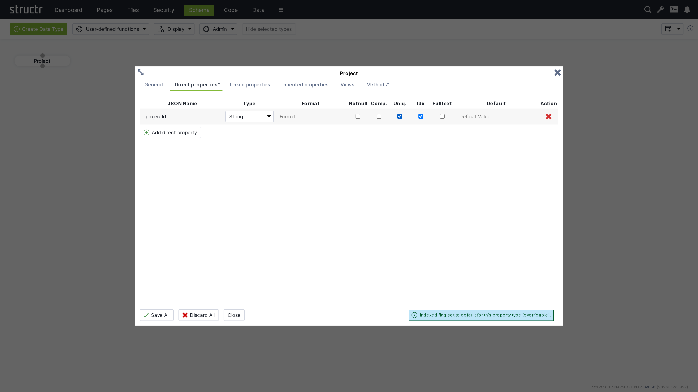
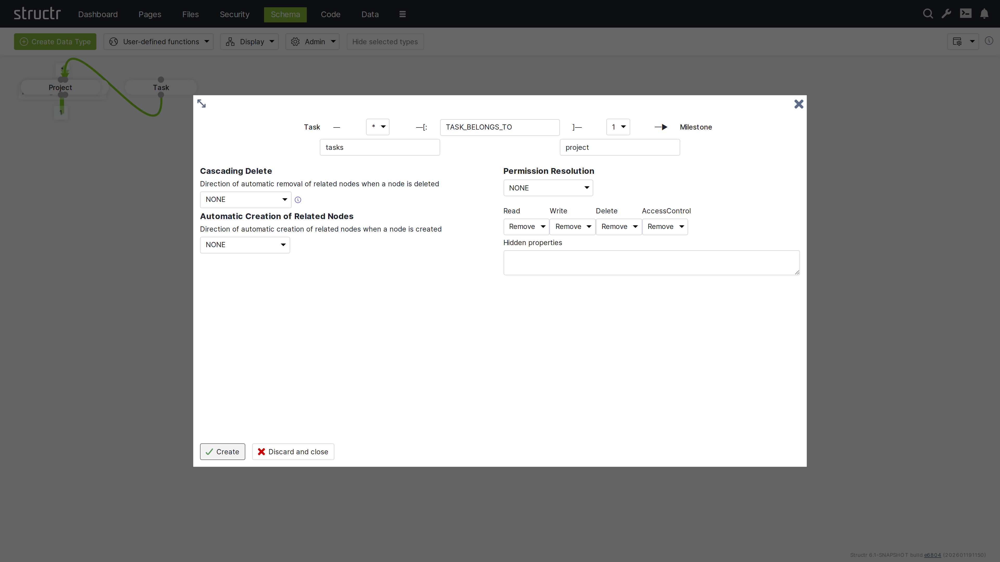

The process of creating a Structr application usually begins with the data model. This chapter focuses on the various steps required to create the data model and serves as a guide to help you navigate the multitude of possibilities.

## A Primer on Data Modeling
The schema should mirror the attributes and relationships that objects have in the real world as closely as possible. A few basic rules help you determine whether an object should be modeled as a node, a relationship, or a property.

### When to Use Nodes?
Most things that you would use a *noun* to describe should be modeled as nodes.

- real-world objects like people, companies, documents, products
- abstract objects that are distinct entities with a unique identity and one or more attributes
- properties that several objects can have in common, like an address or a category
- collections of property values (the items of a list, etc.)
- relationships between **more than two** objects (hyper-relationships)

### When to Use Properties?
Most things that you would use an *adjective* to describe should be modeled as a properties.

- single values like an ID, a name, a color, etc.
- time or date values (if you are not using a time tree index)

### When to Use Relationships?
Most things that you would use a verb to describe should be modeled as relationships.

- relationships between objects that are not based on a single property
- actions or activities
- facts

## Creating a Basic Type
To create a new type, click the green "Create Data Type" button in the top left corner of the [Schema](/structr/docs/ontology/Admin%20User%20Interface/Schema) area.

#### Name & Traits
When you create a new data type, you will first be asked to enter a name for the new type and, if desired, select one or more traits. You can choose from a list of built-in traits to take advantage of functionality provided by Structr.

#### Changelog
The Disable Changelog checkbox allows you to exclude this type from the changelog - if the changelog is activated in the Structr settings.

[Read more about the Changelog.](/structr/docs/ontology/Operations/Auditing)

#### Default Visibility
The two visibility checkboxes allow you to automatically make all instances of the new type public or visible to logged-in users. This is useful, for example, if the data is used in the application, such as the topics in a forum.

#### OpenAPI
The OpenAPI settings allow you to include the new types in the automatically generated OpenAPI description provided by Structr at `/structr/openapi`.

All types for which you activate the "Include in OpenAPI output" checkbox and enter the same tag will be provided together with the standard endpoints for login, logout, etc. at `/structr/openapi/<tag>.json`.

[Read more about OpenAPI.](/structr/docs/ontology/APIs%20&%20Integrations/OpenAPI)

### Other Ways to Create Types in the Schema
Like all other parts of the application, the schema definition itself is stored in the database, so you can also create new types by adding objects of type `SchemaNode` with the name of the desired type in the `name` attribute, and you can also do this from a script or method using the `create()` function.

## Extending a Type
When you click Create in the Create Type dialog, the new type is created and the dialog switches to an Edit Type dialog. You can also open the Edit Type dialog by hovering over a type node and clicking the pencil icon.

The dialog consists of six tabs that configure type properties or display type information.

### General
The General tab is similar to the Create Type dialog and provides configuration options for name, traits, changelog and visibility checkboxes, and a Permissions table. The Permissions table allows you to grant specific groups access rights to all instances of the type.

### Direct Properties

The Direct Properties tab displays a table where you add and edit attributes for the type. Each row represents an attribute with the following configuration options.

##### JSON Name & DB Name¹
JSON Name specifies the attribute name used to access the attribute in code, REST APIs, and other interfaces.

<small>¹ There is an additional setting that is hidden by default: DB Name, which allows you to specify a different database name when working with a database schema you don't control. Enable this setting through the "Show database name for direct properties" checkbox in the configuration menu in the upper right corner of the Schema area.</small>

##### Type
Type specifies the attribute's data type. Common types include String for text values, Integer for whole numbers, and Date for timestamps and date values. Additional types are available, including array versions of these primitive data types.

The type controls what values are accepted as input. For example, an integer attribute only accepts numeric input. A date attribute accepts string values in ISO-8601 format or according to a custom date pattern specified in the format column. Structr stores dates as long values with millisecond precision in the database.

[Read more about Property Types.](/structr/docs/ontology/References/Built-in%20properties)

##### Format
The Format field is optional and has different meanings depending on the attribute type.

{{"Value-based schema constraints", list}}

##### Notnull
If you activate the not-null checkbox, the attribute becomes a mandatory attribute for this type, and the creation of objects without a value for this attribute is prevented with a validation error.

Please note that this only applies to newly created objects. If existing objects are modified after this change, the change can only be saved successfully if the mandatory attribute is also set.

##### Comp.
Comp. stands for Compound Uniqueness, which validates uniqueness across multiple attributes. When you activate the compound uniqueness checkbox on multiple attributes, the system ensures their combined values form a unique combination. For example, if you enable composite uniqueness on both firstName and lastName, the system allows multiple people named "John" and multiple people named "Smith", but prevents creating two entries with the same combination of "John Smith".

##### Uniq.
Uniq. stands for Unique, which validates that an attribute's value is unique across all instances of the type. When you activate the uniqueness checkbox on an attribute, the system ensures no two instances have the same value for that attribute. For example, if you enable uniqueness on an email attribute, the system prevents creating two User instances with the same e-mail address.

##### Idx
Idx. stands for Indexed. When you activate the indexed checkbox on an attribute, the system creates a database index that improves query performance for that attribute. Indexing also speeds up uniqueness validation - not having an index on a unique property will massively impact object creation performance.

##### Fulltext
Fulltext stands for fulltext indexing. When you activate the fulltext checkbox on a string attribute, the system creates a fulltext index with advanced search capabilities and scoring.

You can query fulltext indexed attributes by passing the index name to the `searchFulltext()` function. The index name is automatically generated from the type and attribute name plus the string "fulltext", e.g. `Project_projectId_fulltext`.

##### Default Value
The default value field specifies a value that is returned when an attribute has no value in the database. You can use default values to ensure attributes always return a meaningful value, even for newly created objects or when values have not been set.

### Linked Properties
This section displays special attributes that are automatically created from relationships between types. These are called contextual or linked properties.

### Inherited Properties
This section displays attributes inherited from traits or base classes along with their settings.

### Views
The Views tab allows you to configure views for each type. {{"topic:View", shortDescription}} Structr provides the following four default views.

#### public
The public view is the default view for REST responses when no view is specified in the request. By default, it contains only the attributes id, type, and name, but you can extend or modify it as needed.

#### custom
The custom view is automatically managed and contains all attributes of the type and its base classes or traits that you have added manually.

#### all
The all view is automatically managed by Structr and contains all attributes of the type and its base classes or traits. You cannot modify this view, and it displays only one level of properties while restricting the output of nested objects to id, type, and name. The all view is intended for internal use and diagnostic purposes such as checking object completeness, and its use should generally be avoided in production applications.

#### ui
The ui view is an internal view used by the Structr Admin interface and cannot be modified. Like the all view, it displays only one level of properties and restricts the output of nested objects to id, type, and name.

#### Custom Views
You can create additional views beyond these default views and populate them with any attributes you need. Custom views allow you to tailor the REST output to specific use cases, such as creating a minimal view for list endpoints or a detailed view for single-object requests. You can access each view as its own endpoint by appending the view name to the REST URL of a type.

{{"JSON Nesting Depth", h4, shortDescription}}

### Methods

The Methods tab allows you to define custom methods and lifecycle methods for a type. The tab is divided into two sections: a method list on the left and a code editor on the right.

#### Method List
The left section displays a table of all methods defined on the type, with columns for name, options (three-dot menu), and action buttons. The action buttons let you edit, clone, or delete methods.

Below the table is a dropdown button for creating new methods. You can create either a custom method with a name of your choice, or select one of seven predefined lifecycle methods. When you select a lifecycle method, the system assigns the method name automatically.

The three-dot menu in the options column provides access to method configuration settings:

##### Method is Static
Makes the method static, allowing it to be called on the type itself rather than on instances.

    {
        // call static method on type Project
        $.Project.updateAllProjects();
    }

##### Not Callable via HTTP
Prevents the method from being invoked through the REST API, making it accessible only from within the application.

##### Wrap JavaScript in main()
Controls how JavaScript code is interpreted. When enabled, the system wraps your script in a main() function, which allows you to use the return keyword to return a value. However, this prevents you from using import statements. When disabled, your script is not wrapped in a function and you can use imports. The return value is the last evaluated instruction, similar to a REPL.

##### Return Result Object Only
Controls the response format for HTTP calls to this method. When enabled, the method's return value is sent directly in the response without being wrapped in a result object. This flag only applies to HTTP calls to the method.

This is how the result object of a REST method call.

    {
        "result": [
            {
                "id": "a23f6bbb44a943c9b4ccfae6aae0c0fe",
                "type": "Project",
                "name": "Example Project"
            }
        ],
        "query_time": "0.008530752",
        "result_count": 1,
        "page_count": 1,
        "result_count_time": "0.000132669",
        "serialization_time": "0.000526717"
}

This is the same response with the "Resturn Result Object Only" flag set to `true`.

    {
        "id": "a23f6bbb44a943c9b4ccfae6aae0c0fe",
        "type": "Project",
        "name": "Example Project"
    }

#### Code Editor
The right section provides a code editor with autocompletion and syntax highlighting for editing method source code. You write methods in either StructrScript or JavaScript. To use JavaScript, enclose your code in curly braces `{...}`. Code without curly braces is interpreted as StructrScript.

## Computed Properties

In addition to properties that store primitive values, Structr provides computed properties that execute code when their value is requested. These properties generate values dynamically based on the current state of the object and its relationships, enabling calculated attributes without storing redundant data.

Structr provides two types of computed properties:

### Function Properties
Function Properties contain both a read function and a write function, allowing you to define custom logic for both retrieving and storing values.

#### Read Function
The read function executes when the property value is requested. It can execute StructrScript or JavaScript, perform calculations, call other methods, or aggregate data from related objects. You configure a type hint for function properties to inform the system what type of value the read function returns, which is essential for indexing.

>**Note**: To enable the use of computed properties in database queries, Structr writes the generated values to the database at the end of each transaction and indexes them according to the configured type hint. This operation executes in the security context of the user making the query, hence read functions must return user-independent values that are globally valid.
> 
> If a read function returns different values for different users, the indexed value will reflect whichever user last triggered the calculation. This can cause other users to see incorrect data, as they will query against values calculated for a different user's security context. Additionally, the type hint must accurately reflect the actual return type to ensure proper indexing behavior.

#### Write Function
The write function handles how incoming values are processed and stored when the property is set. Within the write function, you can access the incoming value using the `value` keyword, allowing you to validate, transform, or process the data before storing it.

### Cypher Properties
Cypher properties are read-only computed properties that execute Cypher queries against the graph database. These properties are useful for traversing relationships, aggregating data, or performing complex graph queries. The result of the Cypher query becomes the property's value when accessed.

## Linking Two Types
To create a relationship between two types, click the lower dot on the start type and drag the green connector to the upper dot on the target type. This will open the Create Relationship dialog.

### Using the Create Relationship Dialog

#### Basic Relationship Properties
When you create a relationship, you are asked to configure the source cardinality, the relationship type, and the target cardinality. Below the cardinality selectors, you define the property names that determine how you access the relationship from each type in your code.

##### Cardinality
Select 1 or * from the dropdown for source and target cardinality to define how many objects can connect. Use 1 for single connections and * for multiple connections. For example, if each Project contains multiple Tasks but each Task belongs to one Project, select 1 for the source cardinality (Project side) and * for the target cardinality (Task side).

##### Relationship Type
Enter a name in the center input field that describes the relationship in your database schema. This is typically an action or connection like "OWNS", "MANAGES", or "BELONGS_TO".

>**Note:** Please be as specific as possible and try not to reuse existing relationship types, as this can lead to performance issues later on. For example, do not use “HAS” for everything, as you will then lose the advantage of being able to query different relationship types separately, and all data from the database will have to be filtered via the target type.

##### Property Names
Specify property names in the input fields below each cardinality selector to define the attribute names you use to retrieve related objects from each type. The property name on the Project side (e.g., "tasks") lets you retrieve all tasks for a project, while the property name on the Task side (e.g., "project") lets you access the parent project.

Structr suggests names automatically based on the type names and cardinalities - plural names for *-cardinality and singular names for 1-cardinality. You can change these suggestions to match your domain model.

#### Cascading Delete
The Cascading Delete dropdown controls deletion behavior for related objects. When you delete an object that has relationships to other objects, this setting determines whether those related objects are also deleted and how the deletion propagates through the relationship chain. When resolving cascading deletes, the system evaluates the access rights of each object to ensure that only objects you have permission to delete are affected.

{{"topic:Cascading Delete Options", h5, shortDescription, table}}

#### Automatic Creation of Related Nodes
The dropdown controls the automatic creation of related nodes. This feature allows Structr to function as a document database, transforming JSON documents into graph database structures based on your data model. When you send a JSON document that matches your schema, Structr creates the necessary objects and relationships in the graph database.

You can reference objects in your JSON using stub objects with a unique property such as `name` or any property with a uniqueness constraint. The dropdown controls whether Structr creates the object if it doesn't exist. Within a single document, the first reference to a unique property value creates the object and subsequent references to the same value use the newly created object. The dropdown determines how this automatic creation behavior propagates through nested relationships.

##### Example

    {
        "name": "John Doe",
        "email": "john@example.com",
        "company": {
            "name": "Acme Corp"
        },
        "projects": [
            {
                "name": "Website Redesign",
                "status": "active"
            },
            {
                "name": "Mobile App",
                "status": "planning",
                "company": {
                    "name": "Acme Corp"
                }
            }
        ]
    }

This example shows a person with basic properties, a company referenced by name (stub object), and multiple projects. The second project also references "Acme Corp" - the first reference creates it, and the second reference uses the already-created company object.

{{"topic:Autocreation Options", h5, shortDescription, table}}

[Read more about the REST Interface.](/structr/docs/ontology/REST%20Interface/Overview)

#### Permission Resolution
Permission Resolution controls how access rights propagate between objects through relationships. This lets users access objects indirectly through relationships without needing direct permissions on those objects.

You configure each permission type (read, write, delete, and access control) separately to control which permissions propagate and in which direction. For example, you can allow read access to propagate while restricting write and delete permissions, creating read-only access paths through your data model.

You can hide properties that should not be visible during indirect access—Structr removes these properties from the view. This is useful when you want to grant access to an object but restrict visibility of sensitive attributes like internal IDs or administrative fields.

The schema editor displays relationships with permission resolution in orange instead of green, making it easy to identify which relationships include permission propagation rules.

## Inheritance & Traits
Structr supports multiple inheritance through traits. When you create a type, you select one or more traits that the type inherits from. You can modify the trait selection later when editing the type.

### Order of Inherited Traits
The inheritance order is determined by the order in which you specify the traits.

### Property Inheritance
Inherited properties are automatically visible on subtypes. All properties defined in parent traits become available on the inheriting type. You can override inherited properties by defining a property with the same name, which replaces the inherited property definition. The system detects conflicting properties and prevents their creation.

#### Default Properties
Every node in Structr has at least the following attributes that it inherits from the base trait `AbstractNode`.

| Name | Description | Type |
| --- | --- | --- |
| `id` | The primary identifer of the node, a UUIDv4 | string |
| `type` | The type of the node | string |
| `name` | The name of the node | string |
| `createdDate` | The creation timestamp | date |
| `lastModifiedDate` | The timestamp of the last modification | date |
| `visibleToPublicUsers` | The "public visibility" flag | boolean |
| `visibleToAuthenticatedUsers` | The "authenticated visibility" flag | boolean |

### View Inheritance
Views are inherited from parent traits to child types. All views defined in parent traits become available on the child type. You can override inherited views by defining a view with the same name, which replaces the inherited view definition.

### Method Inheritance
Schema methods are inherited from parent traits to child types. All methods defined in parent traits become available on the child type. You can override inherited methods by defining a method with the same name. Overridden methods are not called automatically—only your override executes.

You can call parent methods from child implementations using the syntax `$.SuperType.methodName()`, where `SuperType` is the name of the parent trait. For example, if your type `Article` inherits from a trait `Content` with a `validate()` method, you call `$.Content.validate()` from your `Article.validate()` method to execute the parent validation before adding your own.

### Lifecycle Method Inheritance
Lifecycle methods follow different inheritance rules than regular methods. All lifecycle methods in the type hierarchy are called automatically, regardless of whether child types override them. This ensures that initialization, validation, and cleanup logic defined in parent traits always executes.

![["Built-in traits" as table on level 2]]

## Transactions

## Indexing

### Passive Indexing
Passive indexing is the term for reading a dynamic value from a property (e.g. Function Property or Boolean Property) at application level, and writing it into the database at the end of each transaction, so the value is visible to Cypher. This is important for BooleanProperty, because its getProperty() method returns false instead of null even if there is no actual value in the database. Hence a Cypher query for this property with the value false would not return any results. Structr resolves this by reading all passively indexed properties of an entity, and writing them into the database at the end of a transaction.

