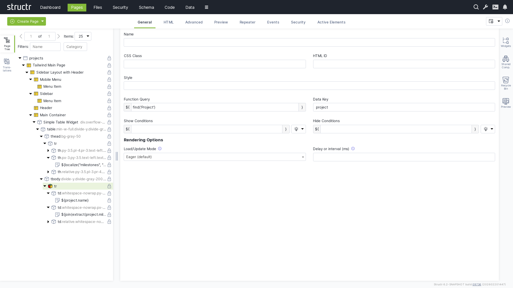
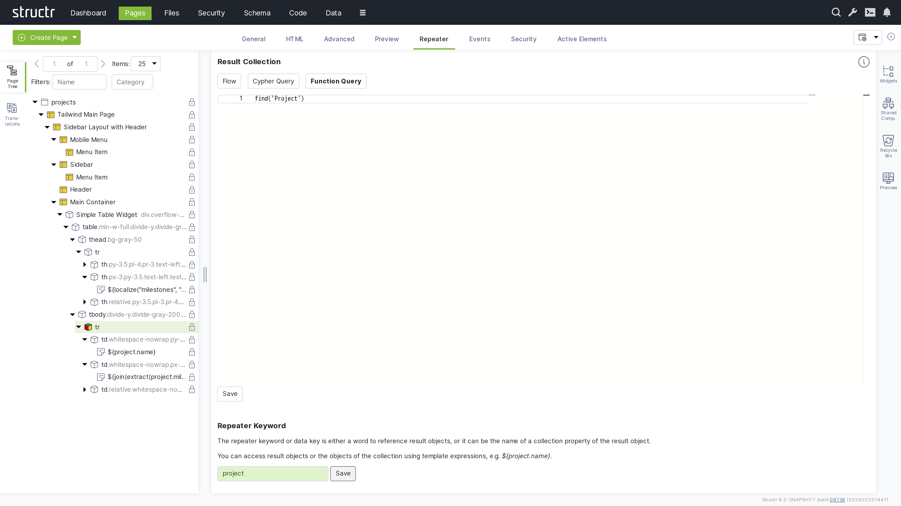
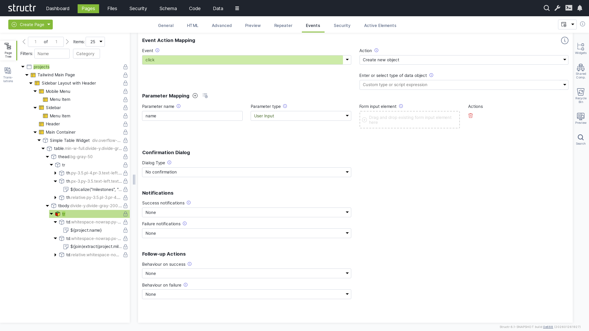

After defining a first version of the data model, the next step is usually to build a user interface. This can be done in the `Pages` area.

## Creating a Page
When you click the green "Create Page" button in the upper left corner of the Pages section, you can choose whether to create a page from a template or import one from a URL.

### Create Page Dialog

#### Templates
When you select "Create Page", you will see a list of templates that are used to create the structure of the new page. Templates are based on the Tailwind CSS framework and range from simple layouts like the Empty Page to more complex structures with sidebars and navigation menus, as well as specialized templates like the Sign-In Page.

When you create a page from a template, you import a pre-built page structure. This can include content, repeaters, permissions, and also shared components for reuse across your site. The Simple Page option, on the other hand, creates a minimal page with only the standard HTML elements `<html>`, `<head>`, and `<body>`.

#### Page Templates Are Widgets
Page templates are widgets with the `isPageTemplate` flag enabled. Structr looks at the widget server and your local widget collection and displays local and remote page templates together in the "Create Page" dialog.

### Import Page Dialog
The Import Page dialog lets you create pages from HTML source code or by importing from external URLs.

#### Create Page From Source Code
Paste your HTML code into the textarea. You can then configure the import options below before creating the page.

#### Fetch Page From URL
You can also import a page from an external URL using the text input below the textarea. This imports the page including all static resources like CSS, JavaScript, and images.

#### Configuration Options
Below the import options, you configure the name and visibility flags of the new page. You can also mark imported files to be included when exporting your application and enable parsing of deployment annotations in the imported HTML.

#### Deployment Annotations
Deployment annotations are special markers that Structr inserts when exporting HTML. They preserve Structr-specific attributes such as content types for content elements and visibility settings for individual HTML elements.

## Working With Pages
A page in Structr consists of HTML elements, template blocks, content elements, or a combination of these. The following sections explain each type of page element and how they work together to build your pages.

## Page Elements
The Page element sits at the top of a page's element tree and represents the page itself. Below the Page element, there is either a single Template element (the Main Page Template) or an `<html>` element containing `<head>` and `<body>` elements.

### Appearance
Page elements appear as an expandable tree item with a little window icon, the page name and optional position attribute on the left, and a lock icon on the right. Click the lock icon to open the Access Control dialog. The icon's appearance indicates the visibility settings: no icon means both visibility flags are enabled, while a lock icon with a key means only one flag is enabled.

### Interaction
When you hover over the Page element with your mouse, two additional icons appear: one opens the context menu (described below) and one opens the live page in a new tab. Note that you can also open the context menu by right-clicking the page element.

Left-clicking the Page element opens the detail settings in the main area of the screen in the center.

### Access Control Dialog
Clicking the lock icon on the page element opens the access control dialog for that page. {{"Access Control Dialog",+3,children}}

### Permissions Influence Rendering
Visibility flags and permissions don't just control database access, they also determine what renders in the page output. You can make entire branches of the HTML tree visible only to specific user groups or administrators, allowing you to create permission-based page structures. For example, an admin navigation menu can be visible only to users with administrative permissions.

For conditional rendering based on runtime conditions, see the Show and Hide Conditions section in the Dynamic Content chapter.

### The General Tab
The General tab of a page contains important settings that affect how the page is rendered for users and displayed in the preview.

#### Name
The page name identifies the page in the page tree and determines its URL. A page named "about" is accessible at `/about`.

#### Content Type
The content type can be used to control the page's output format. The default is `text/html`, but you can use `application/json` for JSON responses, `text/xml` for XML, or any other content type including binary. The content type is sent along with the response in the `ContentType` HTTP header, so it can also include the charset.

#### Category
The category field can be used to organize your pages into groups: assign a category to the page, and you can then use the category filter to show only pages from that category.

#### Show on Error Codes
You can configure this page to be displayed when specific HTTP errors occur. Enter a comma-separated list of status codes, for example, 404 when content isn't found or users lack permission, 401 when authorization is required, or 403 when access is forbidden.

#### Position
When users access the root URL of your application, Structr uses the position attribute to determine which page is displayed. Among all visible pages, the one with the lowest position value is shown. See the Navigation & Routing chapter for a detailed explanation of page ordering and selection.

#### Custom Path
You can assign an alternative URL to the page using this field. Note that URL routing has replaced this setting and provides more flexibility, including support for type-safe path-based arguments that are directly mapped to keywords you can use in your page.

#### Caching disabled
Enable this when your page contains dynamic data that changes frequently or personalized content. Structr sends cache control headers that prevent browsers and proxies from caching the page output. Pages for authenticated users are never cached, so this flag only affects public users.

#### Use binary encoding for output
Enable this if your page generates binary data to make Structr use the correct character encoding automatically.

#### Autorefresh
Enable this to automatically reload the page preview in the Structr Admin UI whenever you make changes.

#### Preview Detail Object
The preview detail object allows you to assign a fixed object that Structr uses as the detail object when rendering the preview, making it available under the `current` keyword.

#### Preview Request Parameters
The preview request parameters field allows you to provide fixed parameters that Structr includes when rendering the preview.

### The Advanced Tab
The Advanced tab provides a raw view of the current object, showing all its attributes grouped by category, in an editable table for quick access. This tab includes the base attributes like `id`, `type`, `createdBy`, `createdDate`, `lastModifiedDate`, and `hidden` that are not available elsewhere.

#### Hidden Flag
The `hidden` flag prevents rendering of the element and all its children. When you enable this flag, Structr excludes the element from the page output entirely, making it useful for temporarily disabling parts of your page structure without deleting them.

### The Preview Tab
The Preview tab displays how your page appears to visitors, while also allowing you to edit text content directly. Hovering over elements highlights them in both the preview and the page tree. You can click highlighted elements to edit them inline or select them in the tree for detailed editing. This inline editing capability is especially valuable for repeater-generated lists or tables, where you can access and modify the underlying template expressions directly in context.

#### Preview Settings
You can configure the preview in the page's General tab settings. Assign a specific object to make it available under the current keyword for testing, or provide fixed request parameters to test your page with specific data. These settings help you preview how your page renders with different objects and parameters.

### The Security Tab
The Security tab contains the Access Control settings for the current page, with owner, visibility flags and individual user / group access rights, just as the Access Control dialog.

### The Active Elements Tab
The Active Elements tab provides a structural overview of the page. Key page components are highlighted, such as templates, repeaters and elements with event action mappings. Clicking a component jumps directly to its location in the page tree.

### The URL Routing Tab
The URL Routing tab allows you to configure additional URL paths under which the page is made available. You can define typed parameters in the path that Structr automatically validates and makes available in the page under the corresponding key.

#### How it works
You start by writing a path expression with placeholders (e.g., `/project/{lang}/{name}`). For each placeholder, the dialog displays a type selection field, and the variable is made available in the page under its respective name when present in the path.

The arguments are optional, meaning empty path segments (e.g., `/projects//my-example-page`) can be passed, in which case the variable is not set (null value).

## HTML Elements
HTML elements form the structured content of a page. An element always has a tag and can include both global attributes like `id`, `class`, and `style`, additional tag-specific attributes defined by the HTML specification, and custom data attributes. HTML elements can be inserted anywhere in the page tree, as Structr does not strictly enforce valid HTML.

HTML elements automatically render their tag, all attributes with non-null values, and their children. An empty string causes the attribute to be output as a boolean attribute without a value (e.g., `<option selected>`).

### Appearance
HTML elements appear as expandable tree items with a little box icon, showing their tag name and CSS classes. You can rename HTML elements to better communicate their purpose - when renamed, the custom name is displayed in the tree instead of the tag. HTML elements also have a lock icon on the right that opens the Access Control dialog. As with pages, the icon's appearance indicates the visibility settings: no icon means both visibility flags are enabled, while a lock icon with a key means only one flag is enabled.

### Interaction
When you hover over an HTML element with your mouse, the context menu icon appears. You can also open the context menu by right-clicking the element. Left-clicking the HTML element selects it in the page tree and opens the detail settings in the main area of the screen in the center.

### Access Control Dialog
Clicking the lock icon on the page element opens the access control dialog for that element.

### The General Tab

The General tab of an HTML element contains important settings that affect how the element is rendered and displayed in the page tree.

#### Name
The name is used to identify the element in the page tree and can help communicate the element's purpose in your page structure.

#### CSS Class
You can specify one or more CSS classes (separated by spaces) that will be applied to the element when rendered. You can also create dynamic CSS classes by inserting template expressions—this is the primary use case for StructrScript expressions. For example: `button ${current.status}` to apply a class based on the current data object's status.

#### HTML ID
This sets the element's unique identifier in the DOM, which can be used for styling, scripting, or linking.

#### Style
Use this to apply inline styles to the element. Template expressions allow you to generate dynamic styles as well. For example: color: `${current.textColor}` to set a color based on the current data object.

#### Function Query
An auto-script field (surrounded with `${` and `}`) for defining repeater queries. This allows you to write a script expression that retrieves data to be iterated over by the repeater.

#### Data Key
Specifies the data key for the repeater. This defines the variable name under which each item from the Function Query result will be available during iteration. Note that data keys with the same names in nested repeaters overwrite each other.

#### Show Conditions
Defines when the element should be shown. The element is rendered only when this expression evaluates to true. Show conditions are evaluated at rendering time, before the page rendering engine starts rendering the element. For example: `me.isAdmin` to show the element only to admin users. This is an auto-script field.

#### Hide Conditions
Like Show Conditions, but defines when the element should be hidden. The element is not rendered when this expression evaluates to true. This is also an auto-script field evaluated at rendering time.

#### Load / Update Mode
Configuration for rendering behavior of the element. {{"Load / Update Mode",shortDescription,table}}

{{"Delay or Interval (ms)",h4,shortDescription}}

### The HTML Tab
The HTML tab enables management of HTML-specific attributes for an element. In addition to the global attributes (`class`, `id`, and `style`), the tab displays the type-specific attributes for each element. For example, `<option>` elements have the `selected` and `value` attributes.

There is a button that allows you to add custom attributes that will be included in the HTML output. We recommend prefixing custom attributes with `data-`, though this is not required. You can also use attributes required by JavaScript frameworks, such as `is`.

At the end of each row is a small cross icon that allows you to remove the attribute's value (i.e., set it to null).

#### Show All
The "Show all attributes" button reveals the complete list of HTML attributes, including event handlers like `onclick`, `ondrag`, or `onmouseover`. By default, only attributes with values are displayed. Attributes containing an empty string display a special warning icon because the distinction between null and empty string is important, but not immediately visible.

#### REST API Representation
If you retrieve HTML elements via REST, you will see that HTML attributes are prefixed with `_html_` to uniquely identify them. This reflects how Structr handles these attributes internally - for example, to distinguish between `_html_id` (the HTML id attribute) and `id` (the element's internal UUID). While the user interface hides this implementation detail, it remains visible in the REST API.

### The Advanced Tab
Like the Advanced tab for Page elements, this tab provides a raw view of the current HTML element, showing all its attributes grouped by category in an editable table for quick access.

### The Preview Tab
Like the Preview tab for Page elements, this tab displays the same rendered output for all elements within a page, as the preview always renders from the root of the page hierarchy. This means whether you are viewing the Page element itself or any child element, you will see the complete page output here.

### The Repeater Tab
The Repeater tab allows you to configure an element to render dynamically based on a data source, repeating its output for each object in a collection.

#### Result Collection
At the top, you select the repeater source: Flow, Cypher Query, or Function Query (a scripting expression).

#### Repeater Keyword
The repeater keyword or data key field defines the variable name for accessing each object in the result.

#### How it works
The repeater and its children are rendered once for each object returned by the source. The data key is available throughout the rendering and can be referenced in content nodes, templates, and attributes.

#### Example
For example, a repeater with the Function Query `find('Project')` and data key `project` would render once for each Project object returned by the query. Within the repeater's children, you could use `${project.name}` to display each project's name.

### The Events Tab

The Events tab allows you to configure Event Action Mappings for individual elements.

#### How it works
You start by selecting the DOM event that the Event Action Mapping should respond to in the Event field. After selecting an event, the Action field appears where you select the action to perform.

Actions include creating objects, modifying objects, login, logout, and more. Once you have selected an action, additional input fields appear progressively, allowing you to configure the mapping step-by-step.

#### Parameter Mapping
Below the configuration fields, there is a Parameter Mapping section where you can add individual parameters. When the action configuration includes a type, the parameters can be automatically populated based on the attributes of that type using the second button next to the Parameter Mapping heading.

#### Confirmation Dialog
This section determines whether the action requires confirmation. When Dialog Type is set to Confirm Dialog, a `window.confirm` dialog is displayed before the Event Action is executed.

#### Notifications
This section allows you to display notifications based on whether the action was executed successfully or not. The following options are available: System Alert, Inline Text Message, Custom Elements, and the option to send a custom JavaScript event.

#### Follow-up Actions
Additionally, you can configure follow-up actions to be performed after the main Event Action. For example, you can reload the entire page or individual elements. You can navigate to a new page based on the action's result. You can also trigger a custom JavaScript event here. You can access variables returned from the action in the follow-up configuration.

#### Further Information
For detailed instructions about how to configure the individual settings of Event Action Mappings, see the [Event Action Mapping](/structr/docs/ontology/Building%20Applications/Event%20Action%20Mapping) chapter below.

### The Security Tab
The Security tab contains the Access Control settings for the current element, with owner, visibility flags and individual user / group access rights.

### The Active Elements Tab
The Active Elements tab displays the same structural overview as its counterpart on page elements, but scoped to the current element and its descendants.

## Templates & Content Elements
Template and content elements contain text or markup that is output directly into the page, instead of building structure from nested HTML elements. They have a content type setting that controls how the text is processed before rendering - Markdown, AsciiDoc, and several other markup dialects are automatically converted to HTML, while plaintext, XML, JSON, and other formats are output as-is.

Content elements are the simpler variant: they output their text and cannot have children. Template elements can have children, but this is where they differ fundamentally from HTML elements.

Note that when using a template element as the root of a page, it must include the `DOCTYPE` declaration that an HTML element would output automatically.

### Composable Page Structures
Unlike HTML elements, templates do not render their children automatically. If you don't explicitly call `render(children)`, the children exist in the page tree but produce no output. This is intentional as it gives you full control over placement rather than forcing a fixed parent-child rendering order.

The result is a composable system. A template can define a layout with multiple insertion points - a sidebar, a navigation area, a main content section - and then render specific children into each slot. Using the render() function, you control exactly where each child appears in the output. This lets you build complex page structures from reusable, composable building blocks.

### Including External Content
You can also use `include()` or `includeChild()` in a template to pull content from other parts of the page tree or from objects in the database.

### Appearance
Template elements appear as expandable tree items with an application icon, showing their name or `#template` when unnamed. Content elements are not expandable because they cannot have children. They display a document icon and show the first few words of their content, or `#content` when empty.

Template elements can be renamed to better communicate their purpose. Both element types have a lock icon on the right that opens the Access Control dialog. As with other element types, the icon's appearance indicates visibility settings: no icon means both visibility flags are enabled, a lock icon with a key means only one flag is enabled.

### Access Control Dialog
Clicking the lock icon on the page element opens the access control dialog for that element.

### The General Tab

TODO

### The Advanced Tab
Like the Advanced tab for HTML elements, this tab provides a raw view of the current template element, showing all its attributes grouped by category in an editable table for quick access.

### The Preview Tab
Like the Preview tab for Page elements, this tab displays the same rendered output for all elements within a page, as the preview always renders from the root of the page hierarchy. This means whether you are viewing the Page element itself or any child element, you will see the complete page output here.

### The Editor Tab

### The Repeater Tab

### The Security Tab
The Security tab contains the Access Control settings for the current element, with owner, visibility flags and individual user / group access rights.

### The Active Elements Tab
The Active Elements tab displays the same structural overview as its counterpart on page elements, but scoped to the current element and its descendants.

## Context Menu
### Suggested Widgets
### Insert HTML Element
### Insert Content Element
### Suggested Elements
### Insert Div Element
### Insert Before
### Insert After
### Clone
### Wrap Element In
### Replace Element With
### Select Element
### Expand / Collapse
### Remove Node

## Static Resources

### File download
### Dynamic files
#### Replace template expressions"

## Translations

## Widgets
### Local Widgets
#### Creating a Widget
#### Widget Configuration
##### Source
##### Configuration
##### Description
##### Options
###### Selectors
###### Is Page Template

### Remote Widgets
#### Widget Servers

## Shared Components

## Recycle Bin

## Preview

## Search

