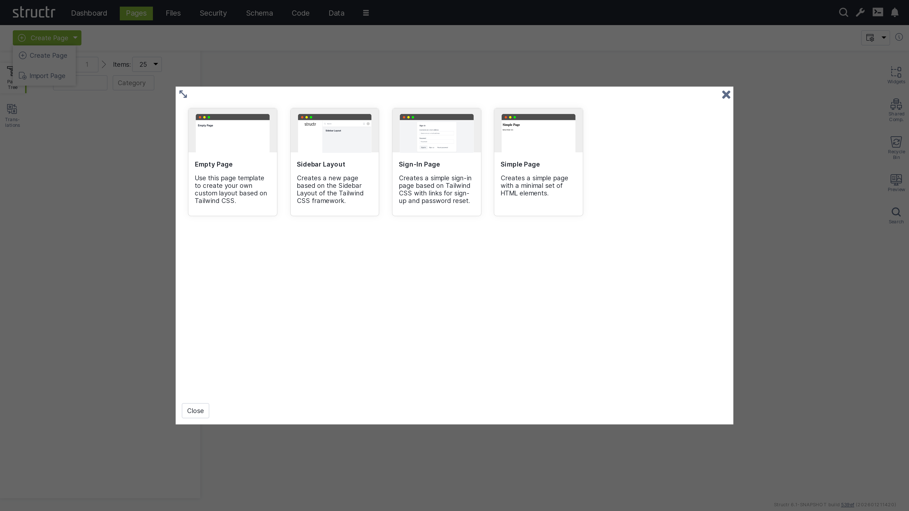
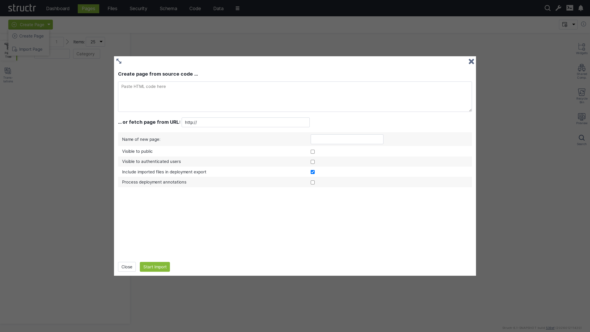
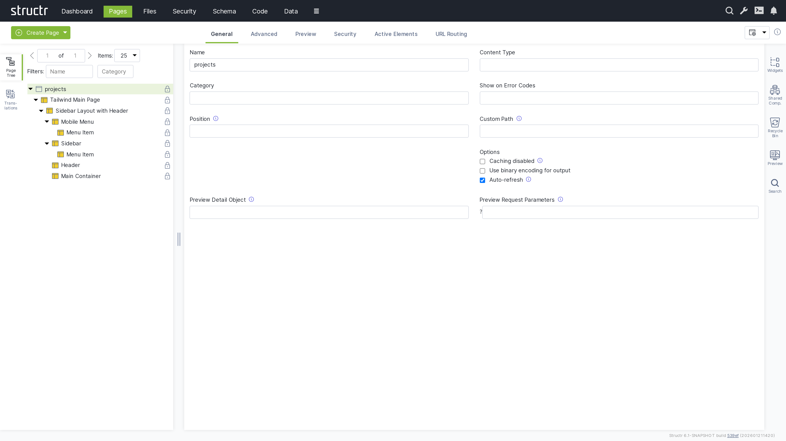
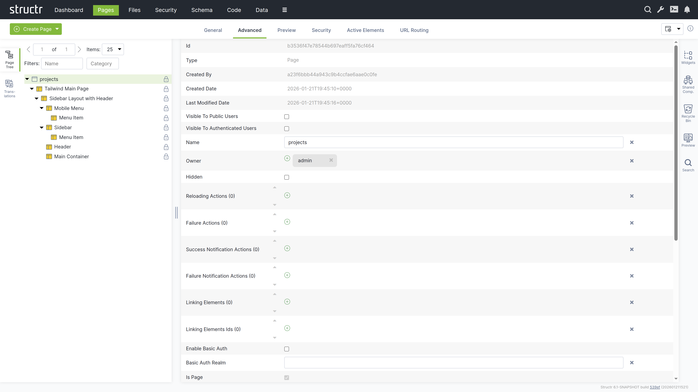
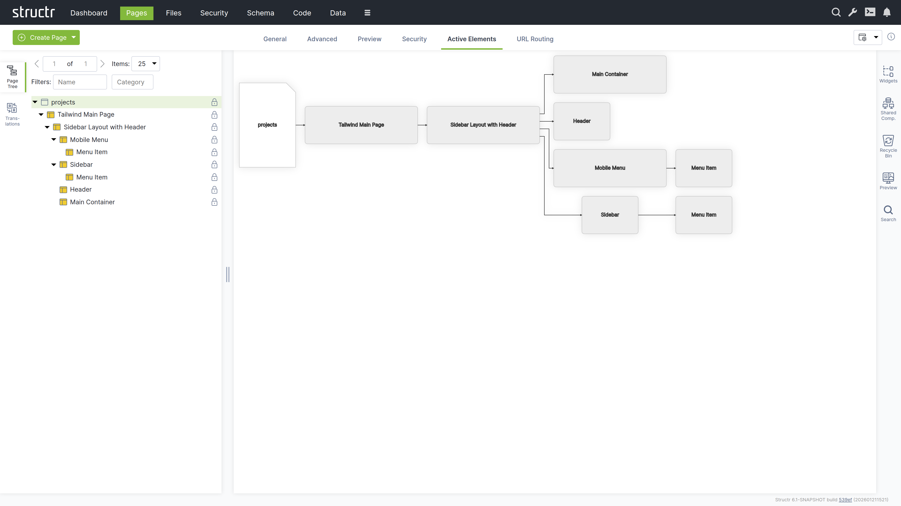

After defining a first version of the data model, the next step is usually to build a user interface. This can be done in the `Pages` area.

## Creating a Page

When you click the green "Create Page" button in the upper left corner of the Pages section, you can choose whether to create a page from a template or import one from a URL.

### Create Page Dialog

#### Templates

When you select "Create Page", you will see a list of templates that are used to create the structure of the new page. Templates are based on the Tailwind CSS framework and range from simple layouts like the Empty Page to more complex structures with sidebars and navigation menus, as well as specialized templates like the Sign-In Page.

When you create a page from a template, some components are created as shared components that you can reuse across your site, whereas the Simple Page option creates a page with standard HTML elements like `<html>`, `<head>`, and `<body>`.

#### Page Templates Are Widgets
Page templates are widgets with the `isPageTemplate` flag enabled. Structr looks at the widget server and your local widget collection and displays local and remote page templates together in the "Create Page" dialog.

### Import Page Dialog

The Import Page dialog lets you create pages from HTML source code or by importing from external URLs.

#### Create Page From Source Code
Paste your HTML code into the textarea. You can then configure the import options below before creating the page.

#### Fetch Page From URL
You can also import a page from an external URL using the text input below the textarea. This imports the page including all static resources like CSS, JavaScript, and images.

#### Configuration Options
Below the import options, you configure the name and visibility flags of the new page. You can also mark imported files to be included when exporting your application and enable parsing of deployment annotations in the imported HTML.

#### Deployment Annotations
Deployment annotations are special markers that Structr inserts when exporting HTML. They preserve Structr-specific attributes such as content types for content elements and visibility settings for individual HTML elements.

## Working With Pages
A page in Structr consists of HTML elements, template blocks, content elements, or a combination of these. The following sections explain each type of page element and how they work together to build your pages. On the left side of the Pages area

### Page Elements
The Page element sits at the top of a page's element tree and represents the page itself. Below the Page element, there is either a single Template element (the Main Page Template) or an <html> element containing <head> and <body> elements.

#### Appearance
The Page element appears as an expandable tree item with the page name and optional position attribute on the left, and a lock icon on the right. Click the lock icon to open the Access Control dialog. The icon's appearance indicates the visibility settings: no icon means both visibility flags are enabled, while a lock icon with a key means only one flag is enabled.

#### Interaction
When you hover over the Page element with your mouse, two additional icons appear: one opens the context menu (described below) and one opens the live page in a new tab.

Clicking the Page element opens the detail settings in the main area of the screen in the center.

#### Access Control Dialog
Clicking the lock icon on the page element opens the access control dialog for that page. {{"Access Control Dialog",+4,children}}

#### Permissions Influence Rendering
Visibility flags and permissions don't just control database access, they also determine what renders in the page output. You can make entire branches of the HTML tree visible only to specific user groups or administrators, allowing you to create permission-based page structures. For example, an admin navigation menu can be visible only to users with administrative permissions. For more advanced conditional rendering based on dynamic runtime conditions, see the Show and Hide Conditions section in the Dynamic Content chapter.

#### The General Tab

The General tab of a page contains important settings that affect how the page is rendered for users and displayed in the preview.

##### Name
The page name identifies the page in the page tree and determines its URL. A page named "about" is accessible at /about.

##### Content Type
Set the content type to control the page's output format. The default is text/html, but you can use application/json for JSON responses, text/xml for XML, or any other content type.

##### Category
You can use the category field to organize your pages into groups. Assign a category to the page, and you can then use the category filter to show only pages from that category.

##### Show on Error Codes
You can configure this page to be displayed when specific HTTP errors occur. Enter a comma-separated list of status codes, for example, 404 when content isn't found or users lack permission, 401 when authorization is required, or 403 when access is forbidden.

##### Position
When users access the root URL of your application, Structr uses the position attribute to determine which page is displayed. Among all visible pages, the one with the lowest position value is shown. See the Navigation & Routing chapter for a detailed explanation of page ordering and selection.

##### Custom Path
You can assign an alternative URL to the page using this field. Note that URL routing has replaced this setting and provides more flexibility, including support for type-safe path-based arguments that are directly mapped to keywords you can use in your page.

##### Caching disabled
Enable this when your page contains dynamic data that changes frequently or personalized content. Structr sends cache control headers that prevent browsers and proxies from caching the page output. Pages for authenticated users are never cached, so this flag only affects public users.

##### Use binary encoding for output
Enable this if your page generates binary data to make Structr use the correct character encoding.

##### Autorefresh
Enable this to automatically reload the page preview in the Structr Admin UI whenever you make changes.

##### Preview Detail Object
The preview detail object allows you to assign a fixed object that Structr uses as the detail object when rendering the preview, making it available under the `current` keyword.

##### Preview Request Parameters
The preview request parameters field allows you to provide fixed parameters that Structr includes when rendering the preview.

#### The Advanced Tab

The Advanced tab provides a raw view of the current object, showing all its attributes in an editable table for quick access. This tab includes special base attributes like `id`, `type`, `createdBy`, `createdDate`, `lastModifiedDate`, and `hidden` that aren't available elsewhere.

##### Hidden Flag
The `hidden` flag prevents rendering of the element and all its children. When you enable this flag, Structr excludes the element from the page output entirely, making it useful for temporarily disabling parts of your page structure without deleting them.

#### The Preview Tab
The Preview tab displays how your page appears to visitors, while also allowing you to edit text content directly. Hovering over elements highlights them in both the preview and the page tree. You can click highlighted elements to edit them inline or select them in the tree for detailed editing. This inline editing capability is especially valuable for repeater-generated lists or tables, where you can access and modify the underlying template expressions directly in context.

##### Preview Settings
You can configure the preview in the page's General tab settings. Assign a specific object to make it available under the current keyword for testing, or provide fixed request parameters to test your page with specific data. These settings help you preview how your page renders with different objects and parameters.

#### The Security Tab
The Security tab contains the same Access Control dialog that opens when you click the lock icon in the page tree.

#### The Active Elements Tab

#### The URL Routing Tab

### HTML Elements
#### Access Control
#### General Settings
#### HTML Settings
#### Advanced Settings
#### Preview
#### Repeater Settings
#### Events Settings
#### Security Settings
#### Active Elements

### Templates & Content Elements

remember: doctype element hint:
Note that if you use a Template element, it must include the DOCTYPE definition that a classic page with an HTML element outputs automatically.

#### Access Control
#### General Settings
#### Advanced Settings
#### Preview
#### Editor
#### Repeater Settings
#### Security Settings
#### Active Elements

### Context Menu
#### Suggested Widgets
#### Insert HTML Element
#### Insert Content Element
#### Insert Div Element
#### Insert Before
#### Insert After
#### Clone
#### Wrap Element In
#### Replace Element With
#### Select Element
#### Expand / Collapse
#### Remove Node

### Static Resources

#### File download
#### Dynamic files
##### Replace template expressions"

## Translations

## Widgets
### Local Widgets
#### Creating a Widget
#### Widget Configuration
##### Source
##### Configuration
##### Description
##### Options
###### Selectors
###### Is Page Template

### Remote Widgets
#### Widget Servers

## Shared Components

## Recycle Bin

## Preview

## Search

